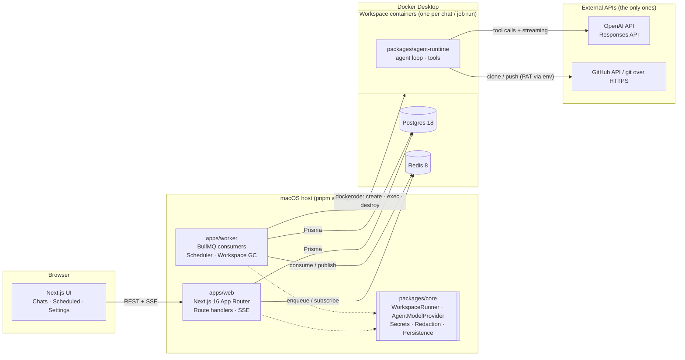
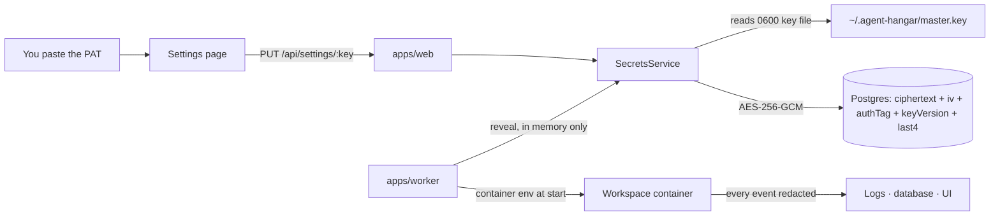

<p align="center">
  
</p>

<h1 align="center">Agent Hangar</h1>

<p align="center">
  <strong>AI agents that do real work on your repositories, each inside its own disposable Docker workspace.</strong><br />
  <sub>Next.js 16 · React 19 · TypeScript 6 · Node 24 · Prisma 7 · PostgreSQL 18 · Redis 8 · BullMQ 6 · Docker · OpenAI Responses API</sub>
</p>

<p align="center">
  <a href="https://github.com/bymaxone/agent-hangar/actions/workflows/ci.yml"></a>
  <a href="https://www.typescriptlang.org/"></a>
  <a href="https://nodejs.org/"></a>
  <a href="https://nextjs.org/"></a>
  <a href="https://www.prisma.io/"></a>
  <a href="https://redis.io/"></a>
  <a href="https://tailwindcss.com/"></a>
  
</p>

<p align="center">
  <a href="#-quick-start">🚀 Quick start</a> ·
  <a href="#-how-it-works">🏗️ How it works</a> ·
  <a href="#-configuration">⚙️ Configuration</a> ·
  <a href="#-security">🔒 Security</a> ·
  <a href="#-testing">🧪 Testing</a> ·
  <a href="docs/spec/README.md">📖 Specification</a>
</p>

<!-- Screenshot: promoted from the W3-A evidence run once the real stack is green. -->

---

## ✨ What this is

Agent Hangar is a **local-first** web application where AI agents answer questions and perform coding tasks against your GitHub repositories. Every chat and every scheduled run gets **its own Docker container** — the agent clones the repo there, runs shell commands, reads and writes files, commits and pushes, and the container is destroyed when it is no longer needed.

Three pillars:

- **Chats.** Pick a repository and branch, send a prompt, watch the agent work live. Archive a chat and restore it later into a brand-new container with its full history.
- **Scheduled jobs.** A cron expression, a timezone, a prompt. Each trigger gets a _fresh_ workspace, records the run and its output, and leaves nothing behind.
- **Settings.** Your GitHub PAT and OpenAI key, encrypted at rest and never printed anywhere.

It runs entirely on your machine. The only external calls are to the OpenAI API and to GitHub.

> ### 📍 Project status
>
> This repository is being built in waves, and this section is kept honest rather than aspirational — it says what runs **today**, not what is planned.
>
> **Working now:** the foundation. The pnpm monorepo with strict TypeScript project references and the lint/format/commit gates; the frozen cross-lane contracts in `packages/core` (runner and model-provider ports, the NDJSON agent protocol with Zod schemas, HTTP API and queue contracts, configuration and instance derivation, typed errors); the shared test doubles (`FakeWorkspaceRunner`, `FakeAgentModelProvider`, in-memory repositories, `FakeClock`, secret canaries); the Prisma 7 schema with its first migration and client factory; the parameterised infrastructure (`pnpm setup`, compose, workspace image base); the Next.js shell serving **placeholder pages** for `/chats/new`, `/chats/:id`, `/scheduled`, `/scheduled/:id` and `/settings` with the design tokens and security headers; a worker that boots, proves Postgres and Redis are reachable and shuts down cleanly; and the CI pipeline.
>
> **Not wired yet:** the chat, scheduled-job and settings flows themselves — no agent runs, no credential is stored, no container is created by the app. The placeholder pages are placeholders, not a working product. Until this block says otherwise, treat the walkthrough in [Quick start](#-quick-start) as the designed first-run experience rather than a verified one; the full flow is proven end to end in the integration wave, and this section is rewritten from that evidence.

---

## 🚀 Quick start

### Requirements

| Tool                                      | Version              | Check                                                    |
| ----------------------------------------- | -------------------- | -------------------------------------------------------- |
| **macOS**                                 | 13+                  | —                                                        |
| **Docker Desktop** (or OrbStack / Colima) | Engine API reachable | `docker info`                                            |
| **Node.js**                               | 24 LTS               | `node -v` — `.nvmrc` pins it, so `nvm use` is enough     |
| **pnpm**                                  | 11                   | `corepack enable && corepack prepare pnpm@11 --activate` |
| **Git**                                   | 2.40+                | `git --version`                                          |

Nothing else is installed globally. PostgreSQL and Redis run in Docker.

### Four commands

```bash
git clone https://github.com/bymaxone/agent-hangar.git && cd agent-hangar
corepack enable
pnpm setup     # installs, configures, boots infrastructure, migrates, builds the image, runs doctor
pnpm dev       # web + worker with hot reload → http://127.0.0.1:3000
```

Then in the browser: **Settings** → paste your GitHub PAT and OpenAI API key → **New chat** → choose a repository → send a prompt.

### What `pnpm setup` actually does

It is idempotent — run it as often as you like.

| #   | Step                             | Detail                                                                                                                                                         |
| --- | -------------------------------- | -------------------------------------------------------------------------------------------------------------------------------------------------------------- |
| 1   | `pnpm install --frozen-lockfile` | never mutates the lockfile                                                                                                                                     |
| 2   | Resolve environment              | derives every port, database name and container prefix from `AH_INSTANCE` + `AH_PORT_BASE`, writes `.env.local` if absent (never overwrites without `--force`) |
| 3   | Create the master key            | `~/.agent-hangar/master.key`, 32 random bytes, `chmod 600`, only if missing                                                                                    |
| 4   | Boot infrastructure              | `docker compose up -d --wait` — PostgreSQL 18 and Redis 8, with healthchecks                                                                                   |
| 5   | Migrate                          | `prisma migrate deploy` + `prisma generate`                                                                                                                    |
| 6   | Build the workspace image        | `docker build -t agent-hangar/workspace:dev infra/workspace`                                                                                                   |
| 7   | `pnpm doctor`                    | verifies all of the above and prints what to fix                                                                                                               |

### When something is off, run the doctor

```bash
pnpm doctor
```

It prints one row per dependency — Node and pnpm versions, where the Docker socket was found, PostgreSQL and Redis reachability, migrations applied, workspace image present, master key present with `0600`, which credentials are configured (showing only the last four characters), and whether your OpenAI key can reach the configured model. **Every ✗ comes with the exact command that fixes it.**

---

## 🏗️ How it works



| Component                    | Responsibility                                                                                                                                                                                                                                                                                |
| ---------------------------- | --------------------------------------------------------------------------------------------------------------------------------------------------------------------------------------------------------------------------------------------------------------------------------------------- |
| **`apps/web`**               | UI and HTTP API. Writes user intent to PostgreSQL, enqueues work in BullMQ, streams results to the browser over SSE by subscribing to Redis. **Never talks to Docker.**                                                                                                                       |
| **`apps/worker`**            | The only process that touches Docker. Consumes the `chat-turns` and `scheduled-jobs` queues, owns workspace lifecycle, persists every event and tool call, publishes progress to Redis, registers BullMQ Job Schedulers from the database, and garbage-collects idle and orphaned workspaces. |
| **`packages/core`**          | Pure domain, no framework imports: the `WorkspaceRunner` and `AgentModelProvider` interfaces and their real implementations, AES-256-GCM secrets, redaction, cron validation, restore-context building, the agent protocol, and the Prisma repositories.                                      |
| **`packages/agent-runtime`** | Bundled _into_ the workspace image. Reads a turn request from stdin as NDJSON, runs the OpenAI tool loop, executes tools inside the container, emits events on stdout. Knows nothing about PostgreSQL or Redis.                                                                               |

### A turn, end to end

1. You send a prompt. `apps/web` validates it, persists the message, and enqueues a turn.
2. `apps/worker` picks it up, ensures a workspace exists (creating a container if needed), decrypts your credentials **in memory only**, and injects them as container environment.
3. Inside the container, `agent-runtime` clones or reuses the checkout and starts the OpenAI loop, executing tools as the model requests them.
4. Every event is redacted, persisted, and published to a Redis stream.
5. The browser is subscribed over SSE and renders the output as it arrives — with replay via `Last-Event-ID` if the connection drops.

### Why containers per chat

Isolation is the whole point: an agent that can run arbitrary shell commands should not share a filesystem with another agent, nor with your machine. Each workspace runs as a non-root user with dropped capabilities, `no-new-privileges`, CPU/memory/PID limits, and **no Docker socket mounted**.

---

## ⚙️ Configuration

Everything is environment-driven and validated with Zod at boot. `.env.example` documents every key; `pnpm setup` writes a working `.env.local`.

**The two values you normally touch are the first two** — every other row is derived from them, which is what lets several checkouts run side by side.

| Variable                  | Default                                                        | Purpose                                                                                     |
| ------------------------- | -------------------------------------------------------------- | ------------------------------------------------------------------------------------------- |
| `AH_INSTANCE`             | `default`                                                      | Instance name. Suffixes every resource below.                                               |
| `AH_PORT_BASE`            | `3000`                                                         | Base of a 10-port block.                                                                    |
| `WEB_PORT`                | `AH_PORT_BASE + 0`                                             | Next.js                                                                                     |
| `POSTGRES_PORT`           | `AH_PORT_BASE + 1`                                             | host port → container 5432                                                                  |
| `REDIS_PORT`              | `AH_PORT_BASE + 2`                                             | host port → container 6379                                                                  |
| `POSTGRES_DB`             | `agent_hangar_<instance>`                                      | database name                                                                               |
| `DATABASE_URL`            | `postgresql://ah:ah@127.0.0.1:${POSTGRES_PORT}/${POSTGRES_DB}` | Prisma                                                                                      |
| `REDIS_URL`               | `redis://127.0.0.1:${REDIS_PORT}`                              | BullMQ + Streams                                                                            |
| `COMPOSE_PROJECT_NAME`    | `agent-hangar-<instance>`                                      | isolates compose containers, volumes and networks                                           |
| `MASTER_KEY_PATH`         | `~/.agent-hangar/master.key`                                   | secrets master key                                                                          |
| `WORKSPACE_IMAGE`         | `agent-hangar/workspace:dev`                                   | image used by the runner                                                                    |
| `WORKSPACE_NAME_PREFIX`   | `ah-ws-<instance>-`                                            | container names and labels — GC only touches its own instance                               |
| `WORKSPACE_IDLE_TTL_MIN`  | `30`                                                           | idle workspace reaping                                                                      |
| `WORKER_TURN_CONCURRENCY` | `2`                                                            | parallel chat turns                                                                         |
| `OPENAI_MODEL`            | `gpt-5.6-sol`                                                  | model id sent to OpenAI                                                                     |
| `OPENAI_BASE_URL`         | unset                                                          | optional override                                                                           |
| `AGENT_MODEL_PROVIDER`    | `openai`                                                       | `fake` in E2E                                                                               |
| `DOCKER_HOST`             | unset                                                          | optional; the runner falls back to `~/.docker/run/docker.sock`, then `/var/run/docker.sock` |
| `LOG_LEVEL`               | `info`                                                         | pino                                                                                        |
| `NEXT_PUBLIC_API_MOCK`    | `0`                                                            | serve the UI against mock handlers instead of the API (development only)                    |

> **Your API credentials are not in this table, and that is deliberate.** The GitHub PAT and the OpenAI key are entered in the Settings page and stored encrypted in PostgreSQL — never as environment variables of the web or worker process. See [Security](#-security).

`127.0.0.1` appears instead of `localhost` throughout because macOS resolves `localhost` to `::1` first, while the compose port forward is IPv4-only.

---

## 📜 Scripts

| Script                                                          | Does                                                                |
| --------------------------------------------------------------- | ------------------------------------------------------------------- |
| `pnpm setup`                                                    | First-run bootstrap (idempotent) — see [Quick start](#-quick-start) |
| `pnpm dev`                                                      | Web (`next dev`) + worker (`tsx watch`), concurrently               |
| `pnpm build` · `pnpm start`                                     | Production build / start of both apps                               |
| `pnpm doctor`                                                   | Diagnose every dependency and print the fix for each failure        |
| `pnpm infra:up` · `infra:down` · `infra:reset`                  | Compose lifecycle (`reset` drops volumes)                           |
| `pnpm infra:image`                                              | Rebuild the workspace image                                         |
| `pnpm db:migrate` · `db:generate` · `db:studio` · `db:prune`    | Prisma                                                              |
| `pnpm ws:list` · `ws:reap`                                      | List / destroy the workspace containers of this instance            |
| `pnpm lint` · `format` · `typecheck`                            | Quality gates                                                       |
| `pnpm test` · `test:integration` · `test:e2e` · `test:mutation` | See [Testing](#-testing)                                            |

---

## 🔀 Working with Conductor

Several checkouts of this repository can run **at the same time** without colliding on ports, databases, Redis keyspaces or container names. `.conductor/settings.toml` (arriving with the infra scripts lane) maps Conductor's workspace variables onto `AH_INSTANCE` and `AH_PORT_BASE`, and everything else derives from those two values.

The same mechanism works by hand:

```bash
AH_INSTANCE=feat-x AH_PORT_BASE=3100 pnpm setup
AH_INSTANCE=feat-x AH_PORT_BASE=3100 pnpm dev    # → http://127.0.0.1:3100
```

Each instance gets its own compose project (`agent-hangar-feat-x`), its own database (`agent_hangar_feat_x`), and its own container prefix (`ah-ws-feat-x-`), so garbage collection in one instance can never touch another's workspaces.

---

## 🔒 Security

### How your credentials are handled



| Boundary                 | Control                                                                                                                                                                          |
| ------------------------ | -------------------------------------------------------------------------------------------------------------------------------------------------------------------------------- |
| **Repository**           | `.gitignore` covers `.env*`, `master.key` and `*.pem`; CI runs a secret scan on every pull request                                                                               |
| **UI**                   | inputs are `type=password`, never pre-filled; the API returns only `{ set, last4 }`                                                                                              |
| **Database**             | ciphertext, IV, auth tag, key version and last four characters — the key itself is never stored                                                                                  |
| **Master key**           | outside the repository, `0600`, created on first setup, versioned via `keyVersion` for rotation                                                                                  |
| **Worker memory**        | plaintext exists only during the `create()` call; never stored on an object, never logged                                                                                        |
| **Container**            | injected as environment at start, never baked into an image layer                                                                                                                |
| **Shell tool**           | child processes get a **scrubbed** environment — git authenticates through `GIT_ASKPASS`, so the token is never in the agent's own environment                                   |
| **Logs and persistence** | redaction runs at four layers: by shape inside the container, exact-value plus shape in the worker before publishing, again on every database write, and once more in the logger |

### What is protected, and what is not

**Protected:** credentials at rest and in transit through the system; agent output that happens to echo a secret; the host filesystem, which no workspace can reach; other workspaces, which never share a filesystem.

**Not protected, by design, because this is a single-user application on your own machine:**

- `docker inspect` on your own machine shows the environment of a running workspace. Replacing this with secret-manager injection is the first thing that changes in a cloud deployment — see [the deployment discussion](docs/spec/08-deployment-discussion.md).
- There is no authentication. The app binds to loopback only (`127.0.0.1`) and mutating routes are designed to enforce same-origin, but anyone with an account on your machine can reach it.
- Traffic is plain HTTP over loopback.

The agent runs with real credentials and can push to your repositories. Treat the prompts you give it with the same care you would give a shell.

---

## 🧪 Testing

| Layer           | Tool                   | What it covers                                                                                                                                                                                 |
| --------------- | ---------------------- | ---------------------------------------------------------------------------------------------------------------------------------------------------------------------------------------------- |
| **Unit**        | Vitest                 | Every pure module. **100% coverage on lines, branches, functions and statements is enforced per package** — the build fails below it.                                                          |
| **Integration** | Vitest + real services | Repositories against real PostgreSQL, queues against real Redis, and the workspace runner against a **real Docker daemon** — containers are created, exec'd, signalled and destroyed for real. |
| **End to end**  | Playwright             | The critical flows through the real stack: create a chat and run a turn, archive and restore, cancel a turn, schedule a job and see it run, secrets masking.                                   |
| **Mutation**    | Stryker 10             | The domain where a surviving mutant would be a real bug — secrets, redaction, scheduling, workspace lifecycle, restore, protocol codec.                                                        |

```bash
pnpm test               # unit, with coverage thresholds enforced
pnpm test:integration   # needs docker compose up and the workspace image
pnpm test:e2e           # Playwright against the real stack with the fake model provider
pnpm test:mutation      # Stryker, per package
```

Integration suites **fail loudly** rather than skipping when their infrastructure is missing in CI, so a green build can never mean "we quietly skipped the hard tests".

### Quality bar

Strict TypeScript with `noUncheckedIndexedAccess` and `exactOptionalPropertyTypes`; **zero suppression comments** (`@ts-ignore`, `eslint-disable`, coverage ignores) anywhere in the codebase; documentation on every export; string-literal unions instead of enums; `dockerode` confined to a single folder so the runner can be swapped without touching anything else.

---

## 🧯 Troubleshooting

| Symptom                                               | Cause and fix                                                                                                                                                                               |
| ----------------------------------------------------- | ------------------------------------------------------------------------------------------------------------------------------------------------------------------------------------------- |
| `pnpm doctor` reports the Docker socket was not found | Docker Desktop does not create `/var/run/docker.sock` unless you opt in. The runner already tries `~/.docker/run/docker.sock`; if you use a different engine, set `DOCKER_HOST` explicitly. |
| Port already in use                                   | Another instance owns that block. Start this one elsewhere: `AH_INSTANCE=alt AH_PORT_BASE=3100 pnpm setup`.                                                                                 |
| `WorkspaceImageMissing` when starting a chat          | The workspace image was never built, or was pruned: `pnpm infra:image`.                                                                                                                     |
| The model id is rejected                              | Your key may not have access to the default model. `pnpm doctor` lists the models it can reach; set `OPENAI_MODEL` to one of them.                                                          |
| Containers left behind after a crash                  | `pnpm ws:list` shows this instance's workspaces, `pnpm ws:reap` destroys them. The worker also reaps orphans on boot.                                                                       |
| Migrations out of date after pulling                  | `pnpm db:migrate`.                                                                                                                                                                          |

---

## 🗺️ Known gaps

Kept current and specific — an empty section is the goal.

Pending lanes, each with its own task file under [`docs/tasks/`](docs/tasks/README.md); the status dashboard lives in [`docs/plan.md` §12](docs/plan.md).

| Lane        | What is missing until it merges                                                                                         |
| ----------- | ----------------------------------------------------------------------------------------------------------------------- |
| W1-A        | AES-256-GCM `SecretsService`, master-key handling, the `Redactor` and the redacting pino logger                         |
| W1-B        | `DockerWorkspaceRunner` over dockerode (create/exec/signal/snapshot/destroy/list) and the real-Docker integration suite |
| W1-C        | `OpenAIModelProvider` over the Responses API, recorded stream fixtures                                                  |
| W1-D        | The agent runtime bundled into the workspace image: turn loop, tools, path confinement, env scrubbing, `GIT_ASKPASS`    |
| W1-E        | Prisma repositories implementing the persistence ports, redact-on-write, `@db` integration tests                        |
| W1-F        | Cron validation, BullMQ queue/scheduler factories, workspace lifecycle state machine, restore-context builder           |
| W1-G        | The shell UI (sidebar, chat list, search, theme toggle) and the chat pages with streaming transcript                    |
| W1-H        | The scheduled-jobs and settings pages                                                                                   |
| W1-I        | `doctor`, `run`, `archive`, key rotation scripts and the Conductor configuration                                        |
| W2-A        | HTTP API routes and the SSE endpoints                                                                                   |
| W2-B        | Worker processors: run-turn, run-scheduled-job, workspace GC, scheduler reconciliation, cancel channel                  |
| W2-C        | Playwright harness and the end-to-end specs                                                                             |
| W3-A        | End-to-end wiring and stabilisation, full-package coverage, a real OpenAI smoke run                                     |
| W3-B        | Documentation refresh from the integrated system                                                                        |
| W4-A / W4-B | Stryker mutation testing on `packages/core` and `packages/agent-runtime` (may slip)                                     |

---

## 🧭 Decisions and trade-offs

| Decision                                                              | Why                                                                                                                                                                                                                                                                                                                                                                                                                                                                | What was given up                                                                       |
| --------------------------------------------------------------------- | ------------------------------------------------------------------------------------------------------------------------------------------------------------------------------------------------------------------------------------------------------------------------------------------------------------------------------------------------------------------------------------------------------------------------------------------------------------------ | --------------------------------------------------------------------------------------- |
| **TypeScript pinned to `~6.0.3`**                                     | TypeScript 7's native compiler has no stable programmatic API until 7.1, and the toolchain (typescript-eslint, the Stryker instrumenter, Next's type-check) depends on it. The config avoids options removed in TS 7, so upgrading later is a version bump.                                                                                                                                                                                                        | The newer compiler's speed, for now.                                                    |
| **PostgreSQL over SQLite**                                            | Two processes write concurrently, JSON columns hold redacted tool arguments, and the path to a managed database in a cloud deployment is direct.                                                                                                                                                                                                                                                                                                                   | A file-based database and one less container.                                           |
| **AES-256-GCM with a local key file, not the OS keychain**            | No extra dependency, deterministic tests, and the same envelope pattern maps onto KMS or Secrets Manager later.                                                                                                                                                                                                                                                                                                                                                    | The OS keychain's own protections.                                                      |
| **SSE over WebSocket**                                                | Streaming is one-directional; SSE reconnects and replays by `Last-Event-ID` natively and survives an HTTP proxy.                                                                                                                                                                                                                                                                                                                                                   | Bidirectional messaging that is not needed.                                             |
| **`exec` + NDJSON over an HTTP server per container**                 | No port allocation, no service discovery, no listening surface inside the workspace.                                                                                                                                                                                                                                                                                                                                                                               | A more familiar request/response shape.                                                 |
| **BullMQ over pg-boss**                                               | Job Schedulers cover cron with timezone handling directly, and Redis Streams already back the SSE replay.                                                                                                                                                                                                                                                                                                                                                          | One fewer service to run.                                                               |
| **A container per chat rather than a shared pool**                    | Isolation is the product requirement; a pool would leak state between chats and between users' repositories.                                                                                                                                                                                                                                                                                                                                                       | Startup latency on the first turn of a chat.                                            |
| **shadcn on Base UI (`base-nova` style)**                             | shadcn 4's default primitives with accessible, unstyled Base UI components under the project's own token set; generated into `apps/web/src/shared/ui` and owned by the repository.                                                                                                                                                                                                                                                                                 | Radix, and a smaller component catalogue than the Radix registry.                       |
| **OpenAI Responses API, stateless (`store: false`)**                  | One call per step with the full history window keeps PostgreSQL the single source of truth and needs no provider-side conversation state.                                                                                                                                                                                                                                                                                                                          | Provider-side continuation (`previous_response_id`) and the input tokens it would save. |
| **Security headers from `next.config.ts`, CSP as defence in depth**   | Every response carries a Content-Security-Policy plus `X-Frame-Options: DENY`, `nosniff`, `Referrer-Policy: no-referrer` and a restrictive `Permissions-Policy`. `script-src` keeps `'unsafe-inline'` (and `'unsafe-eval'` in development for HMR), so the CSP is not a complete XSS mitigation: the primary defences are React's escaping and rendering agent Markdown without `rehype-raw`. A nonce-based CSP is the follow-up if the app ever leaves localhost. | Strict CSP today.                                                                       |
| **Web server bound to `127.0.0.1`**                                   | `next dev`/`next start` bind to `0.0.0.0` by default, which would publish the credential-writing API to the local network; both scripts pass `-H 127.0.0.1`.                                                                                                                                                                                                                                                                                                       | Reaching the UI from another device.                                                    |
| **gitleaks through its container image in CI**                        | `gitleaks/gitleaks-action` requires a licence key for organisation repositories; the official image (`ghcr.io/gitleaks/gitleaks`) needs none and scans the PR range (or the full history on `main`). The action can replace it once a key exists.                                                                                                                                                                                                                  | The action's PR annotations.                                                            |
| **`deepmerge-ts` pinned to `^8` via a pnpm override**                 | `@prisma/config` pins a version affected by GHSA-ggr8-5vv4-36mx (stack exhaustion on recursive objects); the override keeps `pnpm audit --prod` clean and the Prisma CLI works unchanged with v8.                                                                                                                                                                                                                                                                  | Nothing measurable.                                                                     |
| **Workspace image uses `CMD ["sleep","infinity"]`, not `ENTRYPOINT`** | The container idles until the worker `exec`s a turn into it, yet `docker run <image> node --version` (used by CI and by the doctor) still works because the command can be overridden.                                                                                                                                                                                                                                                                             | Nothing.                                                                                |

---

## 📖 Documentation

| Document                                                       | Answers                                                                    |
| -------------------------------------------------------------- | -------------------------------------------------------------------------- |
| [Specification](docs/spec/README.md)                           | The full technical specification, in ten parts                             |
| [System overview](docs/spec/01-overview.md)                    | Goal, scope, success criteria, component diagram, stack                    |
| [Data model](docs/spec/02-data-model.md)                       | Prisma schema, invariants, what a faithful restore needs                   |
| [Interface contracts](docs/spec/03-interfaces.md)              | `WorkspaceRunner`, `AgentModelProvider`, agent protocol, HTTP API, queues  |
| [Sequence flows](docs/spec/04-flows.md)                        | Turn execution, archive and restore, scheduled runs, the secrets lifecycle |
| [Testing strategy](docs/spec/06-testing.md)                    | Layers, the real-Docker integration suite, the E2E list, the mutation gate |
| [Deployment discussion](docs/spec/08-deployment-discussion.md) | What changes to run this in the cloud, and what it would cost              |
| [Non-goals](docs/spec/09-non-goals.md)                         | What is deliberately absent, and where each seam already exists            |

---

## 📄 License

See [LICENSE](LICENSE).
