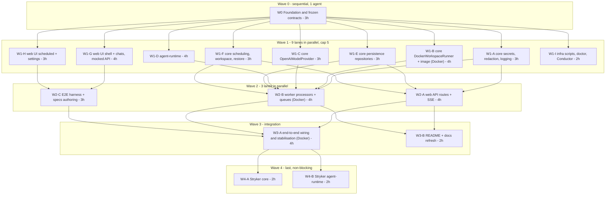

# Agent Hangar — Implementation Plan (orchestrator + parallel subagents)

| | |
|---|---|
| **Status** | ✅ Approved — 2026-08-19 · task files: [docs/tasks/](tasks/README.md) |
| **Source spec** | [docs/spec/](spec/README.md) (01–10) — this plan executes it; where they differ, this plan wins on *sequencing*, the spec wins on *behaviour* |
| **Execution model** | One orchestrator session; each workstream = one isolated subagent in its own git worktree = one PR. Workstreams in the same wave run **in parallel** |
| **Quality bar** | TS strict, zero suppressions, JSDoc on every export, **100 % coverage on all four metrics (lines / branches / functions / statements) per package**, gates green before every PR. Stryker 10 mutation testing is the **final wave** and is explicitly allowed to slip |
| **Last updated** | 2026-08-19 · §12 reflects Wave 1 in flight: seven lanes merged, three running |

---

## 1. Requirements restatement

Build the system in [docs/spec](spec/README.md) — chats backed by isolated Docker workspaces, scheduled jobs in fresh workspaces, encrypted settings, SSE streaming, Conductor-ready local setup — **as fast as wall-clock allows without lowering quality**, by:

1. Splitting the work into **workstreams that own disjoint paths**, so several subagents can implement concurrently in separate worktrees and their PRs merge without conflicts.
2. Freezing **all cross-workstream contracts first** (types, Prisma schema, Zod schemas, test doubles, dependency manifest, tooling) so parallel agents build against interfaces, never against each other's in-progress code.
3. Enforcing the same gates in every PR: lint, typecheck, unit tests with **100 % coverage on every metric**, integration tests where the workstream touches real infrastructure, JSDoc/test-comment policy, self code review to zero findings.
4. Running **Stryker 10** last, per package, as separate non-blocking PRs, with the CI mutation gate switched on only when the score holds.

Non-negotiables carried from the spec: scope exactly as the spec lists (nothing more), English-only artefacts, no secrets anywhere but encrypted Postgres rows, dockerode confined to `packages/core/src/runner/docker/**`.

## 2. Reuse scan (simplicity ladder §0)

- **Codebase:** empty repository (no commits) → every file is new by necessity; no per-file justification is repeated below.
- **Org libs / siblings:** `@bymax-one/*` are NestJS-oriented; this project is Next.js + plain Node worker, so nothing is imported. Proven *patterns* are reused from the knowledge vault: SSE (no compression, `Last-Event-ID` replay, same-origin route), BullMQ Job Schedulers (`upsertJobScheduler`, `maxRetriesPerRequest: null` only on workers), Prisma 7 driver adapter (`$connect()` is lazy → `SELECT 1` at boot), macOS `127.0.0.1` over `localhost`.
- **Platform / stdlib:** `node:crypto` (AES-256-GCM, `randomUUID`, `timingSafeEqual`), `fetch`, `AbortController`, `URL`, `Intl`, `structuredClone`.
- **Installed deps that cover needs (no custom code):** `openai` (Responses streaming), `bullmq`/`ioredis`, `dockerode`, `@prisma/client` + `@prisma/adapter-pg`, `zod`, `pino`, `cron-parser` (cron validation + next run), `react-markdown` + `rehype-highlight` (assistant Markdown), `shadcn` components, `lucide-react`, `msw` (test-mode GitHub API), `@testing-library/react`, `@vitest/coverage-v8`, `@playwright/test`, `@stryker-mutator/core` + `vitest-runner`.
- **Reusable units planned once:** `packages/core/src/testing/**` (fakes used by every workstream), `apps/web/src/shared/ui/**` (shadcn + project primitives, zero domain imports), `packages/core/src/agent-protocol/**` (shared by worker and runtime).

## 3. Parallelism rules (learned the hard way — do not skip)

1. **One agent per directory, one directory per agent.** Every workstream below has an **Owned paths** list; an agent may create/edit only there (plus its own test files). Reading anything is fine. Touching another stream's path = the PR is rejected by the orchestrator.
2. **No dependency additions inside waves.** Wave 0 installs the complete manifest (§5). A stream that truly needs a new package stops and reports; the orchestrator adds it in a tiny `chore(deps)` PR on `main` first. This is what keeps `pnpm-lock.yaml` conflict-free.
3. **Docker-running tests are a shared resource.** Only streams marked 🐳 run real-Docker integration tests, and the orchestrator runs **at most one 🐳 stream at a time** (OOM/port pressure on a laptop). Everyone else tests against `FakeWorkspaceRunner`.
4. **Concurrency cap: 5 subagents** at once (more buys little and risks OOM from five `next build`/`vitest` processes).
5. **Shared files are pre-split.** `packages/core/src/index.ts` re-exports one barrel per folder; a lane adds exports only to the barrel of the folder it owns. Each package's `vitest.config.ts` `coverage.include` is the one file several lanes append a line to — keep it one line per lane, appended at the end, to make rebases trivial. Root `package.json` scripts are owned by W1-I (merged first).
6. **Contracts are frozen after Wave 0.** A stream that needs a contract change opens a 1-file PR against `packages/core/src/**/types.ts` (+ Zod) and waits for the orchestrator to merge and notify dependants. Changes must be additive.
6. **Each subagent: `isolation: "worktree"`, branch `feat/<stream-id>-<slug>`, steps 0–4 only** (branch → implement → gates → self-review → commit/push/open PR → return PR number + summary). The orchestrator owns merge, CI watching, review-thread resolution, and chaining (see §8).
7. **Verify, don't trust:** orchestrator confirms every stream via `git`/`gh` (commits ahead, PR number, CI state) — never via the agent's narration.

## 4. Wave plan (critical path and parallel lanes)



**Dependency graph (what each lane needs merged before it starts)**

| Lane | Needs merged | Why |
|---|---|---|
| W1-A … W1-H | W0 | contracts, tooling, deps |
| W1-I | W0 (+ W1-A, W1-C, W1-E for the doctor/rotate-key tasks) | runs in the second Wave 1 batch; merges first within that batch (root scripts block) |
| W2-A (web API) | W1-A, W1-E, W1-F | secrets status, repositories, scheduling validation |
| W2-B (worker) | W1-A, W1-B, W1-C, W1-D, W1-E, W1-F | everything the processors orchestrate |
| W2-C (E2E authoring) | W1-G, W1-H | UI selectors; specs run for real only in W3-A |
| W3-A | all W2 | wiring, real OpenAI smoke, E2E green |
| W3-B | W2 (can start on W1 and rebase) | docs |
| W4-A/B | W3-A | mutation on stable code |

Estimated wall-clock with cap 5: **≈ 3 h (W0) + ≈ 7 h (W1 in two batches) + ≈ 4 h (W2) + ≈ 4 h (W3) + ≈ 2 h (W4) ≈ 20 h** of agent time, versus ≈ 45 h sequential. Human time is review/merge decisions only.

## 5. Wave 0 — Foundation & frozen contracts (single agent, critical path)

**Goal.** After this PR merges, eight agents can start without asking questions.

**Scope.**

1. **Monorepo & tooling** — `pnpm-workspace.yaml` (`apps/*`, `packages/*`), root `package.json` (`packageManager: pnpm@11`, `engines.node: 24`), `tsconfig.base.json` (strict + `noUncheckedIndexedAccess`, `exactOptionalPropertyTypes`, `verbatimModuleSyntax`, `isolatedModules`), per-package `tsconfig.json` with project references, path alias `@/` per app, ESLint flat config (typescript-eslint, import-x order, security, `no-restricted-imports`: dockerode outside `packages/core/src/runner/docker/**`, `crypto` → `node:crypto`, no `enum` via `no-restricted-syntax`), Prettier + tailwind plugin, Husky + commitlint + lint-staged, `.editorconfig`, `.nvmrc`, `.gitignore` (`.env*`, `master.key`, coverage, reports), `CLAUDE.md` (project rules: ownership map, gates, no-secrets canaries).
   - **TypeScript pinned to `~6.0.3`** (decided — spec 01 R1): latest stable JS-line compiler; TS 7 (native, `latest` tag) is not used because its programmatic API is unstable until 7.1. `tsconfig` avoids options removed in TS 7 (`baseUrl`, legacy `moduleResolution`) so a later upgrade is a version bump. Record in README "Decisions".
2. **Complete dependency manifest** installed and locked (no stream adds deps later):
   - root dev: `typescript`, `eslint` + `typescript-eslint` + `eslint-plugin-import-x` + `eslint-plugin-security` + `eslint-plugin-react-hooks` + `@next/eslint-plugin-next`, `prettier` + `prettier-plugin-tailwindcss`, `husky`, `lint-staged`, `@commitlint/cli` + `config-conventional`, `vitest` + `@vitest/coverage-v8` + `@vitest/ui`, `tsx`, `esbuild`, `concurrently`, `@stryker-mutator/core` + `@stryker-mutator/vitest-runner` (10.x, configured in W4 only), `gitleaks` via CI action (not npm).
   - `packages/core`: `zod`, `pino`, `@prisma/client`, `@prisma/adapter-pg`, `pg`, `prisma` (dev), `bullmq`, `ioredis`, `dockerode` + `@types/dockerode`, `openai`, `cron-parser`, `tar-stream` (copy files into containers if needed by runner).
   - `packages/agent-runtime`: `zod`, `openai` (via core), `execa` **not** used — `node:child_process` suffices (stdlib rung).
   - `apps/web`: `next`, `react`, `react-dom`, `tailwindcss` + `@tailwindcss/postcss`, `shadcn` (dev) + generated components deps (`@base-ui-components/react`, `class-variance-authority`, `clsx`, `tailwind-merge`, `lucide-react`, `sonner`, `cmdk`), `react-markdown`, `rehype-highlight`, `remark-gfm`, `@testing-library/react` + `jest-dom` + `user-event`, `jsdom`, `msw`, `@playwright/test`.
   - `apps/worker`: `pino-pretty` (dev).
3. **Frozen contracts in `packages/core`** (copied from [spec 03](spec/03-interfaces.md), with Zod schemas where data crosses a boundary): `src/runner/types.ts`, `src/model/types.ts`, `src/agent-protocol/{types,schemas,ndjson}.ts` (codec included — tiny and shared), `src/secrets/types.ts` (`SecretsService`, `Redactor`), `src/scheduling/types.ts`, `src/workspace/types.ts` (lifecycle states, `RestoreContext`), `src/persistence/ports.ts` (repository interfaces: `ChatRepository`, `MessageRepository`, `TurnRepository`, `WorkspaceRepository`, `ScheduledJobRepository`, `JobRunRepository`, `ToolCallLogRepository`, `SecretRepository`), `src/api/contracts.ts` (Zod request/response schemas for every route in spec 03 §4 + SSE frame type), `src/queues/contracts.ts` (queue names, job names, payload schemas), `src/config/{schema,instance}.ts` (env schema + instance/port derivation — implemented here because every app boots through it), `src/errors.ts` (typed error classes: `WorkspaceImageMissing`, `SecretIntegrityError`, `ProtocolError`, …).
4. **Test doubles** in `src/testing/**`: `FakeWorkspaceRunner` (in-memory FS per handle, scripted exec), `FakeAgentModelProvider` (script keyed by last user message, supports tool-call sequences and delays), `FakeClock`, `InMemory*Repository` for every port, `canaries.ts` (`GITHUB_CANARY = 'ghp_TESTCANARY…'`, `OPENAI_CANARY = 'sk-TESTCANARY…'`). Fully unit-tested (100 %).
5. **Prisma 7** — `prisma/schema.prisma` exactly as [spec 02](spec/02-data-model.md), `prisma.config.ts`, first migration incl. the partial unique index (one live workspace per chat), `src/persistence/client.ts` (adapter-pg, `SELECT 1` on boot helper).
6. **Infra skeleton** — `infra/docker-compose.yml` (postgres 18 / redis 8, parameterised), `infra/workspace/Dockerfile` (base only; runtime bundle COPY added by W1-D), `infra/scripts/env.sh` (instance/port derivation — mirrors `config/instance.ts`), `.env.example`, root scripts: `setup`, `dev`, `build`, `lint`, `typecheck`, `test`, `test:integration`, `test:e2e`, `infra:*`, `db:*`, `doctor` (stub that W1-I completes).
7. **Apps skeleton** — `apps/web`: Next 16 App Router, Tailwind v4 with the full token set from [spec 10 §2](spec/10-ui-design.md) in `app/globals.css` (`@theme`, light/dark), shadcn init (Base UI, new-york) + the component set from spec 10 §5 generated into `src/shared/ui/`, `next/font` Inter + JetBrains Mono, `(app)/layout.tsx` with an **empty** sidebar slot and routes `/chats/new`, `/chats/[id]`, `/scheduled`, `/scheduled/[id]`, `/settings` rendering placeholders, `src/shared/api/client.ts` (typed fetch over `api/contracts`), `vitest.config.ts` (jsdom, 100 % thresholds, `coverage.include: ['src/**']`), `playwright.config.ts`. `apps/worker`: `src/main.ts` boots config, Postgres `SELECT 1`, Redis ping, logs, graceful shutdown; `vitest.config.ts` 100 %.
8. **CI** — `.github/workflows/ci.yml` with jobs `lint`, `typecheck`, `unit` (coverage thresholds enforced by Vitest config), `integration` (services postgres/redis; runs `@docker`-tagged tests), `e2e`, `build`, `secret-scan` (gitleaks). `mutation` job added in W4. `pnpm/setup@v2` for pnpm 11 + Node 24.
9. **Plan hygiene** — `docs/plan.md` §9 status table initialised; `CLAUDE.md` includes the ownership map (§6) verbatim so every subagent sees it.

**Owned paths.** Everything (only agent in this wave).

**Gates / DONE.** `pnpm setup && pnpm dev` serves placeholder pages; `pnpm lint typecheck test` green with 100 % coverage on `packages/core/src/testing/**`, `config/**`, `agent-protocol/**`, `errors.ts`; CI green on the PR; TS 6 pin recorded in README "Decisions"; `CLAUDE.md` present. Complexity: **HIGH** (breadth), ~3 h.

## 6. Wave 1 — parallel workstreams (after W0 merges)

Each lane below is one subagent prompt. Common to all: read `CLAUDE.md`, the spec documents named, and the contract files; TDD (`/bymax-quality:tdd`) — tests first; JSDoc on exports; test-file headers + `it()` comments; 100 % coverage on **owned** `src/**` (the package's `vitest.config` `coverage.include` is scoped to owned paths until W3 widens it); no new deps; `/bymax-quality:code-review` to zero findings; open PR; return PR number.

### W1-A — Secrets, redaction, logging (core) — complexity MEDIUM, ~3 h

- **Reads:** spec 03 §6, 04 (d), 06 §2.
- **Owned:** `packages/core/src/secrets/**` (AES-256-GCM `SecretsService` impl over `SecretRepository` port, `MasterKeyFile` 0600 create/verify, `keyVersion`, `reveal` marked worker-only), `packages/core/src/redaction/**` (`Redactor`: exact values + shape patterns, `redactJson`, idempotent), `packages/core/src/logging/**` (pino factory with redact paths + `Redactor` serializer; no PII).
- **Tests:** unit suite from spec 06 §2 (roundtrip, iv uniqueness, tamper → `SecretIntegrityError`, wrong key, key-file perms, all shape patterns, deep JSON, idempotence, no false positive, logger never prints canaries).
- **DONE:** 100 % coverage; canaries never appear in any test output (`vitest` reporter grep assertion).

### W1-B 🐳 — DockerWorkspaceRunner + workspace image — complexity HIGH, ~4 h

- **Reads:** spec 03 §1, 05 §5, 06 §3.
- **Owned:** `packages/core/src/runner/docker/**` (socket resolution, container spec builder with labels/limits/security opts, `create/exec/signal/snapshot/destroy/health/list`, exec demux, timeout → KILL), `infra/workspace/**` (Dockerfile: node:24-bookworm-slim, git, rg, jq, python3, build-essential, user `agent`, `/workspace`, `askpass.sh`, git config; `ENTRYPOINT sleep infinity`), script `pnpm infra:image`.
- **Tests:** unit (pure parts with faked dockerode: socket order, spec builder, demux, timeout path); integration `@docker` (create/health/exec stdout+stdin/timeout/signal/snapshot on a real git repo/destroy/list, two-workspace isolation, limits applied, image missing → `WorkspaceImageMissing`). Integration runs only when `DOCKER_AVAILABLE=1`; otherwise the suite **fails loudly** with instructions (never silently skipped in CI).
- **DONE:** 100 % coverage on unit-testable modules; `@docker` suite green locally; image builds in < 3 min; `docker inspect` shows no secrets in image config.

### W1-C — OpenAIModelProvider — complexity MEDIUM, ~3 h

- **Reads:** spec 03 §2; official Responses API docs (verify event names at build time).
- **Owned:** `packages/core/src/model/openai/**` (provider over `openai` SDK `responses.stream`, tool mapping with `strict: true`, event mapping table, error mapping 401/429/400-context, `store:false`, `previousResponseId`, `listModels`), `packages/core/src/model/registry.ts` (`createModelProvider(name)` → openai | fake), `packages/core/fixtures/openai/*.ndjson` (recorded, redacted stream fixtures: text, tool call with args deltas, completed+usage, failed, refusal).
- **Tests:** unit with a fake SDK client replaying fixtures; every `ModelEvent` variant produced; error mapping; model id from input only.
- **DONE:** 100 % coverage; a `scripts/record-fixtures.ts` exists (manual, needs a real key, documented).

### W1-D — Agent runtime (inside the container) — complexity HIGH, ~4 h

- **Reads:** spec 03 §3, 04 (a), 06 §2 runtime section.
- **Owned:** `packages/agent-runtime/**` (`cli.ts` `turn`/`--version`, `protocol.ts` stdin reader/stdout writer using core NDJSON codec, `prepare.ts` clone/checkout/`expectedHeadSha` check, `loop.ts` step loop with limits + cancellation via SIGINT → `AbortController`, `tools/{run-shell,read-file,write-file,list-dir}.ts` with path confinement, truncation, timeout, env scrubbing, `GIT_ASKPASS`, `redact.ts` shape-only redaction, `git-events.ts` push detection, `esbuild.config.mjs` → `dist/cli.js`), and the two `COPY` lines in `infra/workspace/Dockerfile` **by instruction to the orchestrator** (W1-B owns the file; W1-D's PR description lists the exact lines; orchestrator applies them when merging the second of the two).
- **Tests:** unit for every tool against a temp dir (escape attempts, symlink, truncation notice, timeout, scrubbed env), loop with `FakeAgentModelProvider` (stops with no tool calls, `maxSteps`, cancel → `turn.cancelled`, event ordering), protocol framing, prepare against a local bare repo (`git init --bare` in tmp) incl. `workBranch` checkout and sha mismatch warning.
- **DONE:** 100 % coverage; `node dist/cli.js --version` works; bundle < 2 MB; no dependency on Postgres/Redis.

### W1-E — Persistence repositories (core) — complexity MEDIUM, ~3 h

- **Reads:** spec 02, 03 §6 (`Redactor` is injected), 06 §3 persistence.
- **Owned:** `packages/core/src/persistence/repositories/**` (Prisma implementations of every port; message `seq` in a transaction; redact-on-write via injected `Redactor`; mapping Prisma enums ↔ string-union domain types), `packages/core/src/persistence/testing/db.ts` (integration helper: truncate tables, connect to `AH_INSTANCE=test`).
- **Tests:** unit (mapping functions, redact-on-write with an in-memory fake Prisma client is **not** done — instead) integration against compose Postgres (`pnpm test:integration`, tag `@db`): CRUD per repo, cascade, partial unique index enforced, gap-free `seq` under `Promise.all`, canary never stored.
- **DONE:** 100 % coverage (integration counts toward coverage for this package — `vitest` run includes `@db` tests when DB available; CI always has DB).

### W1-F — Scheduling, workspace lifecycle, restore context (core) — complexity MEDIUM, ~3 h

- **Reads:** spec 02 §4, 03 §5, 04 (b)(c).
- **Owned:** `packages/core/src/scheduling/**` (cron validation via `cron-parser`, `nextRunAt` with tz/DST, overlap policy, `reconcile(dbJobs, schedulers)` diff, scheduler key helpers), `packages/core/src/workspace/**` (lifecycle state machine with illegal-transition errors, `ensureWorkspaceDecision`, idle-TTL selection, orphan reconcile decision), `packages/core/src/restore/**` (`buildRestoreContext` → `TurnRequest` fields: history window + `TOOL_SUMMARY` compaction + restoration notice + `expectedHeadSha`), `packages/core/src/queues/{queues,schedulers}.ts` (BullMQ queue/worker factories, `upsertJobScheduler`/`removeJobScheduler` wrappers, `maxRetriesPerRequest: null` on workers only).
- **Tests:** unit for all pure modules (DST boundaries, window budget, compaction text, notice text); integration `@redis` for queue factories and scheduler upsert/remove/list against compose Redis.
- **DONE:** 100 % coverage.

### W1-G — Web UI: shell + chats (mocked API) — complexity HIGH, ~4 h

- **Reads:** spec 10 (all), 03 §4 contracts, 04 (a)(b) for states.
- **Owned:** `apps/web/src/features/shell/**` (`AppSidebar`, `ChatList`, search ⌘K, env pill, theme toggle, keyboard shortcuts), `apps/web/src/features/chats/**` (`Composer` + `RepoPicker` + `BranchPicker`, `SuggestionCard`, `Transcript` + `UserMessage`/`AssistantMarkdown`/`ToolCallRow`/`SystemNotice`/`StreamCursor`, `StatusPill`, `ErrorCard`, archived banner, SSE client hook `useTurnEvents` with reconnect + `Last-Event-ID`, streaming reducer), pages `app/(app)/chats/new/page.tsx`, `app/(app)/chats/[id]/page.tsx`, `app/(app)/layout.tsx` (fills the sidebar slot), `apps/web/src/mocks/**` (MSW handlers implementing `api/contracts` for dev/test, incl. a scripted SSE stream).
- **Tests:** component tests (Testing Library) for every component and state in spec 10 §4.1–4.2 and §6; reducer tests; hook tests with a fake `EventSource`; a11y assertions (labels, roles, focus order) — 100 % coverage.
- **DONE:** `pnpm dev` with `NEXT_PUBLIC_API_MOCK=1` shows the home composition matching spec 10 §4.1 and a streaming chat from MSW; Lighthouse a11y ≥ 95 locally (screenshot in PR).

### W1-H — Web UI: scheduled + settings — complexity MEDIUM, ~3 h

- **Reads:** spec 10 §4.3–4.4, 03 §4.
- **Owned:** `apps/web/src/features/scheduled/**` (`JobsTable`, `JobDialog` + `CronField` + `CronPreview` + timezone combobox, `RunsTable`, `RunDrawer` reusing `Transcript` **by import from `features/chats` barrel? No — cross-feature import is banned**: `Transcript` is lifted by W1-G into `apps/web/src/shared/transcript/**` (zero domain imports) so both features use it; W1-H imports from `shared`), `apps/web/src/features/settings/**` (`SecretField` masked/replace/remove, `EnvSummary`, toasts), pages `app/(app)/scheduled/**`, `app/(app)/settings/page.tsx`, MSW handlers for jobs/runs/settings in `apps/web/src/mocks/scheduled.ts`, `settings.ts` (separate files from W1-G's).
- **Tests:** component tests for all states (empty, loading, error, validation, mask), cron preview text, 100 % coverage.
- **DONE:** both pages match spec 10 wireframes with MSW; a11y checks pass.

> Coordination note for W1-G/W1-H: W1-G creates `apps/web/src/shared/transcript/**` **first** (in its first commit) and the orchestrator merges W1-G before W1-H's final rebase; until then W1-H develops `RunDrawer` against a local stub and swaps the import at rebase. This is the only soft coupling in Wave 1.

### W1-I — Infra scripts, doctor, Conductor — complexity LOW, ~2 h

- **Reads:** spec 05 (all), 01 R2.
- **Owned:** `infra/scripts/{setup,run,archive,doctor,rotate-key}.sh`, `.conductor/settings.toml`, `infra/docker-compose.yml` (compose-profile `test` + healthchecks), `.env.example`, root `package.json` **scripts block only** (orchestrator-mediated: W1-I's PR is merged first in its batch to avoid `package.json` conflicts; other streams do not edit scripts).
- **Tests:** `bats`-free shell tests via Vitest spawning the scripts with env permutations (`AH_INSTANCE`/`CONDUCTOR_*` precedence, slugify, port math, idempotent setup, archive leaves no `ah-ws-<instance>-*`); `doctor` output snapshot.
- **DONE:** two instances (`default`, `feat-x`) start side by side with distinct ports/DBs; `doctor` table correct for both; Conductor file validates against its schema.

## 7. Wave 2 — integration lanes (after the listed W1 lanes merge)

### W2-A — Web API routes + SSE — complexity HIGH, ~4 h

- **Reads:** spec 03 §4–5, 04 (a)(d), vault SSE gotchas.
- **Owned:** `apps/web/app/api/**` (all routes from spec 03 §4, Zod-validated via `api/contracts`, repositories from core, queue producers, settings routes with request-logging disabled, `events` SSE routes: Redis Streams `XRANGE` replay + `XREAD BLOCK` tail, heartbeat, no compression, cancel via Redis pub/sub command channel), `apps/web/src/server/**` (DI container: prisma client, repos, queues, secrets service status-only, redactor, github client for `/api/repos`), `apps/web/proxy.ts` only if needed (none planned).
- **Tests:** route handler unit tests with in-memory repositories + fake queue (validation, status transitions, settings never leak plaintext); integration `@redis` for SSE replay/tail/heartbeat; 100 % coverage.
- **DONE:** UI runs against real API with `NEXT_PUBLIC_API_MOCK=0` for chats/jobs/settings CRUD (turns stay queued until W2-B).

### W2-B 🐳 — Worker processors — complexity HIGH, ~4 h

- **Reads:** spec 04 (a)(b)(c), 03 §5, 06 §3 worker e2e.
- **Owned:** `apps/worker/src/**` (`processors/run-turn.ts`, `processors/run-scheduled-job.ts`, `processors/gc.ts`, `scheduler-reconcile.ts`, `commands.ts` (cancel channel), `events.ts` (XADD publisher with MAXLEN/EXPIRE), `container.ts` (DI), `main.ts` wiring + graceful shutdown + image-present check at boot).
- **Tests:** unit with `FakeWorkspaceRunner` + `FakeAgentModelProvider` + in-memory repos (ordering of persisted events, statuses, `finally` destroy for jobs, overlap policy, stalled recovery, cancel); integration 🐳 `@docker @db @redis`: full turn with real container + fake provider, GC reaps idle + orphan, restore turn clones `workBranch`, scheduled run creates and destroys its container; 100 % coverage.
- **DONE:** with `AGENT_MODEL_PROVIDER=fake`, a chat turn round-trips UI → API → worker → container → SSE → UI.

### W2-C — E2E harness + specs (authoring) — complexity MEDIUM, ~3 h

- **Reads:** spec 06 §4.
- **Owned:** `apps/web/e2e/**` (fixtures: DB reset, local git server container `infra/test/gitserver/**` (owned too), MSW-in-server for GitHub API in test mode, helpers), the six specs from spec 06 §4, `playwright.config.ts` projects (chromium), `pnpm test:e2e` wiring, CI `e2e` job body.
- **Tests:** the specs themselves; run against W1-G/H + MSW to validate selectors; full runs only in W3-A.
- **DONE:** specs compile, selectors resolve against the mocked UI, harness boots/tears down cleanly.

## 8. Wave 3 — wiring, stabilisation, docs (2 lanes)

### W3-A 🐳 — End-to-end wiring & stabilisation — complexity HIGH, ~4 h (single agent; touches many paths, so nothing else runs in `apps/**` concurrently)

- Widen every `vitest.config` `coverage.include` to the whole package (`src/**`) and keep 100 %; wire remaining seams (worker image check banner in UI, `/api/health` ↔ env pill, cancel button, restore banner, settings-missing gate); run Playwright suite for real (Docker + Postgres + Redis + fake provider) until green 3× in a row; run **one real OpenAI smoke** with the user's key (documented script `pnpm smoke:openai`, not in CI); fix flakiness at the root; UI polish pass against spec 10 §10 checklist on real data; `pnpm infra:doctor` final; CI all jobs green.
- **Owned:** any path, one agent. **DONE:** spec 01 §5 success criteria S1–S6, S8 verified and listed in the PR with evidence.

### W3-B — README + docs refresh — complexity LOW, ~2 h (parallel with W3-A; owns only `README.md`, `docs/**`)

- README per spec 05 §7 (quick start, config table, scripts, Conductor, testing, security notes, troubleshooting, known gaps, decisions, deployment appendix = spec 08 condensed with a link); refresh `docs/spec/*` to match reality (versions, names); this plan's §9 updated.

## 9. Wave 4 — Stryker 10 mutation testing (last, non-blocking, parallel per package)

Deliberately last: the code is stable, so mutants are meaningful, and if time runs out the product is complete without it (README "Known gaps" then states the mutation status and the plan — which is this section).

| Lane | Owned | Config | Gate |
|---|---|---|---|
| W4-A | 🟥 held | — | **Held by the operator, not by a dependency.** Mutation testing on `packages/core` starts only after the whole system has been merged, run end to end, and exercised by hand — and only when the operator says so. Do not start it on the strength of its dependency graph alone |
| W4-B | 🟥 held | — | **Held by the operator, not by a dependency.** Mutation testing on `packages/agent-runtime` starts only after the whole system has been merged, run end to end, and exercised by hand — and only when the operator says so. Do not start it on the strength of its dependency graph alone |

Rules: kill survivors by **strengthening tests** (or simplifying code to the value that serves); no `// Stryker disable` without a one-line reason; equivalent mutants documented in the PR. When both lanes pass, a third tiny PR adds the `mutation` CI job (PR-scoped incremental, nightly full) and the README badge/section.

## 10. Risks

| Level | Risk | Mitigation in this plan |
|---|---|---|
| LOW | TypeScript toolchain incompatibility stalls W0 | Decided up front: `typescript@~6.0.3` (stable); TS 7 not used in v1 |
| HIGH | Contract drift discovered mid-Wave 1 | Contracts copied verbatim from spec 03 + Zod; additive-only change PRs; `FakeWorkspaceRunner`/`FakeAgentModelProvider` in W0 give every lane a working counterpart |
| MEDIUM | `pnpm-lock.yaml`/`package.json` merge conflicts | Full manifest in W0; scripts block owned by W1-I and merged first; no deps added in lanes |
| MEDIUM | OOM / port collisions from parallel Docker-heavy lanes | ≤ 1 🐳 lane at a time; `AH_INSTANCE` per worktree (`feat-*` ports) so even two local stacks never collide |
| MEDIUM | 100 % coverage on UI code slows W1-G/H | Components are small and state-driven; MSW + Testing Library; `coverage.include` scoped to owned paths during the wave; W3-A widens |
| MEDIUM | Subagent ends without PR (context exhaustion) | Orchestrator verifies via `git`; spawns a *finalize-agent* on the **same worktree path** to run gates, commit, push, open PR |
| LOW | Responses API event names differ from spec | W1-C verifies against official docs and fixtures; provider is the only place that changes |
| LOW | Stryker time budget | Last wave, parallel per package, explicitly allowed to slip; CI gate added only once green |

## 11. Orchestrator protocol (copy into the orchestrator session)

```text
ORCHESTRATION PROTOCOL — Agent Hangar (waves of parallel workstreams, one PR per workstream)

ROLES
- WORKSTREAM SUBAGENT (spawned per lane, isolation:"worktree", branch feat/<lane>-<slug>):
  steps 0–4 ONLY: branch off latest main → read CLAUDE.md + the lane's spec sections +
  contract files → TDD implement inside OWNED PATHS only → gates (lint, typecheck, unit
  100 % coverage all metrics, integration if tagged, code-review to zero findings) →
  commit (Conventional, English, no attribution trailers) → push → open PR → RETURN
  {pr, branch, headSha, gates, coverage, notes, contractChangeRequests[]}.
  Do NOT add dependencies, edit paths you don't own, wait for CI, merge, or chain.
- ORCHESTRATOR (this session): owns steps 5–9 per PR and the wave schedule:
  5. background poll until SIGNAL (CI fail | review posted | grace elapsed) — never fixed sleep.
  6. on findings: free the branch (remove the agent's worktree), spawn an isolated fix-agent
     with the exact findings; re-poll.
  7. MERGE only when: CI green (0 fail/0 pending) + 0 unresolved review threads +
     ≥ 4–5 min grace since last push. Re-fetch FRESH thread ids, reply+resolve one by one.
     `gh pr merge --squash --delete-branch`.
  8. sync main, remove worktree, verify no stale remote branch, update docs/plan.md §12.
  9. spawn the next lanes whose dependencies (plan §4 table) are all merged, respecting
     cap 5 and ≤ 1 🐳 lane; stop only when Wave 4 is merged or explicitly deferred.

MERGE ORDER INSIDE A WAVE: W1-I first (scripts block), then any lane as it turns green;
W1-G before W1-H's final rebase; W1-B and W1-D: apply W1-D's Dockerfile COPY lines when
merging the later of the two.

AUTONOMY BACKBONE: never end a turn without a pending tracked job OR an armed long
ScheduleWakeup (1200s+) whose prompt states the CURRENT wave/lane status.

VERIFY, DON'T TRUST: confirm every claim via git/gh (`git rev-list --count main..HEAD`,
`git status --porcelain`, `gh pr view`). Never Read an agent's transcript output file.

RESOURCE RULES: ≤ 5 concurrent subagents; ≤ 1 Docker-integration lane at a time;
each worktree uses AH_INSTANCE=<lane> so local stacks never collide.
```

## 12. Status dashboard (orchestrator keeps this current)

**Where the build stands** — read from `gh` and `git` on 2026-08-20, not from memory.

| | |
|---|---|
| Default branch | `main`; check its latest run with `gh run list --branch main --limit 1` rather than trusting a status recorded here, which ages the moment anything merges |
| Lanes merged | **13 of 17** — the foundation, all nine first-wave lanes, both integration lanes (the web API and the worker) and the documentation lane |
| Lanes in review | **1** — the end-to-end harness, which also unblocks the third wave |
| Lanes not started | **3** — wiring and stabilisation, and both mutation-testing lanes. The two mutation lanes are additionally **held by the operator**: they wait on a working system the operator has tried, not on their dependencies |
| Tasks merged | **74 of 94** |
| Tasks written but not yet merged | **6** on the one open lane branch, so 80 of 94 exist as code |
| Routed findings still open | **18** of the 31 rows in §14 below. Closed rows are marked, not deleted, so this is `31 minus the rows whose Owner column starts with 🟩 or says superseded` — check it against the table rather than believing it |
| Orchestrator fixes | **36 merged, 1 open** — defects found while shepherding, listed under the lane table. Some rows carry several pull requests, so this counts ids and not rows. `gh pr list --state merged` is the authority the moment the two disagree, and this line is the kind of derived number that should not be here at all |

Three tables in this section describe the same build and are updated together, because one of them
being stale is how a reader ends up with the wrong answer: the lane table, the orchestrator-fix
table beneath it, and the task-progress table at the end. The lane index in `docs/tasks/README.md`
mirrors the first of them and moves with it.

The task counts come from the per-lane task indexes in `docs/tasks/`. A lane's tasks only count as
merged once its pull request lands, so the gap between 74 and 80 is exactly the one lane still in
review.

**What unblocks what.** Both integration lanes are merged, so the documentation lane's gate has
already cleared — it waits on the web API and the worker, not on the end-to-end harness. The wiring
lane is the one still gated, on the end-to-end lane in review, and the two mutation lanes wait on
wiring. So there is work available now that nothing is blocking.

| Lane | Status | Branch / PR | Coverage | Notes |
|---|---|---|---|---|
| W0 | 🟩 merged | PR #4 | core 100 / web 100 / worker 100 (all four metrics) | TypeScript pinned `~6.0.3` |
| W1-A | 🟩 merged | PR #6 | core 100 (all four metrics) | secret ciphertext bound to its key as GCM AAD; master-key file refuses symlink, FIFO and group/world-readable modes |
| W1-B 🐳 | 🟩 merged | PR #7 | 100/100/100/100 (runner/docker) | subpath export `@agent-hangar/core/runner/docker`; `/opt/agent-runtime` stays root-owned so the workspace cannot replace the askpass helper |
| W1-C | 🟩 merged | PR #10 | core 100 (all four metrics) | openai SDK 7.5.0 verified against its shipped types; no SDK or server text reaches a persisted event |
| W1-D | 🟩 merged | PR #11 | 100/100/100/100 (agent-runtime `src/**`) | three Dockerfile `COPY` lines (bundle, map, `{"type":"module"}` manifest) written in the PR body for the infra lane to apply, not in this diff; path confinement resolves symlinks |
| W1-E | 🟩 merged | PR #8 | core 100 (all four metrics) | status stamps are transactional; `ScheduledJob.prompt` and `Chat.title` redacted on write |
| W1-F | 🟩 merged | PR #12 | core 100 (all four metrics) | BullMQ 6 API read from the installed types |
| W1-G | 🟩 merged | PR #19 | web 100 (all four metrics) | chats list, composer and streaming detail; Lighthouse accessibility 100 on both routes |
| W1-H | 🟩 merged | PR #24 | web 100 (all four metrics) | 27 placeholder files removed and the screens adapted to the real modules; Lighthouse accessibility 100 on all three routes |
| W1-I | 🟩 merged | PR #18 | scripts 100 (all four metrics) | run, doctor, archive, prune and the Conductor wiring; the two-instance walkthrough was executed against real Docker, not simulated |
| W2-A | 🟩 merged | PR #21 | web 100 · core 100 (all four metrics) | 19 routes and both SSE streams; found and fixed a path traversal in the forge slug pattern that would have sent the authorisation header to an unnamed path |
| W2-B 🐳 | 🟩 merged | PR #22 | worker 100 (all four metrics) | three consumers, cancel channel, scheduler reconcile and graceful shutdown; Docker suite ran green six consecutive times with no leftover containers |
| W2-C | 🟨 PR open | PR #32 | web 100 (all four metrics) | Playwright harness, a local git server and the six critical-flow specs. Rebased onto the merged fixes; mock mode green, all nine checks green. The real-mode reading that named R25 is **withdrawn**: R25 is closed by PR #44, and the run that produced it executed another lane's runtime, because the workspace image tag is shared across checkouts (R29) — so it measured a combination of worker and runtime that existed in no tree. A clean re-measurement on an instance-private image is pending, and where real mode stops is currently unknown rather than known |
| W3-A 🐳 | ⬜ not started | — | — | Waiting on W2-C, its only unmerged dependency. It is also the largest backlog on the board and the row said none of that: besides its own 6 tasks it owns **all 18 open routed findings**, R2 and R8 included since their lane closed without them, and they are not one job. Four of them — R16, R21, R22 and R26 — are the same missing primitive, a conditional terminal write the persistence port does not offer, and should land as one change rather than four. Five more (R4, R5, R6, R17, R18) are tooling and hygiene that depend on nothing and can be done before W2-C merges. The remainder need a system that runs end to end, which is what this lane exists to produce. DONE is spec 01 §5 success criteria S1–S6, S8, verified with evidence in the PR |
| W3-B | 🟩 merged | PR #37 | n/a (docs only) | README rewritten against the running system, every command executed from a fresh clone; three claims corrected because verification refuted them (`pnpm doctor` is shadowed by pnpm's own command, five scripts resolved the instance from the shell while `setup`/`run` read `.env.local`, and the `RequestContext` in 09 does not exist); R11 and R20 closed in `docs/AUTOPILOT.md`. The five-scripts finding describes behaviour that PR #39 has since replaced: every instance-acting script now reads the checkout's `.env.local` and refuses on disagreement, and the shadowed command has the working alias `pnpm infra:doctor` |
| W4-A | 🟥 held | — | — | held by the operator, not a dependency; may slip — documented |
| W4-B | 🟥 held | — | — | held by the operator, not a dependency; may slip — documented |

**Orchestrator fixes alongside the lanes** (not lanes of the plan; each fixes a defect found while shepherding, and the Status column says whether that fix has landed):

| PR | Status | The defect |
|---|---|---|
| #1 · #2 · #3 | 🟩 merged | The launch decisions, the web security defaults and the container grouping were agreed in conversation and existed nowhere a lane could read them |
| #5 | 🟩 merged | `@agent-hangar/core` was unresolvable from source, so a fresh worktree could not run the worker; repository URLs hardened |
| #9 | 🟩 merged | The `e2e` job installed a browser to run an empty suite, taking 111–1367 s and gating every merge |
| #13 | 🟩 merged | A connection failure repeated the driver message and attached the driver error as `cause`, leaking the database password twice over |
| #14 | 🟩 merged | The destructive-test guard printed the password back when the connection URL had no authority |
| #15 | 🟩 merged | This dashboard had drifted six merges behind reality |
| #16 | 🟩 merged | The workspace image had no agent runtime in it: the bundle was described in a pull request body and never applied |
| #17 | 🟩 merged | Updating this dashboard was treated as an errand to schedule rather than the last step of the merge in front of it |
| #20 | 🟩 merged | The development server could not resolve the shared package at all: it requests the source condition unconditionally and resolves the NodeNext specifiers literally |
| #23 | 🟩 merged | Findings that no lane could close had no record outside a conversation |
| #25 | 🟩 merged | A routed row stated a contract change as though it had landed, and named the wrong remedy for it |
| #26 | 🟩 merged | `pnpm typecheck` emits without rewriting, so it leaves a `dist` whose declarations name files that do not exist |
| #27 | 🟩 merged | The dashboard and the task index disagreed about which lanes were ready |
| #28 | 🟩 merged | The dashboard listed every lane's state but never what it added up to |
| #29 | 🟩 merged | The summary recorded a branch tip and a continuous-integration state, both of which age the moment anything merges|
| #30 | 🟩 merged | The first wave completed and the board still showed a lane blocking it; two delete-versus-edit races had no record|
| #31 | 🟩 merged | A finding was being carried as a limit when a third option closed it outright |
| #33 | 🟩 merged | The scripts suite failed under load from two independent causes: no timeout for its process trees, and workers colliding over the same port bases |
| #34 | 🟩 merged | The configuration offered a configurable forge while two validators refused everything but one hard-coded host, so end-to-end real mode could not start |
| #35 · #36 · #37 | 🟩 merged | The board lagged two integration lanes; a web test waited on a request being seen rather than on the settled state; the README described a system nobody had run |
| #38 | 🟩 merged | Stopping a scheduled run answered 404: the only cancel route resolved through the turn repository, which never holds a run id |
| #39 | 🟩 merged | Five scripts read the instance from the shell while `setup`/`run` read the checkout, the health probes reported a listening socket as a working service, and `pnpm doctor` ran pnpm's own command instead of this project's |
| #40 | 🟩 merged | A Stop the API had already accepted with 202 was recorded as `FAILED` on every branch that ends a run without executing it — in both processors |
| #41 | 🟩 merged | The interface rebuilt clone URLs against a hard-coded origin instead of carrying the one the API returned, so editing an unrelated field of a job silently rewrote its repository |
| #42 | 🟩 merged | The scripted provider's script was set by the end-to-end harness and read by nothing: the worker's container environment is a fixed set that never carried it, so a real run always played the built-in answers |
| #43 · #45 · #48 | 🟩 merged | The dashboard drifted behind the merges three times, and each round of findings had nowhere to live until it did |
| #44 | 🟩 merged | The credential helper released the forge token to any origin a crafted prompt named — the URL authority was cut at `/` only, so `https://evil.test?@github.com` reduced to the approved host; and the policy itself was an environment entry the model could set inline through `bash -lc` |
| #46 | 🟩 merged | `pnpm test` stopped before the scripts project whenever any workspace failed, and `tsc -b && <rewrite>` skipped the rewrite on a failed compile, leaving declarations naming files that do not exist |
| #47 | 🟩 merged | The repository picker offered repositories the agent cannot work in — read-only, archived, or with no branch at all — and the composer's Send button went dead without saying which of three things was missing |
| #49 | 🟨 PR open | The OpenAI provider was never wired into the binary the container runs: `bin.ts` fed no factory and the seam was optional, so every real turn failed with `the openai provider is not wired into this build`. **Spec 01 §5 S1 and S6 had therefore never been demonstrated** |
| #50 | 🟩 merged | `CLAUDE.md` still told authors to chain the declaration rewrite by hand, contradicting the guard that now forbids naming the compiler directly |

Legend: ⬜ not started · 🟦 running (branch) · 🟨 PR open · 🟩 merged · 🟥 blocked / held.

**Task progress per lane.** *Merged* counts tasks whose lane has landed on `main`; *on its branch*
counts tasks a lane has finished but not yet merged. Taken from each lane's own task index, so a
number here is only as current as the last close-out that lane wrote.

| Lane | Merged | On its branch | Total |
|---|---|---|---|
| W0 | 8 | — | 8 |
| W1-A | 5 | — | 5 |
| W1-B | 5 | — | 5 |
| W1-C | 5 | — | 5 |
| W1-D | 5 | — | 5 |
| W1-E | 5 | — | 5 |
| W1-F | 5 | — | 5 |
| W1-G | 7 | — | 7 |
| W1-H | 6 | — | 6 |
| W1-I | 6 | — | 6 |
| W2-A | 6 | — | 6 |
| W2-B | 6 | — | 6 |
| W2-C | 0 | 6 | 6 |
| W3-A | 0 | — | 6 |
| W3-B | 5 | — | 5 |
| W4-A | 0 | — | 4 |
| W4-B | 0 | — | 4 |
| **Total** | **74** | **6** | **94** |

## 13. Estimated complexity

| Wave | Agent hours (sum) | Wall-clock (cap 5, ≤ 1 🐳) |
|---|---|---|
| W0 | 3 | 3 |
| W1 | 29 | ≈ 7 (two batches: A,B🐳,C,E,F then D🐳,G,H,I — I is short and merges first) |
| W2 | 11 | ≈ 4 |
| W3 | 6 | ≈ 4 |
| W4 | 4 | ≈ 2 (deferrable) |
| **Total** | **53** | **≈ 18–20 h** |

## 14. Routed findings that no lane owns yet

Raised by a review, a lane report or the orchestrator, confirmed against the code, and too large or
too cross-cutting to fold into the lane that found them. **Every row names exactly one lane**, never a
role and never a choice between two — an owner a reader has to resolve is how an item gets dropped,
which is the failure this section exists to prevent.
Nothing here is silently dropped: an item that ships unfixed becomes a README "Known gaps" entry
stating the residual risk in plain terms. **A closed row is marked, never deleted** — three rows
(R7, R14, R19) were removed on closure before this was written down, which made a reader of this
section unable to tell a finding that closed from one that never existed; they are restored below.
These ids are **not** the risk ids of `docs/spec/01-overview.md` §8, which also run from R1: a
reference to "R7" has to name which table it means.

| # | Finding | Why it was not fixed in place | Owner |
|---|---|---|---|
| R1 | A task's `run_shell` can read the forge token through `AH_GIT_TOKEN_FILE` and send it anywhere the container can reach. Credential mediation via `GIT_ASKPASS` stops the token appearing in a remote URL or in `git` output; it does not stop code that deliberately reads the file. | The obvious mitigation does not work as stated: a second uid that cannot read the token file also stops `askpass.sh` authenticating, because Git runs it as a child of the agent process and it reads that same file. Any real fix has to keep the helper's access while denying the task's — a setuid or setgid helper, a credential daemon on a socket the task cannot reach, or moving mediation out of the container entirely — together with an egress policy. That is a change to the container's process model, not a patch. | W3-A |
| R2 | The BullMQ scheduler keeps every completed repeatable job. At one job every five minutes that is 288 records a day, growing without bound in Redis. | Retention belongs with the processors that create the jobs, not with the scheduling contract. | W3-A — rerouted: W2-B merged in PR #22, and a finding whose owner is a closed lane has no executor, which is the failure this section exists to prevent |
| R3 | `JobRun.workspaceId` is not constrained to workspace-kind identifiers. Both the in-memory double and the Prisma repository must change together for the invariant to mean anything. | Split across two lanes it would be half-enforced, which is worse than not claiming it. | W3-A |
| R4 | Vitest resolves `@agent-hangar/core/testing` through the production condition rather than the source. It passes only because the built output happens to be present. | Needs the `development`-condition contract test extended rather than a local workaround. | 🟩 closed by PR #46 — the premise did not reproduce (measured with no `dist`, and again with a poisoned `dist` whose entry points throw). The real gap was that nothing verified it: the check read manifest text, which passes identically either way. It now compares module identity against the source barrel |
| R5 | `packages/core/fixtures/openai/recorded-*.ndjson` is not ignored. A recorded fixture carries whatever the live API returned. | Belongs with the fixture-recording story rather than an unrelated diff. | 🟩 closed by PR #46 — `.gitignore` matches `packages/core/fixtures/openai/recorded-*.ndjson`; the committed synthetic fixtures stay tracked |
| R6 | No continuous-integration job declares `timeout-minutes`. A hung job holds a runner for the platform default of six hours. | Infrastructure hygiene, not a lane deliverable. | 🟩 closed by PR #46 — all seven jobs declare `timeout-minutes`, sized from 34 observed runs |
| R8 | Four contract values are **mirrored** in `apps/worker/src` rather than imported — `TURN_EVENT_FIELD` in `events.ts`, the heartbeat key, timings and schema in `heartbeat.ts`, and the scheduled-delivery payload in `processors/run-scheduled-job.ts`. Each is byte-identical to the definition in `packages/core/src/queues/contracts.ts` today. | They live on the web API lane's branch, which the worker lane may not touch. Two copies of a constant diverge silently and both sides stay green — this must become a one-line import each the moment that branch merges. | W3-A — rerouted. #21 merged and no follow-up was ever opened, so the routing named an event rather than an owner. Still live: `TURN_EVENT_FIELD` is declared in both `apps/worker/src/events.ts:39` and `packages/core/src/queues/contracts.ts:148` |
| R9 | The same-origin guard compares `Origin` against `Host`, which DNS rebinding defeats. Closing it needs a Host allow-list. | A deployment decision, not a code one: the app binds to loopback, and an allow-list would refuse any proxy an operator fronts it with. Documented in `same-origin.ts`. | W3-A |
| R10 | `WorkspaceRunner` exposes no `imageExists`, so the boot check and the health card report what the last `create` observed — accurate once anything has run, optimistic before that. | Not the one-file change it looks like: `DockerWorkspaceRunner` and `FakeWorkspaceRunner` both declare that they implement `WorkspaceRunner`, so adding a method to the port breaks both until each implements it — the port, the real runner and the double must land together. | W3-A |
| R13 | A driver error reaching the 5xx log carries the Postgres password. The pino serializer runs the redactor over message and stack, which covers both credentials this repository's rule names — the forge token is now registered by exact value, and the model key never enters the web process — but the database password is neither registered nor shape-matched, so a connection-failure message can put it in a log. | The redaction policy lives in `packages/core/src/redaction`, which is frozen, and the password is not one of the two secrets the stated rule protects. Widening what counts as a secret is a policy decision, not a lane fix. | W3-A |
| R15 | Three worker file headers assert that only an unreachable Docker daemon rejects and that BullMQ therefore retries the turn. Measured against the installed library and the queue construction, nothing retries: `attempts` defaults to 0, `enqueueRunTurn` sets none, `createQueue` declares no default job options, and the only redelivery configured is stalled recovery for jobs whose lock lapsed. Either those comments are wrong or the queue options are. | Adding `attempts` and `backoff` belongs in `packages/core/src/queues/queues.ts`, which is frozen. Until it lands, a transport error must stay terminal — leaving the turn non-terminal would strand it with no event on its stream, which is a worse defect than the one it would fix. | W3-A |
| R16 | The workspace claim that serialises the turn processor against the idle collector is process-local, because `WorkspaceRepository` exposes only an unconditional `setStatus` with no conditional update to build a real claim from. It matches today's deployment — one worker process per instance — and says so in its own header. | A `claim(id, expectedStatus, nextStatus)` returning null when the row moved is the honest home for this, and it lives in frozen persistence code. Needed before a second worker process is ever run. | W3-A |
| R12 | `packages/core`'s `loadConfig()` still treats the instance-derived ports as defaults, so an explicit `POSTGRES_PORT` in the process environment wins there. `env.sh` is now stricter than the library it mirrors. In practice everything loads from `.env.local`, which `env.sh` writes with derived values, so the two agree today. | Making the identity block non-overridable lives in `packages/core/src/config/schema.ts`, which is frozen and belongs to no open lane. | W3-A |
| R17 | `pnpm test` is `pnpm -r --if-present test && vitest run --project scripts`. The `&&` means a failure in any workspace stops the run, so the scripts suite never executes — a flake elsewhere silently voids it, and the job reports the earlier failure rather than "these tests did not run". Observed: a timing-dependent web test failed, the scripts suite was never reached, and the tests that mattered to the change under review were never executed. | Restructuring the root test script and how continuous integration reports per-workspace results is repository-wide tooling, not a lane deliverable. | 🟩 closed by PR #46 — `scripts/run-tests.sh` runs every workspace suite and then the scripts project unconditionally, reporting per group and still exiting non-zero if any failed |
| R18 | `tsc -b && <rewrite>` short-circuits, so a failing typecheck emits a partial output and skips the rewrite. Worse, a **successful** typecheck also emits without rewriting when it is the root `tsc -b` rather than the package build, which then fails that package's own guard test on the very next test run — a failure nobody introduced. Accepted as unlikely when the chain was written; observed independently twice within the hour, once from a tree with no generated database client and once from an ordinary typecheck-then-test sequence. The working order is typecheck, then build the shared package, then tests. | Preserving the compiler's exit code while always rewriting needs exit-code handling in four manifests. The cheaper answers are making the prerequisite explicit so the compile does not fail that way, and making the gate order not matter. | 🟩 closed by PR #46 — no manifest may name `tsc -b`; `scripts/tsc-build.sh` always rewrites and still exits with the compiler status, and a guard makes the short-circuit unrepresentable |
| R20 | The ownership map gives a lane its source directory, but a package manifest's scripts block now has two authors: the lane, and repository-wide infrastructure work that must chain a build step from every script reaching the shared package. Nothing states who wins, so a rebase resolved mechanically can drop one side without complaining — the collision was found only because a lane stopped and read it. | The map needs a rule for shared manifests, not a fix to either change. Measured today: of the branches in flight exactly one is affected, so the rule is cheap to write now and expensive later. | 🟩 closed by PR #37 — `docs/AUTOPILOT.md` now states that the cross-cutting change is the base and the lane's change is reapplied on top |
| R21 | Deleting a scheduled job is not serialised with editing it. After the scheduler is removed, a concurrent edit can rewrite the row and recreate the scheduler; the delete then removes the row, leaving a scheduler firing on its cron for a job that no longer exists. | Bounded in two ways, both measured rather than assumed. A delivery naming a missing job is failed with an explicit reason and a terminal event, so the orphan produces reporting failures and not corruption. And the worker's scheduler reconciliation removes schedulers with no matching enabled job — but only at worker startup, so the orphan fires on its cron until the next restart. Closing it properly needs the conditional or versioned write the persistence port does not offer. | W3-A |
| R22 | Deleting a chat has the same check-then-write shape: its live-turn check precedes the delete, so a concurrent message can claim a turn the cascade then removes. Found by the lane while fixing the sibling race in the archive path, and deliberately not folded into that round. | Not corrupting — the chat and everything under it are gone either way, and the losing request fails with an error and logs the release it could not perform. It shares R21's root cause and should be fixed with it rather than separately. | W3-A |
| R23 | The turn processor refines its stalled-workspace recovery on the delivery attempt count. That field never moves for a job rescued from a dead worker: the library's stalled-recovery script increments a separate stalled counter and never touches the attempt count, and nothing here configures retry attempts. The refinement is therefore dead code. | Not a defect today — the recovery's other arm, a workspace left busy, is what actually catches an abandoned turn, so the behaviour is right for the wrong reason. It becomes one the moment someone relies on the attempt count or removes the other arm. Found while fixing the same mistake in the sibling processor, where it *was* load-bearing and would have shipped a guard that silently preserved the defect it was written to fix. | W3-A |
| R11 | The presence check that greps route files for `assertSameOrigin` reports every route as covered **by construction**, because the guard lives in the handler behind a thin wiring module. It cannot fail. | Replaced by `apps/web/app/api/same-origin-policy.test.ts`, which calls every state-changing export from a foreign origin and names the offending route when the guard is removed. The grep must be retired from the lane prompts so it is not reintroduced. | 🟩 closed by PR #37 — the invariant-greps section now checks for that test file instead, naming it as the only check that can fail when a route loses the guard |
| R24 | The credential helper and the repository allow-list no longer agree, and nothing forwards the agreement. `askpass.sh` falls back to `github.com` because `AH_GIT_ALLOWED_HOST` is set by nothing: the container env is a fixed set in `provision-workspace.ts` that does not include it. So an operator who lists any other origin in `ALLOWED_REPO_HOSTS` gets a URL the API accepts, a clone that runs, and a helper that refuses to release the token — private repositories on that origin cannot be cloned at all. The port half is the same split: the helper rejects any explicit port unconditionally, while the schema now authorises ported origins by whole-origin equality, and the comment justifying the rejection still claims the schema refuses them. | Fail-closed, so it leaks nothing — but the allow-list is half-implemented and the helper asserts a coupling that does not exist. The fix is not to hand the helper the allow-list, which would release the token to any listed origin a crafted prompt names; it is to bind `AH_GIT_ALLOWED_HOST` to the single origin of the repository this workspace is cloning, already validated against the list by `refuseDisallowedRepo` one call earlier. That is strictly narrower than today for `github.com` and correct for everything else. Touches the worker env construction, which is occupied by another change in flight. | superseded by R25, which found the same split in a third place and is being fixed as one |
| R25 | `ALLOWED_REPO_HOSTS` is enforced in one of the three places that apply it. The API validates against it; `infra/workspace/askpass.sh` reads `AH_GIT_ALLOWED_HOST`, which nothing sets, and falls back to `github.com`; `packages/agent-runtime/src/prepare.ts` hard-codes the host and the scheme, and the override seam that exists is never fed. Measured end to end: every turn fails at prepare for a repository the API accepted and the worker cloned. | Fail-closed, so nothing leaks, but the allow-list is two-thirds decorative and real mode cannot complete a turn on any origin. The fix is not to hand the container the allow-list — the helper releases the token based on a host it parses out of a prompt string, so a set of acceptable hosts is a set a crafted prompt can name. It is to bind both enforcement points to the single origin of the repository the workspace was created for, already validated one call earlier. Strictly narrower than today even for `github.com`. Subsumes R24. | 🟩 closed by PR #44 — the policy is a root-owned file placed between container create and start, so the model cannot set it inline; the helper and the runtime read the same file, and a third exfiltration path (the authority ending at `?`, `#` or `\`) was found and closed with it |
| R26 | A cancellation accepted by the API can still be recorded as `FAILED`. `watch.requested()` is a snapshot: the check and the terminal write are two awaits apart, and a Stop landing in that gap is seen by the cancel route as a non-terminal run, so it answers 202 and publishes while the worker has already committed to the failure. Both processors have it. | The fourth instance of one missing primitive, not a fourth defect. The persistence port exposes only an unconditional `finish`, so no transition can be arbitrated — the same gap behind R16, R21 and R22, and it should be fixed with them rather than separately. PR #40 narrows the window from the whole branch to the interval between one flag read and the write after it; the residual is bounded, because a run that loses the race is still recorded with a terminal event on its stream, so the outcome is wrong rather than absent, and every path that executes re-consults the watch. | W3-A |
| R27 | A terminal run status does not mean the worker has finished with the run. Both processors persist the outcome inside the `try` and tear the workspace down in the `finally` — container destroy, workspace `DESTROYED`, run times — so anything that waits on status and then deletes races the teardown it cannot see. Found by the end-to-end lane, whose reset does exactly that. | Needs an observable signal that does not exist: `healthResponse` carries no live-workspace count, and the lane cannot invent one because the contract is another lane's path. Harmless in the mocked suite, which is what continuous integration runs; it bites the moment real mode is switched on, which is this lane's own job. | W3-A |
| R28 | `pnpm setup` fails with `MASTER_KEY_PATH: unbound variable` when `.env.local` exists but is incomplete. `env.sh --print-effective` trusts an existing file and echoes it verbatim without re-deriving, and `setup.sh` then dereferences a key that file never carried, under `set -u`. Observed on a checkout whose file held 5 of the 17 keys, with the missing one present only as a comment. | Fail-closed but unreadable: the first missing key becomes a shell error on a line that explains nothing, and the file that caused it is not named. The honest fix is for the scripts that consume the file to check it against the key list they already declare and name what is missing — or to fill in the derived ones — rather than assuming any existing file is complete. | W3-A |
| R29 | The workspace image tag is machine-global. `WORKSPACE_IMAGE` derives to `agent-hangar/workspace:dev` for every instance, so `pnpm infra:image` in one checkout retargets the tag every other checkout resolves **when it creates a workspace container**. Containers that already exist are unaffected — they are bound to the image ID they were created from — so the boundary is container creation, not the rebuild itself. Measured: a lane's end-to-end run was rebuilt out from under it one minute in, and the failure it recorded described a combination of worker and runtime that existed in no tree. | Not a defect of any lane, and it invalidates measurements silently rather than loudly — the run does not fail, it reports something untrue. The tag should carry the instance the way the compose project, database and container prefix already do, so a rebuild in one checkout cannot decide what another checkout's next container runs. Affects an operator testing by hand for the same reason. | W3-A |
| R30 | The end-to-end harness writes `state.json`, `master.key` and `worker.log` to a fixed `apps/web/e2e/.tmp`, not under the instance. Two runs on different port bases share those files, so the isolation `instanceForPortBase` provides for ports does not extend to the harness's own state. | Bounded today because the suite is not run concurrently with itself, and the lane that found it does not own the answer for where instance-scoped scratch state belongs. | W3-A |
| R7 | `healthResponse` required `ports`, so any health fixture or mock handler without it failed response parsing. | Restored to this table rather than left deleted. | 🟩 closed by PR #21 — the fixture and the mock handler carry `ports`; the row had been removed from this section instead of marked, which is the traceability gap the preamble below now names |
| R14 | `GITHUB_API_BASE_URL` and `ALLOWED_REPO_HOSTS` promised a configurable forge while the shared `repoUrl` schema accepted only `https://github.com/...`, so a self-hosted repository appeared in the picker and then failed with a 400 the user could not act on. | Restored to this table rather than left deleted. | 🟩 closed by PR #34, and again by PR #44 which carried the policy into the container and the credential helper. It shipped with a residual — only a GitHub-compatible API is *discoverable* — which is the README "Known gaps" entry that still cites this id |
| R19 | `postMessage` bumped the chat's ordering timestamp after the turn was dispatched, and that last write was unguarded: its failure answered 500 for a turn the worker already held, and a caller who retried met its own turn reported as already in progress. | Restored to this table rather than left deleted. | 🟩 closed by PR #29's follow-up work; the row had been removed from this section instead of marked |
| R31 | The repository picker showed repositories the agent cannot work in, and the composer's Send button went dead without naming which of three requirements was missing. Fixed in PR #47 — recorded here because it is **scope beyond spec 10**, which §1 says the build does not take. | Accepted deliberately: both were found by the operator using the running system, and both are failures of the product to explain itself rather than features. Recorded so the scope decision is visible instead of implicit. | 🟩 closed by PR #47 |

Approved 2026-08-19. Per-lane task files with self-contained agent prompts live in [docs/tasks/](tasks/README.md).
