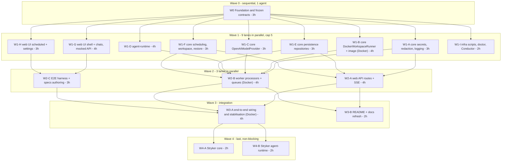

# Agent Hangar — Implementation Plan (orchestrator + parallel subagents)

| | |
|---|---|
| **Status** | ✅ Approved — 2026-08-19 · task files: [docs/tasks/](tasks/README.md) |
| **Source spec** | [docs/spec/](spec/README.md) (01–10) — this plan executes it; where they differ, this plan wins on *sequencing*, the spec wins on *behaviour* |
| **Execution model** | One orchestrator session; each workstream = one isolated subagent in its own git worktree = one PR. Workstreams in the same wave run **in parallel** |
| **Quality bar** | TS strict, zero suppressions, JSDoc on every export, **100 % coverage on all four metrics (lines / branches / functions / statements) per package**, gates green before every PR. Stryker 10 mutation testing is the **final wave** and is explicitly allowed to slip |
| **Last updated** | 2026-08-20 · every count in §12 is re-derived from `gh` and `git` at the top of that section, never carried forward from this line |

**If you have just arrived.** This is the *build plan*: how the work was cut into lanes that own
disjoint paths, in what order those lanes run, and what each one has to prove before it merges.
It does not describe what the product does — [docs/spec/](spec/README.md) does that, and `README.md`
is the operator's entry point.

- **"What is the state of this project?"** → [§12 Status dashboard](#12-status-dashboard-orchestrator-keeps-this-current).
  It holds the lane table, the fixes merged alongside the lanes, and the per-lane task counts, and
  it names the `gh` and `git` commands that settle any disagreement with it.
- **"What is known to be wrong or missing?"** → [§14 Routed findings](#14-routed-findings-that-no-lane-owns-yet).
  Every defect and gap that no merged lane closed, open and closed alike, with the reasoning that
  put it there.
- **"Why is it built this way?"** → §1–§4 (requirements, reuse scan, parallelism rules, wave plan).
- §5–§9 are the lane briefs, §10 the risk register, §11 the orchestration protocol and §13 the
  original estimates. They are the instructions the build ran on and are kept as the record of it;
  they are not a description of today.

---

## 1. Requirements restatement

Build the system in [docs/spec](spec/README.md) — chats backed by isolated Docker workspaces, scheduled jobs in fresh workspaces, encrypted settings, SSE streaming, Conductor-ready local setup — **as fast as wall-clock allows without lowering quality**, by:

1. Splitting the work into **workstreams that own disjoint paths**, so several subagents can implement concurrently in separate worktrees and their PRs merge without conflicts.
2. Freezing **all cross-workstream contracts first** (types, Prisma schema, Zod schemas, test doubles, dependency manifest, tooling) so parallel agents build against interfaces, never against each other's in-progress code.
3. Enforcing the same gates in every PR: lint, typecheck, unit tests with **100 % coverage on every metric**, integration tests where the workstream touches real infrastructure, JSDoc/test-comment policy, self code review to zero findings.
4. Running **Stryker 10** last, per package, as separate non-blocking PRs, with the CI mutation gate switched on only when the score holds.

Non-negotiables carried from the spec: scope exactly as the spec lists (nothing more), English-only artefacts, no secrets anywhere but encrypted Postgres rows, dockerode confined to `packages/core/src/runner/docker/**`.

## 2. Reuse scan (simplicity ladder §0)

- **Codebase:** empty repository (no commits) → every file is new by necessity; no per-file justification is repeated below.
- **Org libs / siblings:** `@bymax-one/*` are NestJS-oriented; this project is Next.js + plain Node worker, so nothing is imported. Proven *patterns* are reused from the knowledge vault: SSE (no compression, `Last-Event-ID` replay, same-origin route), BullMQ Job Schedulers (`upsertJobScheduler`, `maxRetriesPerRequest: null` only on workers), Prisma 7 driver adapter (`$connect()` is lazy → `SELECT 1` at boot), macOS `127.0.0.1` over `localhost`.
- **Platform / stdlib:** `node:crypto` (AES-256-GCM, `randomUUID`, `timingSafeEqual`), `fetch`, `AbortController`, `URL`, `Intl`, `structuredClone`.
- **Installed deps that cover needs (no custom code):** `openai` (Responses streaming), `bullmq`/`ioredis`, `dockerode`, `@prisma/client` + `@prisma/adapter-pg`, `zod`, `pino`, `cron-parser` (cron validation + next run), `react-markdown` + `rehype-highlight` (assistant Markdown), `shadcn` components, `lucide-react`, `msw` (test-mode GitHub API), `@testing-library/react`, `@vitest/coverage-v8`, `@playwright/test`, `@stryker-mutator/core` + `vitest-runner`.
- **Reusable units planned once:** `packages/core/src/testing/**` (fakes used by every workstream), `apps/web/src/shared/ui/**` (shadcn + project primitives, zero domain imports), `packages/core/src/agent-protocol/**` (shared by worker and runtime).

## 3. Parallelism rules (learned the hard way — do not skip)

1. **One agent per directory, one directory per agent.** Every workstream below has an **Owned paths** list; an agent may create/edit only there (plus its own test files). Reading anything is fine. Touching another stream's path = the PR is rejected by the orchestrator.
2. **No dependency additions inside waves.** Wave 0 installs the complete manifest (§5). A stream that truly needs a new package stops and reports; the orchestrator adds it in a tiny `chore(deps)` PR on `main` first. This is what keeps `pnpm-lock.yaml` conflict-free.
3. **Docker-running tests are a shared resource.** Only streams marked 🐳 run real-Docker integration tests, and the orchestrator runs **at most one 🐳 stream at a time** (OOM/port pressure on a laptop). Everyone else tests against `FakeWorkspaceRunner`.
4. **Concurrency cap: 5 subagents** at once (more buys little and risks OOM from five `next build`/`vitest` processes).
5. **Shared files are pre-split.** `packages/core/src/index.ts` re-exports one barrel per folder; a lane adds exports only to the barrel of the folder it owns. Each package's `vitest.config.ts` `coverage.include` was the one file several lanes appended a line to, one line per lane at the end. **That convention is retired**: every package now measures its whole `src/**`, so a new folder is covered the moment it exists and no file depends on a lane having remembered to claim it. Root `package.json` scripts are owned by W1-I (merged first).
6. **Contracts are frozen after Wave 0.** A stream that needs a contract change opens a 1-file PR against `packages/core/src/**/types.ts` (+ Zod) and waits for the orchestrator to merge and notify dependants. Changes must be additive.
6. **Each subagent: `isolation: "worktree"`, branch `feat/<stream-id>-<slug>`, steps 0–4 only** (branch → implement → gates → self-review → commit/push/open PR → return PR number + summary). The orchestrator owns merge, CI watching, review-thread resolution, and chaining (see §8).
7. **Verify, don't trust:** orchestrator confirms every stream via `git`/`gh` (commits ahead, PR number, CI state) — never via the agent's narration.

## 4. Wave plan (critical path and parallel lanes)



**Dependency graph (what each lane needs merged before it starts)**

| Lane | Needs merged | Why |
|---|---|---|
| W1-A … W1-H | W0 | contracts, tooling, deps |
| W1-I | W0 (+ W1-A, W1-C, W1-E for the doctor/rotate-key tasks) | runs in the second Wave 1 batch; merges first within that batch (root scripts block) |
| W2-A (web API) | W1-A, W1-E, W1-F | secrets status, repositories, scheduling validation |
| W2-B (worker) | W1-A, W1-B, W1-C, W1-D, W1-E, W1-F | everything the processors orchestrate |
| W2-C (E2E authoring) | W1-G, W1-H | UI selectors; specs run for real only in W3-A |
| W3-A | all W2 | wiring, real OpenAI smoke, E2E green |
| W3-B | W2 (can start on W1 and rebase) | docs |
| W4-A/B | W3-A | mutation on stable code |

Estimated wall-clock with cap 5: **≈ 3 h (W0) + ≈ 7 h (W1 in two batches) + ≈ 4 h (W2) + ≈ 4 h (W3) + ≈ 2 h (W4) ≈ 20 h** of agent time, versus ≈ 45 h sequential. Human time is review/merge decisions only.

## 5. Wave 0 — Foundation & frozen contracts (single agent, critical path)

**Goal.** After this PR merges, eight agents can start without asking questions.

**Scope.**

1. **Monorepo & tooling** — `pnpm-workspace.yaml` (`apps/*`, `packages/*`), root `package.json` (`packageManager: pnpm@11`, `engines.node: 24`), `tsconfig.base.json` (strict + `noUncheckedIndexedAccess`, `exactOptionalPropertyTypes`, `verbatimModuleSyntax`, `isolatedModules`), per-package `tsconfig.json` with project references, path alias `@/` per app, ESLint flat config (typescript-eslint, import-x order, security, `no-restricted-imports`: dockerode outside `packages/core/src/runner/docker/**`, `crypto` → `node:crypto`, no `enum` via `no-restricted-syntax`), Prettier + tailwind plugin, Husky + commitlint + lint-staged, `.editorconfig`, `.nvmrc`, `.gitignore` (`.env*`, `master.key`, coverage, reports), `CLAUDE.md` (project rules: ownership map, gates, no-secrets canaries).
   - **TypeScript pinned to `~6.0.3`** (decided — spec 01 R1): latest stable JS-line compiler; TS 7 (native, `latest` tag) is not used because its programmatic API is unstable until 7.1. `tsconfig` avoids options removed in TS 7 (`baseUrl`, legacy `moduleResolution`) so a later upgrade is a version bump. Record in README "Decisions".
2. **Complete dependency manifest** installed and locked (no stream adds deps later):
   - root dev: `typescript`, `eslint` + `typescript-eslint` + `eslint-plugin-import-x` + `eslint-plugin-security` + `eslint-plugin-react-hooks` + `@next/eslint-plugin-next`, `prettier` + `prettier-plugin-tailwindcss`, `husky`, `lint-staged`, `@commitlint/cli` + `config-conventional`, `vitest` + `@vitest/coverage-v8` + `@vitest/ui`, `tsx`, `esbuild`, `concurrently`, `@stryker-mutator/core` + `@stryker-mutator/vitest-runner` (10.x, configured in W4 only), `gitleaks` via CI action (not npm).
   - `packages/core`: `zod`, `pino`, `@prisma/client`, `@prisma/adapter-pg`, `pg`, `prisma` (dev), `bullmq`, `ioredis`, `dockerode` + `@types/dockerode`, `openai`, `cron-parser`, `tar-stream` (copy files into containers if needed by runner).
   - `packages/agent-runtime`: `zod`, `openai` (via core), `execa` **not** used — `node:child_process` suffices (stdlib rung).
   - `apps/web`: `next`, `react`, `react-dom`, `tailwindcss` + `@tailwindcss/postcss`, `shadcn` (dev) + generated components deps (`@base-ui-components/react`, `class-variance-authority`, `clsx`, `tailwind-merge`, `lucide-react`, `sonner`, `cmdk`), `react-markdown`, `rehype-highlight`, `remark-gfm`, `@testing-library/react` + `jest-dom` + `user-event`, `jsdom`, `msw`, `@playwright/test`.
   - `apps/worker`: `pino-pretty` (dev).
3. **Frozen contracts in `packages/core`** (copied from [spec 03](spec/03-interfaces.md), with Zod schemas where data crosses a boundary): `src/runner/types.ts`, `src/model/types.ts`, `src/agent-protocol/{types,schemas,ndjson}.ts` (codec included — tiny and shared), `src/secrets/types.ts` (`SecretsService`, `Redactor`), `src/scheduling/types.ts`, `src/workspace/types.ts` (lifecycle states, `RestoreContext`), `src/persistence/ports.ts` (repository interfaces: `ChatRepository`, `MessageRepository`, `TurnRepository`, `WorkspaceRepository`, `ScheduledJobRepository`, `JobRunRepository`, `ToolCallLogRepository`, `SecretRepository`), `src/api/contracts.ts` (Zod request/response schemas for every route in spec 03 §4 + SSE frame type), `src/queues/contracts.ts` (queue names, job names, payload schemas), `src/config/{schema,instance}.ts` (env schema + instance/port derivation — implemented here because every app boots through it), `src/errors.ts` (typed error classes: `WorkspaceImageMissing`, `SecretIntegrityError`, `ProtocolError`, …).
4. **Test doubles** in `src/testing/**`: `FakeWorkspaceRunner` (in-memory FS per handle, scripted exec), `FakeAgentModelProvider` (script keyed by last user message, supports tool-call sequences and delays), `FakeClock`, `InMemory*Repository` for every port, `canaries.ts` (`GITHUB_CANARY = 'ghp_TESTCANARY…'`, `OPENAI_CANARY = 'sk-TESTCANARY…'`). Fully unit-tested (100 %).
5. **Prisma 7** — `prisma/schema.prisma` exactly as [spec 02](spec/02-data-model.md), `prisma.config.ts`, first migration incl. the partial unique index (one live workspace per chat), `src/persistence/client.ts` (adapter-pg, `SELECT 1` on boot helper).
6. **Infra skeleton** — `infra/docker-compose.yml` (postgres 18 / redis 8, parameterised), `infra/workspace/Dockerfile` (base only; runtime bundle COPY added by W1-D), `infra/scripts/env.sh` (instance/port derivation — mirrors `config/instance.ts`), `.env.example`, root scripts: `setup`, `dev`, `build`, `lint`, `typecheck`, `test`, `test:integration`, `test:e2e`, `infra:*`, `db:*`, `doctor` (stub that W1-I completes).
7. **Apps skeleton** — `apps/web`: Next 16 App Router, Tailwind v4 with the full token set from [spec 10 §2](spec/10-ui-design.md) in `app/globals.css` (`@theme`, light/dark), shadcn init (Base UI, new-york) + the component set from spec 10 §5 generated into `src/shared/ui/`, `next/font` Inter + JetBrains Mono, `(app)/layout.tsx` with an **empty** sidebar slot and routes `/chats/new`, `/chats/[id]`, `/scheduled`, `/scheduled/[id]`, `/settings` rendering placeholders, `src/shared/api/client.ts` (typed fetch over `api/contracts`), `vitest.config.ts` (jsdom, 100 % thresholds, `coverage.include: ['src/**']`), `playwright.config.ts`. `apps/worker`: `src/main.ts` boots config, Postgres `SELECT 1`, Redis ping, logs, graceful shutdown; `vitest.config.ts` 100 %.
8. **CI** — `.github/workflows/ci.yml` with jobs `lint`, `typecheck`, `unit` (coverage thresholds enforced by Vitest config), `integration` (services postgres/redis; runs `@docker`-tagged tests), `e2e`, `build`, `secret-scan` (gitleaks). `mutation` job added in W4. `pnpm/setup@v2` for pnpm 11 + Node 24.
9. **Plan hygiene** — `docs/plan.md` §9 status table initialised; `CLAUDE.md` includes the ownership map (§6) verbatim so every subagent sees it.

**Owned paths.** Everything (only agent in this wave).

**Gates / DONE.** `pnpm setup && pnpm dev` serves placeholder pages; `pnpm lint typecheck test` green with 100 % coverage on `packages/core/src/testing/**`, `config/**`, `agent-protocol/**`, `errors.ts`; CI green on the PR; TS 6 pin recorded in README "Decisions"; `CLAUDE.md` present. Complexity: **HIGH** (breadth), ~3 h.

## 6. Wave 1 — parallel workstreams (after W0 merges)

Each lane below is one subagent prompt. Common to all: read `CLAUDE.md`, the spec documents named, and the contract files; TDD (`/bymax-quality:tdd`) — tests first; JSDoc on exports; test-file headers + `it()` comments; 100 % coverage on **owned** `src/**` (the package's `vitest.config` `coverage.include` was scoped to owned paths during the waves and now covers the whole `src/**`); no new deps; `/bymax-quality:code-review` to zero findings; open PR; return PR number.

### W1-A — Secrets, redaction, logging (core) — complexity MEDIUM, ~3 h

- **Reads:** spec 03 §6, 04 (d), 06 §2.
- **Owned:** `packages/core/src/secrets/**` (AES-256-GCM `SecretsService` impl over `SecretRepository` port, `MasterKeyFile` 0600 create/verify, `keyVersion`, `reveal` marked worker-only), `packages/core/src/redaction/**` (`Redactor`: exact values + shape patterns, `redactJson`, idempotent), `packages/core/src/logging/**` (pino factory with redact paths + `Redactor` serializer; no PII).
- **Tests:** unit suite from spec 06 §2 (roundtrip, iv uniqueness, tamper → `SecretIntegrityError`, wrong key, key-file perms, all shape patterns, deep JSON, idempotence, no false positive, logger never prints canaries).
- **DONE:** 100 % coverage; canaries never appear in any test output (`vitest` reporter grep assertion).

### W1-B 🐳 — DockerWorkspaceRunner + workspace image — complexity HIGH, ~4 h

- **Reads:** spec 03 §1, 05 §5, 06 §3.
- **Owned:** `packages/core/src/runner/docker/**` (socket resolution, container spec builder with labels/limits/security opts, `create/exec/signal/snapshot/destroy/health/list`, exec demux, timeout → KILL), `infra/workspace/**` (Dockerfile: node:24-bookworm-slim, git, rg, jq, python3, build-essential, user `agent`, `/workspace`, `askpass.sh`, git config; `ENTRYPOINT sleep infinity`), script `pnpm infra:image`.
- **Tests:** unit (pure parts with faked dockerode: socket order, spec builder, demux, timeout path); integration `@docker` (create/health/exec stdout+stdin/timeout/signal/snapshot on a real git repo/destroy/list, two-workspace isolation, limits applied, image missing → `WorkspaceImageMissing`). Integration runs only when `DOCKER_AVAILABLE=1`; otherwise the suite **fails loudly** with instructions (never silently skipped in CI).
- **DONE:** 100 % coverage on unit-testable modules; `@docker` suite green locally; image builds in < 3 min; `docker inspect` shows no secrets in image config.

### W1-C — OpenAIModelProvider — complexity MEDIUM, ~3 h

- **Reads:** spec 03 §2; official Responses API docs (verify event names at build time).
- **Owned:** `packages/core/src/model/openai/**` (provider over `openai` SDK `responses.stream`, tool mapping with `strict: true`, event mapping table, error mapping 401/429/400-context, `store:false`, `previousResponseId`, `listModels`), `packages/core/src/model/registry.ts` (`createModelProvider(name)` → openai | fake), `packages/core/fixtures/openai/*.ndjson` (recorded, redacted stream fixtures: text, tool call with args deltas, completed+usage, failed, refusal).
- **Tests:** unit with a fake SDK client replaying fixtures; every `ModelEvent` variant produced; error mapping; model id from input only.
- **DONE:** 100 % coverage; a `scripts/record-fixtures.ts` exists (manual, needs a real key, documented).

### W1-D — Agent runtime (inside the container) — complexity HIGH, ~4 h

- **Reads:** spec 03 §3, 04 (a), 06 §2 runtime section.
- **Owned:** `packages/agent-runtime/**` (`cli.ts` `turn`/`--version`, `protocol.ts` stdin reader/stdout writer using core NDJSON codec, `prepare.ts` clone/checkout/`expectedHeadSha` check, `loop.ts` step loop with limits + cancellation via SIGINT → `AbortController`, `tools/{run-shell,read-file,write-file,list-dir}.ts` with path confinement, truncation, timeout, env scrubbing, `GIT_ASKPASS`, `redact.ts` shape-only redaction, `git-events.ts` push detection, `esbuild.config.mjs` → `dist/cli.js`), and the two `COPY` lines in `infra/workspace/Dockerfile` **by instruction to the orchestrator** (W1-B owns the file; W1-D's PR description lists the exact lines; orchestrator applies them when merging the second of the two).
- **Tests:** unit for every tool against a temp dir (escape attempts, symlink, truncation notice, timeout, scrubbed env), loop with `FakeAgentModelProvider` (stops with no tool calls, `maxSteps`, cancel → `turn.cancelled`, event ordering), protocol framing, prepare against a local bare repo (`git init --bare` in tmp) incl. `workBranch` checkout and sha mismatch warning.
- **DONE:** 100 % coverage; `node dist/cli.js --version` works; bundle < 2 MB; no dependency on Postgres/Redis.

### W1-E — Persistence repositories (core) — complexity MEDIUM, ~3 h

- **Reads:** spec 02, 03 §6 (`Redactor` is injected), 06 §3 persistence.
- **Owned:** `packages/core/src/persistence/repositories/**` (Prisma implementations of every port; message `seq` in a transaction; redact-on-write via injected `Redactor`; mapping Prisma enums ↔ string-union domain types), `packages/core/src/persistence/testing/db.ts` (integration helper: truncate tables, connect to `AH_INSTANCE=test`).
- **Tests:** unit (mapping functions, redact-on-write with an in-memory fake Prisma client is **not** done — instead) integration against compose Postgres (`pnpm test:integration`, tag `@db`): CRUD per repo, cascade, partial unique index enforced, gap-free `seq` under `Promise.all`, canary never stored.
- **DONE:** 100 % coverage (integration counts toward coverage for this package — `vitest` run includes `@db` tests when DB available; CI always has DB).

### W1-F — Scheduling, workspace lifecycle, restore context (core) — complexity MEDIUM, ~3 h

- **Reads:** spec 02 §4, 03 §5, 04 (b)(c).
- **Owned:** `packages/core/src/scheduling/**` (cron validation via `cron-parser`, `nextRunAt` with tz/DST, overlap policy, `reconcile(dbJobs, schedulers)` diff, scheduler key helpers), `packages/core/src/workspace/**` (lifecycle state machine with illegal-transition errors, `ensureWorkspaceDecision`, idle-TTL selection, orphan reconcile decision), `packages/core/src/restore/**` (`buildRestoreContext` → `TurnRequest` fields: history window + `TOOL_SUMMARY` compaction + restoration notice + `expectedHeadSha`), `packages/core/src/queues/{queues,schedulers}.ts` (BullMQ queue/worker factories, `upsertJobScheduler`/`removeJobScheduler` wrappers, `maxRetriesPerRequest: null` on workers only).
- **Tests:** unit for all pure modules (DST boundaries, window budget, compaction text, notice text); integration `@redis` for queue factories and scheduler upsert/remove/list against compose Redis.
- **DONE:** 100 % coverage.

### W1-G — Web UI: shell + chats (mocked API) — complexity HIGH, ~4 h

- **Reads:** spec 10 (all), 03 §4 contracts, 04 (a)(b) for states.
- **Owned:** `apps/web/src/features/shell/**` (`AppSidebar`, `ChatList`, search ⌘K, env pill, theme toggle, keyboard shortcuts), `apps/web/src/features/chats/**` (`Composer` + `RepoPicker` + `BranchPicker`, `SuggestionCard`, `Transcript` + `UserMessage`/`AssistantMarkdown`/`ToolCallRow`/`SystemNotice`/`StreamCursor`, `StatusPill`, `ErrorCard`, archived banner, SSE client hook `useTurnEvents` with reconnect + `Last-Event-ID`, streaming reducer), pages `app/(app)/chats/new/page.tsx`, `app/(app)/chats/[id]/page.tsx`, `app/(app)/layout.tsx` (fills the sidebar slot), `apps/web/src/mocks/**` (MSW handlers implementing `api/contracts` for dev/test, incl. a scripted SSE stream).
- **Tests:** component tests (Testing Library) for every component and state in spec 10 §4.1–4.2 and §6; reducer tests; hook tests with a fake `EventSource`; a11y assertions (labels, roles, focus order) — 100 % coverage.
- **DONE:** `pnpm dev` with `NEXT_PUBLIC_API_MOCK=1` shows the home composition matching spec 10 §4.1 and a streaming chat from MSW; Lighthouse a11y ≥ 95 locally (screenshot in PR).

### W1-H — Web UI: scheduled + settings — complexity MEDIUM, ~3 h

- **Reads:** spec 10 §4.3–4.4, 03 §4.
- **Owned:** `apps/web/src/features/scheduled/**` (`JobsTable`, `JobDialog` + `CronField` + `CronPreview` + timezone combobox, `RunsTable`, `RunDrawer` reusing `Transcript` **by import from `features/chats` barrel? No — cross-feature import is banned**: `Transcript` is lifted by W1-G into `apps/web/src/shared/transcript/**` (zero domain imports) so both features use it; W1-H imports from `shared`), `apps/web/src/features/settings/**` (`SecretField` masked/replace/remove, `EnvSummary`, toasts), pages `app/(app)/scheduled/**`, `app/(app)/settings/page.tsx`, MSW handlers for jobs/runs/settings in `apps/web/src/mocks/scheduled.ts`, `settings.ts` (separate files from W1-G's).
- **Tests:** component tests for all states (empty, loading, error, validation, mask), cron preview text, 100 % coverage.
- **DONE:** both pages match spec 10 wireframes with MSW; a11y checks pass.

> Coordination note for W1-G/W1-H: W1-G creates `apps/web/src/shared/transcript/**` **first** (in its first commit) and the orchestrator merges W1-G before W1-H's final rebase; until then W1-H develops `RunDrawer` against a local stub and swaps the import at rebase. This is the only soft coupling in Wave 1.

### W1-I — Infra scripts, doctor, Conductor — complexity LOW, ~2 h

- **Reads:** spec 05 (all), 01 R2.
- **Owned:** `infra/scripts/{setup,run,archive,doctor,rotate-key}.sh`, `.conductor/settings.toml`, `infra/docker-compose.yml` (compose-profile `test` + healthchecks), `.env.example`, root `package.json` **scripts block only** (orchestrator-mediated: W1-I's PR is merged first in its batch to avoid `package.json` conflicts; other streams do not edit scripts).
- **Tests:** `bats`-free shell tests via Vitest spawning the scripts with env permutations (`AH_INSTANCE`/`CONDUCTOR_*` precedence, slugify, port math, idempotent setup, archive leaves no `ah-ws-<instance>-*`); `doctor` output snapshot.
- **DONE:** two instances (`default`, `feat-x`) start side by side with distinct ports/DBs; `doctor` table correct for both; Conductor file validates against its schema.

## 7. Wave 2 — integration lanes (after the listed W1 lanes merge)

### W2-A — Web API routes + SSE — complexity HIGH, ~4 h

- **Reads:** spec 03 §4–5, 04 (a)(d), vault SSE gotchas.
- **Owned:** `apps/web/app/api/**` (all routes from spec 03 §4, Zod-validated via `api/contracts`, repositories from core, queue producers, settings routes with request-logging disabled, `events` SSE routes: Redis Streams `XRANGE` replay + `XREAD BLOCK` tail, heartbeat, no compression, cancel via Redis pub/sub command channel), `apps/web/src/server/**` (DI container: prisma client, repos, queues, secrets service status-only, redactor, github client for `/api/repos`), `apps/web/proxy.ts` only if needed (none planned).
- **Tests:** route handler unit tests with in-memory repositories + fake queue (validation, status transitions, settings never leak plaintext); integration `@redis` for SSE replay/tail/heartbeat; 100 % coverage.
- **DONE:** UI runs against real API with `NEXT_PUBLIC_API_MOCK=0` for chats/jobs/settings CRUD (turns stay queued until W2-B).

### W2-B 🐳 — Worker processors — complexity HIGH, ~4 h

- **Reads:** spec 04 (a)(b)(c), 03 §5, 06 §3 worker e2e.
- **Owned:** `apps/worker/src/**` (`processors/run-turn.ts`, `processors/run-scheduled-job.ts`, `processors/gc.ts`, `scheduler-reconcile.ts`, `commands.ts` (cancel channel), `events.ts` (XADD publisher with MAXLEN/EXPIRE), `container.ts` (DI), `main.ts` wiring + graceful shutdown + image-present check at boot).
- **Tests:** unit with `FakeWorkspaceRunner` + `FakeAgentModelProvider` + in-memory repos (ordering of persisted events, statuses, `finally` destroy for jobs, overlap policy, stalled recovery, cancel); integration 🐳 `@docker @db @redis`: full turn with real container + fake provider, GC reaps idle + orphan, restore turn clones `workBranch`, scheduled run creates and destroys its container; 100 % coverage.
- **DONE:** with `AGENT_MODEL_PROVIDER=fake`, a chat turn round-trips UI → API → worker → container → SSE → UI.

### W2-C — E2E harness + specs (authoring) — complexity MEDIUM, ~3 h

- **Reads:** spec 06 §4.
- **Owned:** `apps/web/e2e/**` (fixtures: DB reset, local git server container `infra/test/gitserver/**` (owned too), MSW-in-server for GitHub API in test mode, helpers), the six specs from spec 06 §4, `playwright.config.ts` projects (chromium), `pnpm test:e2e` wiring, CI `e2e` job body.
- **Tests:** the specs themselves; run against W1-G/H + MSW to validate selectors; full runs only in W3-A.
- **DONE:** specs compile, selectors resolve against the mocked UI, harness boots/tears down cleanly.

## 8. Wave 3 — wiring, stabilisation, docs (2 lanes)

### W3-A 🐳 — End-to-end wiring & stabilisation — complexity HIGH, ~4 h (single agent; touches many paths, so nothing else runs in `apps/**` concurrently)

- Widen every `vitest.config` `coverage.include` to the whole package (`src/**`) and keep 100 %; wire remaining seams (worker image check banner in UI, `/api/health` ↔ env pill, cancel button, restore banner, settings-missing gate); run Playwright suite for real (Docker + Postgres + Redis + fake provider) until green 3× in a row; run **one real OpenAI smoke** with the user's key (documented script `pnpm smoke:openai`, not in CI); fix flakiness at the root; UI polish pass against spec 10 §10 checklist on real data; `pnpm infra:doctor` final; CI all jobs green.
- **Owned:** any path, one agent. **DONE:** spec 01 §5 success criteria S1–S6, S8 verified and listed in the PR with evidence.

### W3-B — README + docs refresh — complexity LOW, ~2 h (parallel with W3-A; owns only `README.md`, `docs/**`)

- README per spec 05 §7 (quick start, config table, scripts, Conductor, testing, security notes, troubleshooting, known gaps, decisions, deployment appendix = spec 08 condensed with a link); refresh `docs/spec/*` to match reality (versions, names); this plan's §9 updated.

## 9. Wave 4 — Stryker 10 mutation testing (done: every scope at 100)

Deliberately last: the code is stable, so mutants are meaningful, and if time had run out the product would have been complete without it.

**Status: done on 2026-08-23.** It was taken up after being deferred on 2026-08-20, and it grew past the two lanes written here. The two lanes named `packages/core` and `packages/agent-runtime`; what shipped covers those plus `apps/worker`, `apps/web` and `infra/scripts/lib`, each at a score of **100.00** with `break: 100`. Choosing directories in advance decides where to look rather than what is true, and the widening is what found most of what was found.

| Scope | Mutants | Score | Config |
|---|---|---|---|
| `packages/core` | 3,927 | **100.00** | `packages/core/stryker.config.mjs` + `vitest.stryker.config.ts` |
| `packages/agent-runtime` | 944 | **100.00** | `packages/agent-runtime/stryker.config.mjs` |
| `apps/worker` | — | **100.00** | `apps/worker/stryker.config.mjs` + `vitest.stryker.config.ts` |
| `apps/web` | 3,723 | **100.00** | `apps/web/stryker.config.mjs` + `vitest.stryker.config.ts` |
| `infra/scripts/lib` | 836 | **100.00** | root `stryker.config.mjs` + `vitest.stryker.config.ts` |

`pnpm test:mutation` runs all five through `scripts/run-mutation.sh`, which mirrors `run-tests.sh`: every scope runs whatever the ones before it did, sequentially, and the exit code is non-zero if any fell under its threshold. `infra/scripts/lib` needed the root configuration because it is not a pnpm workspace and the recursive script never reached it — twelve modules behind `doctor.sh`, `rotate-key.sh` and the smoke check that no mutation run had ever touched.

Rules held throughout: kill survivors by **strengthening tests**, or by simplifying the code to the value that serves; a `// Stryker disable` only where no observer can tell the two answers apart, always with its reason in the source. The `mutation` CI job was **not** added: a full sweep is about two hours, which belongs in a nightly workflow or a deliberate local run rather than in front of every change.

### What a 100 % covered suite still could not see

Every scope was already at 100 % coverage on four metrics before this wave. The mutants that survived that were, in order of how often they appeared:

1. **Doubles kinder than the thing they stood in for.** A `matchMedia` stub that called back whatever listener it was given regardless of event name; a Redis probe double that did the same, hiding whether the probe subscribed to the `error` ioredis actually emits; a `FakeRedis` recording `disconnect` as a boolean, so releasing a connection twice looked identical to releasing it once. Each was fixed in the double, which then failed the test that had been passing.
2. **Assertions comparing a constant with itself.** `expect(shortcutLabel('search', 'mac')).toBe(SHORTCUTS.search.label)` agrees however the label is spelled, including as nothing. The same shape hid the storage keys, the doctor's status vocabulary, the smoke check's prompt and usage line, and every message an operator reads.
3. **Resources nothing checked were given back.** A leaked heartbeat interval per SSE connection; the smoke check's deadline timer, which would have kept the process alive after it printed its verdict; the probes' three teardown deadlines. All are now asserted under fake timers, where a leaked timer is measurable rather than fatal.
4. **Real behavioural gaps.** A rollback that would have missed a row an interrupted key rotation had already re-sealed, reporting a clean rollback over a split store while the operator deletes the only key that opens it. A smoke check that accepted a successful `read_file` as proof the agent could list a repository and write a file. A chunk decoder that would have corrupted any non-ASCII character landing on a chunk boundary.

### Sizing and sequencing, measured rather than assumed

### Sizing and sequencing, measured rather than assumed

The heading of this section used to say "parallel per package". It no longer does. On 2026-08-22 the
two lanes were probed against `main` on the 14-core / 36 GB laptop with `concurrency: 2`, and the
numbers moved the decision:

| | W4-A `packages/core` | W4-B `packages/agent-runtime` |
|---|---|---|
| Files / mutants in the `mutate` scope | 25 / **1,396** | 9 / **944** |
| Sample measured in full | `redaction/redactor.ts` — 117 mutants, **6 s**, 91.45 % | `tools/run-shell.ts` — 109 mutants, **3 min 51 s**, 83.33 % |
| Cost per mutant | ~0.05 s | ~2.1 s |
| Projected full run | **3–10 min** | **20–40 min** — not the ten this plan assumed |
| Peak RSS over idle baseline | +751 MB (~375 MB per runner) | +662 MB (~330 MB per runner) |

**Memory was not the constraint, and the reason is specific.** For Vitest ≥ 4.1 the Stryker vitest
runner builds its context with `pool: 'threads'`, `maxWorkers: 1`, `maxConcurrency: 1` and coverage
disabled, so a package's own `maxWorkers: 3` never multiplies inside a runner: peak is
`concurrency × one worker`. Two lanes at `concurrency: 2` would cost about 1.4 GB of 36 — nowhere
near the multiplication that the no-parallel-test-agents rule was written against, which came from
per-worker module graphs under a different runner.

**What binds instead is the verdict.** `Timeout` counts as killed and is measured in wall-clock, so a
loaded machine does not merely slow a run, it changes the score — and 24 of `run-shell.ts`'s 109
verdicts were timeouts. So: **one lane at a time, and the same lock covers the full gate run**
(`pnpm test -- --coverage` reaches `apps/web`'s 174 jsdom suites, which is the real memory event of
this wave). **Run W4-B first**: it is the slow lane, the timeout-sensitive one, and the one whose
survivors are sandbox escapes and leaked credentials. W4-A follows and costs minutes.

Four things the lane files got wrong, now corrected in them:

1. `plugins: ['@stryker-mutator/vitest-runner']` is **mandatory** — Stryker globs
   `node_modules/@stryker-mutator/*` relative to the cwd, and under pnpm the packages exist only at
   the root, so without it the run dies with `Cannot find TestRunner plugin "vitest"`.
2. W4-A cannot start without `packages/core/vitest.stryker.config.ts`: the eight repository gates in
   `src/config/**` derive the repo root by climbing four levels from `import.meta.url`, which inside
   `.stryker-tmp/sandbox-N/` lands on `packages/core` and fails with
   `ENOENT … packages/core/packages/core/package.json`, aborting the whole run in the dry phase.
3. `timeoutMS: 20000` is wrong for both packages; the default 5000 is what the projections above
   were measured at.
4. `ignorePatterns` was missing, so the 6.7 MB `dist/` tree was being copied into every sandbox.

`.gitignore` already listed `.stryker-tmp/` and `reports/`, so no work was needed there. The root
`test:mutation` used to be a single recursive `pnpm` invocation; it is now `scripts/run-mutation.sh`,
because a recursive run cannot reach `infra/scripts` (not a workspace) and because `&&` would have
let one scope's failure hide every scope after it.

**A directive binds by comment attachment, not by line.** A `// Stryker disable` placed above
`}, []);` or above `} finally {` is a trailing comment of the statement before it and never binds,
however plausible it looks; it has to lead the whole statement it applies to. Where that would have
swallowed killable mutants inside the same statement, the fix was to split the function —
`rotateSecrets` is now only the lifetime of the revealed plaintext and delegates the rotation
itself, so the directive covers the wrapper and nothing else.

## 10. Risks

| Level | Risk | Mitigation in this plan |
|---|---|---|
| LOW | TypeScript toolchain incompatibility stalls W0 | Decided up front: `typescript@~6.0.3` (stable); TS 7 not used in v1 |
| HIGH | Contract drift discovered mid-Wave 1 | Contracts copied verbatim from spec 03 + Zod; additive-only change PRs; `FakeWorkspaceRunner`/`FakeAgentModelProvider` in W0 give every lane a working counterpart |
| MEDIUM | `pnpm-lock.yaml`/`package.json` merge conflicts | Full manifest in W0; scripts block owned by W1-I and merged first; no deps added in lanes |
| MEDIUM | OOM / port collisions from parallel Docker-heavy lanes | ≤ 1 🐳 lane at a time; `AH_INSTANCE` per worktree (`feat-*` ports) so even two local stacks never collide |
| MEDIUM | 100 % coverage on UI code slows W1-G/H | Components are small and state-driven; MSW + Testing Library; `coverage.include` scoped to owned paths during the wave, widened to the whole package afterwards |
| MEDIUM | Subagent ends without PR (context exhaustion) | Orchestrator verifies via `git`; spawns a *finalize-agent* on the **same worktree path** to run gates, commit, push, open PR |
| LOW | Responses API event names differ from spec | W1-C verifies against official docs and fixtures; provider is the only place that changes |
| LOW | Stryker time budget | Realised and absorbed: the full sweep across all five scopes is about two hours, so it is a nightly or deliberate local run rather than a per-change gate (§9). One scope at a time, because a timeout verdict is wall-clock |

## 11. Orchestrator protocol (copy into the orchestrator session)

```text
ORCHESTRATION PROTOCOL — Agent Hangar (waves of parallel workstreams, one PR per workstream)

ROLES
- WORKSTREAM SUBAGENT (spawned per lane, isolation:"worktree", branch feat/<lane>-<slug>):
  steps 0–4 ONLY: branch off latest main → read CLAUDE.md + the lane's spec sections +
  contract files → TDD implement inside OWNED PATHS only → gates (lint, typecheck, unit
  100 % coverage all metrics, integration if tagged, code-review to zero findings) →
  commit (Conventional, English, no attribution trailers) → push → open PR → RETURN
  {pr, branch, headSha, gates, coverage, notes, contractChangeRequests[]}.
  Do NOT add dependencies, edit paths you don't own, wait for CI, merge, or chain.
- ORCHESTRATOR (this session): owns steps 5–9 per PR and the wave schedule:
  5. background poll until SIGNAL (CI fail | review posted | grace elapsed) — never fixed sleep.
  6. on findings: free the branch (remove the agent's worktree), spawn an isolated fix-agent
     with the exact findings; re-poll.
  7. MERGE only when: CI green (0 fail/0 pending) + 0 unresolved review threads +
     ≥ 4–5 min grace since last push. Re-fetch FRESH thread ids, reply+resolve one by one.
     `gh pr merge --squash --delete-branch`.
  8. sync main, remove worktree, verify no stale remote branch, update docs/plan.md §12.
  9. spawn the next lanes whose dependencies (plan §4 table) are all merged, respecting
     cap 5 and ≤ 1 🐳 lane; stop only when Wave 4 is merged or explicitly deferred.

MERGE ORDER INSIDE A WAVE: W1-I first (scripts block), then any lane as it turns green;
W1-G before W1-H's final rebase; W1-B and W1-D: apply W1-D's Dockerfile COPY lines when
merging the later of the two.

AUTONOMY BACKBONE: never end a turn without a pending tracked job OR an armed long
ScheduleWakeup (1200s+) whose prompt states the CURRENT wave/lane status.

VERIFY, DON'T TRUST: confirm every claim via git/gh (`git rev-list --count main..HEAD`,
`git status --porcelain`, `gh pr view`). Never Read an agent's transcript output file.

RESOURCE RULES: ≤ 5 concurrent subagents; ≤ 1 Docker-integration lane at a time;
each worktree uses AH_INSTANCE=<lane> so local stacks never collide.
```

## 12. Status dashboard (orchestrator keeps this current)

**Where the build stands** — read from `gh` and `git` on 2026-08-21, not from memory.

| | |
|---|---|
| Default branch | `main`; check its latest run with `gh run list --branch main --limit 1` rather than trusting a status recorded here, which ages the moment anything merges |
| Lanes merged | **15 of 17** — the foundation, all nine first-wave lanes, all three integration lanes (web API, worker, end-to-end) and the documentation lane. Their 14 pull requests are #4, #6, #7, #8, #10, #11, #12, #18, #19, #21, #22, #24, #32 and #37; every other merged pull request is an orchestrator fix, which is how the last row of this table is derived |
| Lanes in review | **0**, and a reader can check it without asking GitHub: the lane set is closed at 17 and every one of them is a row of the table below, so a lane in review would say so there |
| Lanes not merged | **2** — both mutation-testing lanes, 🟩 done on 2026-08-23 but held on the local branch `agent/work` at the operator's instruction, so nothing about them is on the remote. Done and unmerged, which is not the same as unfinished — §9 carries the scores |
| Tasks merged | **86 of 94** — the eight that remain are the two mutation lanes', done locally and unpushed |
| Tasks written but not yet merged | **0** — W3-A's six merged with PR #81 and `feat/w3a-integration` no longer exists on the remote. The eight the mutation lanes describe were satisfied by the work on `agent/work` rather than written as task files, because the scope they name is narrower than what shipped |
| Routed findings still open | **2** of the 63 rows in §14 below — R1 and R63, both documented residuals rather than unfinished repairs. Closed rows are marked, not deleted, so this is the count of rows whose **Owner column** does not begin with 🟩 or `superseded`. Read that column, not the whole line: a row can say "superseded" in its prose while still being open, and a check that greps the line miscounts it. It was 31 of 44 before this refresh: six rows (R12, R13, R28, R33, R34, R35) closed against PRs #60 and #61, which had landed without the board recording it, R10 went half-closed and stayed open, and three rows were added of which two are open. It was 26 before PR #83, which closed R32 and R44 and moved R46 and R49 half-way without closing either — a half-closed row stays open and keeps counting, which is why two moved rows changed the number by two rather than by four. **This number moves the day PR #56 merges**: as that branch stands it adds R39, R40 and R41 and closes R16, and it is being reworked, so what arrives may differ. Re-derive rather than trust: read the last column of every `| R…` row and count the ones that do not begin with 🟩 or `superseded` |
| Orchestrator fixes | **No total is recorded here, deliberately.** They are *every merged pull request that is not one of the 14 lane pull requests named two rows up*; to get the number, run `gh pr list --state merged --limit 200 --json number` and subtract those 14. The table below the lane table names the fifty merged by 2026-08-20 — anything merged after that date is missing from it by construction, and the table is a record of what was fixed rather than a count of it. The previous version of this row said "41 merged, 0 open" when the true figure was 48: it double-counted a lane's own pull request as a fix and had no row for nine merged ones. That correction was then overtaken twice more before it could merge — #64 and #62 landed — and its open-side figure was wrong the moment it was typed, because the pull request carrying it was itself an open orchestrator fix and could not count itself. A line that cannot be right while it is being written is not worth keeping right |

Four tables in this section describe the same build and are updated together, because one of them
being stale is how a reader ends up with the wrong answer: the lane table, the two orchestrator-fix
tables beneath it (what has merged, then the one open pull request that moves §14), and the task-progress
table at the end. The lane index in
`docs/tasks/README.md` mirrors the first of them and moves with it, and so does each lane file's own
header block — three places, one value. Where they disagree, the merged state settles it.

Every count above is derived, and each one says from what. **A number is recorded here only when the set it
counts is enumerated in this document** — the 17 lanes, the 94 tasks, the rows of §14. Those move only when
something in these pages moves, and a reader can recount them without leaving the file. The pull requests of
this repository are not such a set: they change while the page is being written. For those, this section keeps
the derivation and the command and not the answer. Nothing here should be believed over `gh pr list --state all
--limit 200` and `git log --oneline origin/main`.

The task counts come from the per-lane task indexes in `docs/tasks/`. A lane's tasks only count as
merged once its pull request lands, so there is no gap today: nothing is on a branch.

**What unblocks what.** Nothing on this board is blocked. Every dependency of the wiring lane —
the web API, the worker and the end-to-end harness — is merged, so W3-A is available to start and
is the only lane whose remaining work is gated on nobody. The two mutation lanes name W3-A as their
dependency, but they are not waiting on it: they were deferred by decision on 2026-08-20 (§9), so
they would still need the operator to say so even if W3-A merged tomorrow.

An earlier version of this paragraph said the wiring lane was gated on the end-to-end lane "in
review". That lane merged as PR #32 on 2026-08-20 and the sentence outlived it, which is why the
lane table now carries the merge state and this paragraph carries only what follows from it.

| Lane | Status | Branch / PR | Coverage | Notes |
|---|---|---|---|---|
| W0 | 🟩 merged | PR #4 | core 100 / web 100 / worker 100 (all four metrics) | TypeScript pinned `~6.0.3` |
| W1-A | 🟩 merged | PR #6 | core 100 (all four metrics) | secret ciphertext bound to its key as GCM AAD; master-key file refuses symlink, FIFO and group/world-readable modes |
| W1-B 🐳 | 🟩 merged | PR #7 | 100/100/100/100 (runner/docker) | subpath export `@agent-hangar/core/runner/docker`; `/opt/agent-runtime` stays root-owned so the workspace cannot replace the askpass helper |
| W1-C | 🟩 merged | PR #10 | core 100 (all four metrics) | openai SDK 7.5.0 verified against its shipped types; no SDK or server text reaches a persisted event |
| W1-D | 🟩 merged | PR #11 | 100/100/100/100 (agent-runtime `src/**`) | three Dockerfile `COPY` lines (bundle, map, `{"type":"module"}` manifest) written in the PR body for the infra lane to apply, not in this diff; path confinement resolves symlinks |
| W1-E | 🟩 merged | PR #8 | core 100 (all four metrics) | status stamps are transactional; `ScheduledJob.prompt` and `Chat.title` redacted on write |
| W1-F | 🟩 merged | PR #12 | core 100 (all four metrics) | BullMQ 6 API read from the installed types |
| W1-G | 🟩 merged | PR #19 | web 100 (all four metrics) | chats list, composer and streaming detail; Lighthouse accessibility 100 on both routes |
| W1-H | 🟩 merged | PR #24 | web 100 (all four metrics) | 27 placeholder files removed and the screens adapted to the real modules; Lighthouse accessibility 100 on all three routes |
| W1-I | 🟩 merged | PR #18 | scripts 100 (all four metrics) | run, doctor, archive, prune and the Conductor wiring; the two-instance walkthrough was executed against real Docker, not simulated |
| W2-A | 🟩 merged | PR #21 | web 100 · core 100 (all four metrics) | 19 routes and both SSE streams; found and fixed a path traversal in the forge slug pattern that would have sent the authorisation header to an unnamed path |
| W2-B 🐳 | 🟩 merged | PR #22 | worker 100 (all four metrics) | three consumers, cancel channel, scheduler reconcile and graceful shutdown; Docker suite ran green six consecutive times with no leftover containers |
| W2-C | 🟩 merged | PR #32 | web 100 (all four metrics) | Playwright harness, a local git server and the six critical-flow specs. Merged against **its own** Definition of Done — specs compile, selectors resolve, the harness boots and tears down — not against a real-mode pass, which §7 assigns to W3-A in as many words. It was the integration canary regardless: five defects blocking a real turn were found through it and fixed elsewhere (the client clone URL, the scheduled-run cancel route, the repository-origin policy, the scripted-provider script and the unwired model provider). The last recorded real-mode figure is **7 of 9**, measured before PR #61. Its two failures were R34 and R35 (R33 is the assertion that could not fail, not a failure) — an earlier version of this row named R33 and R34, which was wrong. PR #61 found and fixed the cause of both: the scripted double omitted arguments the tools require under strict function calling, so four calls were refused before they ran, and the archive check waited for the double's wording rather than the product's. **No real-mode run has been recorded since**, so 9 of 9 is expected and unmeasured — run it before repeating a number here |
| W3-A 🐳 | 🟩 merged | PR #81 | core 100 · web 100 · worker 100 · agent-runtime 100 · scripts 100 (all four metrics) | **All six tasks are done.** Five shipped on their own branches (#74/#75, #77, #79, #76, #80), so `feat/w3a-integration` carries the close-out alone. Spec 01 §5 is answered in the pull request with the artefact for each criterion: **S2, S3, S4, S5, S6 and S8 met**, **S1 partial** — every README command was executed from a fresh clone of the remote (#67, fixed by #69 and #73) and the warm-machine walk from `git clone` to a healthy instance measured 21 s, but the criterion names a *clean* macOS and no clean-machine stopwatch exists, because a cold dependency install and a cold image build cannot be measured on a machine that has already done both. **S7 is not claimed here**: mutation testing was deferred when this lane closed. It has since been done — every scope at 100.00 on 2026-08-23 (§9) — on a local branch that was never pushed, so it changes nothing about what this pull request shipped. One evidence line of the task could not be followed as written and is satisfied by other means, recorded in the pull request: `/api/health` has no `workspaces.live` field — the third task in this lane to ask for one that was deliberately not built — so the same fact is read from the worker heartbeat's `containers` counter, which does exist and answered 0. **The routed §14 rows are not closed here.** Closing this lane closes its six tasks; §14 keeps its own count, and every open row in it stays routed to whoever takes it next |
| W3-B | 🟩 merged | PR #37 | n/a (docs only) | README rewritten against the running system, every command executed from a fresh clone; three claims corrected because verification refuted them (`pnpm doctor` is shadowed by pnpm's own command, five scripts resolved the instance from the shell while `setup`/`run` read `.env.local`, and the `RequestContext` in 09 does not exist); R11 and R20 closed in `docs/AUTOPILOT.md`. The five-scripts finding describes behaviour that PR #39 has since replaced: every instance-acting script now reads the checkout's `.env.local` and refuses on disagreement, and the shadowed command has the working alias `pnpm infra:doctor` |
| W4-A | 🟩 done | local only | core 100.00 · web 100.00 · worker 100.00 · agent-runtime 100.00 · scripts 100.00 (mutation score) | Done on 2026-08-23, on `agent/work`, **not pushed** — the operator asked for the work to stay local. It grew past `packages/core`: the scope is every package plus `infra/scripts/lib`, at `break: 100` — see §9 for what a fully covered suite still could not see |
| W4-B | 🟩 done | local only | agent-runtime 100.00 (mutation score) | Closed with W4-A above: `packages/agent-runtime` mutates the whole of `src/**` rather than `src/tools/**`, and the two lanes turned out to share every configuration decision, so separating them would have been bookkeeping rather than isolation |

**Orchestrator fixes alongside the lanes** (not lanes of the plan; each fixes a defect found while shepherding, and the Status column says whether that fix has landed):

| PR | Status | The defect |
|---|---|---|
| #1 · #2 · #3 | 🟩 merged | The launch decisions, the web security defaults and the container grouping were agreed in conversation and existed nowhere a lane could read them |
| #5 | 🟩 merged | `@agent-hangar/core` was unresolvable from source, so a fresh worktree could not run the worker; repository URLs hardened |
| #9 | 🟩 merged | The `e2e` job installed a browser to run an empty suite, taking 111–1367 s and gating every merge |
| #13 | 🟩 merged | A connection failure repeated the driver message and attached the driver error as `cause`, leaking the database password twice over |
| #14 | 🟩 merged | The destructive-test guard printed the password back when the connection URL had no authority |
| #15 | 🟩 merged | This dashboard had drifted six merges behind reality |
| #16 | 🟩 merged | The workspace image had no agent runtime in it: the bundle was described in a pull request body and never applied |
| #17 | 🟩 merged | Updating this dashboard was treated as an errand to schedule rather than the last step of the merge in front of it |
| #20 | 🟩 merged | The development server could not resolve the shared package at all: it requests the source condition unconditionally and resolves the NodeNext specifiers literally |
| #23 | 🟩 merged | Findings that no lane could close had no record outside a conversation |
| #25 | 🟩 merged | A routed row stated a contract change as though it had landed, and named the wrong remedy for it |
| #26 | 🟩 merged | `pnpm typecheck` emits without rewriting, so it leaves a `dist` whose declarations name files that do not exist |
| #27 | 🟩 merged | The dashboard and the task index disagreed about which lanes were ready |
| #28 | 🟩 merged | The dashboard listed every lane's state but never what it added up to |
| #29 | 🟩 merged | The summary recorded a branch tip and a continuous-integration state, both of which age the moment anything merges|
| #30 | 🟩 merged | The first wave completed and the board still showed a lane blocking it; two delete-versus-edit races had no record|
| #31 | 🟩 merged | A finding was being carried as a limit when a third option closed it outright |
| #33 | 🟩 merged | The scripts suite failed under load from two independent causes: no timeout for its process trees, and workers colliding over the same port bases |
| #34 | 🟩 merged | The configuration offered a configurable forge while two validators refused everything but one hard-coded host, so end-to-end real mode could not start |
| #35 · #36 | 🟩 merged | The board lagged two integration lanes; a web test waited on a request being seen rather than on the settled state. **#37 used to be listed here and is not a fix**: it is the documentation lane's own pull request and belongs to the lane table above, where it already appears — counting it in both places is what made this table's total read one too high |
| #38 | 🟩 merged | Stopping a scheduled run answered 404: the only cancel route resolved through the turn repository, which never holds a run id |
| #39 | 🟩 merged | Five scripts read the instance from the shell while `setup`/`run` read the checkout, the health probes reported a listening socket as a working service, and `pnpm doctor` ran pnpm's own command instead of this project's |
| #40 | 🟩 merged | A Stop the API had already accepted with 202 was recorded as `FAILED` on every branch that ends a run without executing it — in both processors |
| #41 | 🟩 merged | The interface rebuilt clone URLs against a hard-coded origin instead of carrying the one the API returned, so editing an unrelated field of a job silently rewrote its repository |
| #42 | 🟩 merged | The scripted provider's script was set by the end-to-end harness and read by nothing: the worker's container environment is a fixed set that never carried it, so a real run always played the built-in answers |
| #43 · #45 · #48 | 🟩 merged | The dashboard drifted behind the merges three times, and each round of findings had nowhere to live until it did |
| #44 | 🟩 merged | The credential helper released the forge token to any origin a crafted prompt named — the URL authority was cut at `/` only, so `https://evil.test?@github.com` reduced to the approved host; and the policy itself was an environment entry the model could set inline through `bash -lc` |
| #46 | 🟩 merged | `pnpm test` stopped before the scripts project whenever any workspace failed, and `tsc -b && <rewrite>` skipped the rewrite on a failed compile, leaving declarations naming files that do not exist |
| #47 | 🟩 merged | The repository picker gave no sign which repositories the agent cannot push to — read-only or archived — or cannot work from at all, having no branch; and the composer's Send button went dead without saying which of three things was missing |
| #49 | 🟩 merged | The OpenAI provider was never wired into the binary the container runs: `bin.ts` fed no factory and the seam was optional, so every real turn failed with `the openai provider is not wired into this build`. **Spec 01 §5 S1 and S6 had therefore never been demonstrated** |
| #50 | 🟩 merged | `CLAUDE.md` still told authors to chain the declaration rewrite by hand, contradicting the guard that now forbids naming the compiler directly |
| #51 | 🟩 merged | Findings were **deleted** from §14 when they closed, so a reader could not tell one that closed from one that never existed — while the section promised nothing is silently dropped |
| #52 | 🟩 merged | Two optional fields still let an unwired build type-check; the seam had survived #49 because `TurnDeps` restated its members instead of extending, so the two could require different things |
| #53 | 🟩 merged | A chat's **second turn** could never start: preparation chose its path on whether the work branch existed on the *remote* and never looked locally, so a reused workspace whose first turn had not pushed failed with `already exists`. A force-pushed work branch also broke preparation permanently, on an unforced fetch refspec |
| #54 · #55 · #58 · #65 | 🟩 merged | Four more rounds of board work: mutation testing was deferred by decision and had no record saying so; an image built from one checkout serves every instance on the machine and nothing said which checkout it came from; and two rounds of findings from the interface and parallel-fix pull requests had nowhere to live |
| #57 | 🟩 merged | Nine defects the running product showed and no suite did: shortcut labels read `navigator` while rendering, so hydration disagreed with the server pass; a prompt's tooltip carried the raw ISO instant, a machine string in UTC that the prop's own documentation called "currently unused visually" (the fix formats it as local wall-clock time, client-side, so hydration still matches); a picker trigger ran under the control beside it; the branch picker auto-selected the first entry of a listing GitHub returns alphabetically, so an `agent/…` branch was silently pinned into new chats and schedules; the composer sent only on ⌘Enter; the drawer painted its close button over the sidebar's own header control; and two dialogs told the operator to run `pnpm doctor`, which reaches pnpm's built-in command and exits 0 whatever this environment is in |
| #59 | 🟩 merged | A reloaded chat showed only prompts and prose. The mapper emitted a turn's tool calls only under a user message carrying that turn's id, and the API writes the user message before the turn row exists, so the condition could never hold; the push notice and the cancellation line were not reconstructed at all |
| #60 | 🟩 merged | Four routed findings at once — R13, R28, R12 and half of R10. A connection URL's password was redacted by nothing; `env.sh --print-effective` trusted an incomplete file and let the first consumer die on `MASTER_KEY_PATH: unbound variable`; `loadConfig` and `env.sh` disagreed about whether the environment may overrule a derived port, which turned out to be intentional and is now stated and pinned; and the runner port gained `imageExists` so an image check need not create a container |
| #61 | 🟩 merged | The two real-mode end-to-end failures, diagnosed rather than adjusted away. Only `run_shell` streamed, so the other three tools reached the model and nothing else — a row said "no output" beside a byte count that contradicted it. And the scripted double omitted arguments that strict function calling requires, so four calls were refused before they ran: `FAILED` in one to two milliseconds with no exit code, which is why a `sleep 60` left no window for a Stop button |
| #63 | 🟩 merged | The sidebar rail was a one-way door — narrowing below 1024 px collapsed the column and nothing on screen brought it back — and at rail width the footer painted the theme toggle outside the sidebar's own right border |
| #64 | 🟩 merged | The run drawer's "Copy run id" button sat **inside** the sheet close button's box: measured in Chrome at 1280 px, Copy's centre point (1250, 37) lay within the close button, so a click aimed at Copy closed the drawer. One of the three collisions R43 names — R43 itself stays open, because it is about no check in this repository being able to see any of them |
| #62 | 🟩 merged | Retrying a failed turn posted its prompt a second time. Measured on `chat-failed`: one persisted `USER` row before, two after, with a second `Turn` row beside it — the duplicate was in the database, so hiding it in the interface would have made the screen disagree with the record on every reload |

Legend: 📋 ToDo · 🟦 running (branch) · 🟨 PR open · 🟩 merged · 🟥 blocked / held · 🟡 deferred by decision (in the plan, scheduled later — not blocked). The same six symbols are used by [docs/tasks/README.md](tasks/README.md) and by each lane file's own header, and no lane may carry a different one in two places.

**Open pull requests are not inventoried here.** `gh pr list --state open` answers that, and the answer
changes faster than a page can be written — it changed four times while this section was being corrected.
One open pull request is named below, and only because it moves rows of §14, which a reader counting open
findings has to know is coming:

| PR | Status | The defect |
|---|---|---|
| #56 | 🟩 merged | The persistence port offers only unconditional writes, so no workspace or run transition can be arbitrated — the missing primitive R16, R21, R22 and R26 all name. As merged, `WorkspaceRepository.claimStatus(id, from, to)` carries the expected status in the `WHERE` of the update and answers `null` when no row matched, which closes R16, leaves the other three open and adds R39, R40 and R41. **The branch is in rework** — a review challenged the `BUSY` arm of its boot recovery — so read it there rather than treating any of that as settled |

**Task progress per lane.** *Merged* counts tasks whose lane has landed on `main`; *on its branch*
counts tasks a lane has finished but not yet merged. Taken from each lane's own task index, so a
number here is only as current as the last close-out that lane wrote.

| Lane | Merged | On its branch | Total |
|---|---|---|---|
| W0 | 8 | — | 8 |
| W1-A | 5 | — | 5 |
| W1-B | 5 | — | 5 |
| W1-C | 5 | — | 5 |
| W1-D | 5 | — | 5 |
| W1-E | 5 | — | 5 |
| W1-F | 5 | — | 5 |
| W1-G | 7 | — | 7 |
| W1-H | 6 | — | 6 |
| W1-I | 6 | — | 6 |
| W2-A | 6 | — | 6 |
| W2-B | 6 | — | 6 |
| W2-C | 6 | — | 6 |
| W3-A | 6 | — | 6 |
| W3-B | 5 | — | 5 |
| W4-A | 0 | — | 4 |
| W4-B | 0 | — | 4 |
| _(the eight above were satisfied by the local mutation work of 2026-08-23 rather than as task files — §9)_ | | | |
| **Total** | **86** | **0** | **94** |

## 13. Estimated complexity

| Wave | Agent hours (sum) | Wall-clock (cap 5, ≤ 1 🐳) |
|---|---|---|
| W0 | 3 | 3 |
| W1 | 29 | ≈ 7 (two batches: A,B🐳,C,E,F then D🐳,G,H,I — I is short and merges first) |
| W2 | 11 | ≈ 4 |
| W3 | 6 | ≈ 4 |
| W4 | 4 | ≈ 2 (deferrable) |
| **Total** | **53** | **≈ 18–20 h** |

## 14. Routed findings that no lane owns yet

Raised by a review, a lane report or the orchestrator, confirmed against the code, and too large or
too cross-cutting to fold into the lane that found them. **Every OPEN row names exactly one lane**, never a
role and never a choice between two — a closed row names what closed it instead — an owner a reader has to resolve is how an item gets dropped,
which is the failure this section exists to prevent.
Nothing here is silently dropped: an item that ships unfixed becomes a README "Known gaps" entry
stating the residual risk in plain terms. **A closed row is marked, never deleted** — three rows
(R7, R14, R19) were removed on closure before this was written down, which made a reader of this
section unable to tell a finding that closed from one that never existed; they are restored in the table that follows.
These ids are **not** the risk ids of `docs/spec/01-overview.md` §8, which also run from R1: a
reference to "R7" has to name which table it means.

A row can also close as a **decision**: the finding was real, it was measured, and the answer was that the
behaviour is intended. R12 and R48 are the two. Their Owner column begins with 🟩 like any other closed row,
so they do not count as open, and it names the pull request whose reasoning settled it — the point of
keeping them is that the next reader does not close a symptom by undoing a choice nobody told them was one.

The ids run to R63 and none is free; R63 was raised against the running application and routed here as a documented residual rather than fixed. R39, R40 and R41 were allocated on the branch of PR #56 while it was
open and arrived here when it merged, which is the paragraph this one replaces; R51 was raised against the
running application and routed here rather than fixed in silence. Nothing was ever deleted at any id.

| # | Finding | Why it was not fixed in place | Owner |
|---|---|---|---|
| R1 | A task's `run_shell` can read the forge token and send it anywhere the container can reach. Three paths were measured against the real image with the runner's own flags. **One is closed:** `/proc/1/environ` returned `GITHUB_TOKEN` and `OPENAI_API_KEY` with no file involved, because every exec runs as the same uid as the container's main process and PID 1 outlives every turn — nothing puts either credential in the environment any more, so it now returns configuration and no credential. **Three remain.** Two are about the token git needs: the private tmpfs file named by `AH_GIT_TOKEN_FILE`, readable by the task for the duration of a turn, and `askpass.sh` itself, which the task may invoke with a hand-written `Password for 'https://github.com'` prompt and which answers with the token. The third is the handoff file during the start-up that consumes it, measured against the real image: the directory is `0700` but owned by `agent`, because the runtime must be able to unlink what it reads, and every process of the workspace runs as that uid — so `ls`, `cat` and `touch` all succeed there for the workspace user. `run_shell` kills a command's process group on a timeout or a cancellation but not on a normal exit, and a chat reuses its container, so a detached poller left by an earlier turn can win the race between the runner's write and the runtime's read. What bounds this path is the unlink, not the mode. The OpenAI key is no longer reachable by the first two paths: it exists only in the runtime's memory. Egress is still open — `NetworkMode: bridge`, `curl` in the image, `https://api.github.com` reachable. | Narrowed, not closed. The credentials now travel per execution as a file the runner places immediately before the runtime starts and the runtime unlinks as it reads it, so the window is a start-up rather than the life of a container that a chat reuses for every turn. What is left is irreducible without a different process model: git only reaches the credential helper as a child of the task, so a helper the task can call is an oracle whoever owns it, and the file that helper reads has to be readable by the same uid. A setuid or setgid helper is inert under `SecurityOpt: no-new-privileges` and would not help if it worked; a credential daemon fails at the same point, because anything git can dial from the agent's namespace the agent can dial. Both change who may *read* the secret; the exposure is who may *call the broker*. The only shape that removes it keeps the credential out of the container and mediates git from the worker — a process model, not a patch — and it buys little without an egress policy, which an allow-list cannot supply either since the forge is itself somewhere data can be written. The specification requires a personal access token, which rules out a short-lived installation token. So this stays a documented residual with a smaller blast radius: the agent is inside the trust boundary of the token, and the control that holds is the token's scope — the README now tells the reader to create a fine-grained PAT, granted to named repositories, with `Contents: Read and write`, `Metadata: Read-only` and an expiry. Measured after the change: `cat /proc/1/environ` in a container that has just finished a real turn carries neither credential, and the worker's `@docker @db @redis` suite sweeps that container for them; reverting the worker to inject them fails it with `Secret canary leaked: ghp_TESTCANARY…, sk-TESTCANARY…`. | W3-A |
| R2 | The BullMQ scheduler keeps every completed repeatable job. At one job every five minutes that is 288 records a day, growing without bound in Redis. | Retention belongs with the processors that create the jobs, not with the scheduling contract. | 🟩 closed by PR #88 — every scheduler template now carries `JOB_RETENTION`, the constant the producers already used, exported from `queues.ts` rather than restated. Pinned twice, because a template field the library ignored would leave the jobs unbounded while a unit assertion still passed: the unit test asserts the template, and a `@redis` test reads `removeOnComplete`/`removeOnFail` off the delayed job BullMQ actually minted. Reverting the source fails the unit test with the `opts` block missing from the recorded call |
| R3 | `JobRun.workspaceId` is not constrained to workspace-kind identifiers. Both the in-memory double and the Prisma repository must change together for the invariant to mean anything. | Split across two lanes it would be half-enforced, which is worse than not claiming it. | 🟩 closed by PR #88 — `JobRunRepository.setStatus` refuses a workspace that is not `JOB`, in the Prisma repository (a read inside the same transaction, which is sound because `Workspace.kind` is written by the insert and by nothing else) and in the in-memory double, with the same `WorkspaceKindMismatchError`. The rule is written once, in `persistence/testing/run-workspace-kind-contract.ts`, and run against both — reverting either side fails it with `promise resolved "undefined" instead of rejecting` |
| R4 | Vitest resolves `@agent-hangar/core/testing` through the production condition rather than the source. It passes only because the built output happens to be present. | Needs the `development`-condition contract test extended rather than a local workaround. | 🟩 closed by PR #46 — the premise did not reproduce (measured with no `dist`, and again with a poisoned `dist` whose entry points throw). The real gap was that nothing verified it: the check read manifest text, which passes identically either way. It now compares module identity against the source barrel |
| R5 | `packages/core/fixtures/openai/recorded-*.ndjson` is not ignored. A recorded fixture carries whatever the live API returned. | Belongs with the fixture-recording story rather than an unrelated diff. | 🟩 closed by PR #46 — `.gitignore` matches `packages/core/fixtures/openai/recorded-*.ndjson`; the committed synthetic fixtures stay tracked |
| R6 | No continuous-integration job declares `timeout-minutes`. A hung job holds a runner for the platform default of six hours. | Infrastructure hygiene, not a lane deliverable. | 🟩 closed by PR #46 — all seven jobs declare `timeout-minutes`, sized from 34 observed runs |
| R8 | Four contract values are **mirrored** in `apps/worker/src` rather than imported — `TURN_EVENT_FIELD` in `events.ts`, the heartbeat key, timings and schema in `heartbeat.ts`, and the scheduled-delivery payload in `processors/run-scheduled-job.ts`. Each is byte-identical to the definition in `packages/core/src/queues/contracts.ts` today. | They live on the web API lane's branch, which the worker lane may not touch. Two copies of a constant diverge silently and both sides stay green — this must become a one-line import each the moment that branch merges. | 🟩 closed by PR #88 — `events.ts` re-exports `TURN_EVENT_FIELD` from the contract, and the scheduled-delivery payload is `runScheduledJobPayload` itself rather than a no-op `.extend` of it. No assertion on a value can fail while two copies agree — that is what makes the drift silent — so the pin is structural: `apps/worker/src/contracts.test.ts` fails on any non-comment line of `apps/worker/src` that declares a name the contract exports as a constant, or reshapes a schema it exports. It reported both mirrors by file and line |
| R9 | The same-origin guard compares `Origin` against `Host`, which DNS rebinding defeats. Closing it needs a Host allow-list. | 🟩 closed by PR #86 — the allow-list is derived rather than configured: `next dev` and `next start` are both launched with `-H 127.0.0.1`, so the hostnames that can legitimately address the listener are exactly the ones core's `isLoopbackHostname` already defines, and `assertKnownHost` refuses everything else. Nothing for an operator to maintain and nothing to go stale when an instance moves; the port is deliberately not part of it, because instances differ by port and the `Origin` comparison already pins the one a browser addressed. Applied to **every** route, reads and streams included — rebinding is precisely the case where the browser hands the response body back to the attacking page, so the confidentiality argument that excused the reads is what fails. Held by `apps/web/app/api/same-origin-policy.test.ts`, which now sweeps every export with a rebound request and names the route that answers anything but 403. | 🟩 closed by PR #86 — every route now refuses a `Host` that does not name this machine, derived from the bind address (`-H 127.0.0.1`) through core's existing `isLoopbackHostname` rather than from the instance's port, so nothing is operator-maintained and nothing goes stale. The port is deliberately excluded: the `Origin` comparison already pins the port a browser addressed. Reads and streams are covered too, because the confidentiality argument that excused them is exactly what rebinding breaks — a rebound page reads the answer. `same-origin-policy.test.ts` sweeps all 27 exports with a rebound request and names the offending route |
| R10 | `WorkspaceRunner` exposes no `imageExists`, so the boot check and the health card report what the last `create` observed — accurate once anything has run, optimistic before that. | Not the one-file change it looks like: `DockerWorkspaceRunner` and `FakeWorkspaceRunner` both declare that they implement `WorkspaceRunner`, so adding a method to the port breaks both until each implements it — the port, the real runner and the double must land together. | 🟩 **closed by this pull request** (on top of PR #60, which landed the port and both implementations). The two consumers were moved: `probeWorkspaceImage` in `apps/worker/src/app.ts` asks `runner.imageExists(WORKSPACE_IMAGE)` — one call answering both halves of the boot check, since a host that cannot be asked rejects and takes the boot down while a host without the image resolves `false` and only logs — and the heartbeat asks the runner on every beat instead of publishing a remembered value. `apps/worker/src/image-status.ts` is deleted with them: it existed only because the port had no lookup, and keeping it would have left a writer with no reader. The stale header the row complains about went with the function it described. Measured on the running application against a real daemon: `docker rmi agent-hangar/workspace:<instance>` with nothing else changed flipped `GET /api/health` `checks.image` from `{ok: true}` to `{ok: false, detail: "run pnpm infra:image"}` on the next beat, and a boot with the image absent logged `workspace image missing — build it with: pnpm infra:image` and started anyway |
| R13 | A driver error reaching the 5xx log carries the Postgres password. The pino serializer runs the redactor over message and stack, which covers both credentials this repository's rule names — the forge token is now registered by exact value, and the model key never enters the web process — but the database password is neither registered nor shape-matched, so a connection-failure message can put it in a log. | The redaction policy lives in `packages/core/src/redaction`, which is frozen, and the password is not one of the two secrets the stated rule protects. Widening what counts as a secret is a policy decision, not a lane fix. | 🟩 closed by PR #60 — the process-side redactor now treats the password in a URL's userinfo as a credential by shape, so it needs no registration and covers every process. The match is bounded by the authority and is greedy to the last at-sign, which is the WHATWG parser's own rule for where userinfo ends; a password carrying whitespace or a bare quote is still left to registration at boot, and the code says so |
| R15 | Three worker file headers assert that only an unreachable Docker daemon rejects and that BullMQ therefore retries the turn. Measured against the installed library and the queue construction, nothing retries: `attempts` defaults to 0, `enqueueRunTurn` sets none, `createQueue` declares no default job options, and the only redelivery configured is stalled recovery for jobs whose lock lapsed. Either those comments are wrong or the queue options are. | Adding `attempts` and `backoff` belongs in `packages/core/src/queues/queues.ts`, which is frozen. Until it lands, a transport error must stay terminal — leaving the turn non-terminal would strand it with no event on its stream, which is a worse defect than the one it would fix. | 🟩 closed by PR #88 as a decision — the comments were wrong, not the queue options, and making them true would have changed nothing: both processors record the outcome and end the event stream *before* the job is rejected, so a redelivery would find a finished turn and skip. What the wrong comments were masking is the case where that is not true, and it was measured — an unreachable daemon at container-create time left the turn `PREPARING`, error `null`, **no events at all**, for ever. `endUnreportedTurn` is the net: a delivery that ends without an outcome records one and publishes the terminal event, then rethrows. `packages/core/src/queues/queues.ts` is untouched |
| R16 | The workspace claim that serialises the turn processor against the idle collector is process-local, because `WorkspaceRepository` exposes only an unconditional `setStatus` with no conditional update to build a real claim from. It matches today's deployment — one worker process per instance — and says so in its own header. | A `claim(id, expectedStatus, nextStatus)` returning null when the row moved is the honest home for this, and it lives in frozen persistence code. Needed before a second worker process is ever run. | 🟩 closed by PR #56 — `WorkspaceRepository.claimStatus(id, from, to, update?)` carries the expected status in the `WHERE` of the update itself and answers `null` when no row matched, so Postgres arbitrates rather than a process. Every write that commits a writer to a workspace uses it: the turn taking it `BUSY`, the teardown moving it to `STOPPING`, and the reconciler closing out a row whose container is gone. Each names a status nobody owns rather than the status it read — `READY` for the first two — because `BUSY -> STOPPING` and `STOPPING -> STOPPING` are both moves the database would accept, so a claim quoting what it found would be granted over a row that already has an owner. Measured: removing the status from that `WHERE` makes two concurrent callers both win against a real database. The in-process register survives as an optimisation — it spares a worker preparing work it is about to lose — and as the turn-redelivery guard, which no row status can express. Refusing to take a row that is not `READY` removed the unsafe recovery the old unconditional write provided, so boot now closes out what a dead incarnation left half-torn-down; the residual of that is R39 |
| R12 | `packages/core`'s `loadConfig()` still treats the instance-derived ports as defaults, so an explicit `POSTGRES_PORT` in the process environment wins there. `env.sh` is now stricter than the library it mirrors. In practice everything loads from `.env.local`, which `env.sh` writes with derived values, so the two agree today. | Making the identity block non-overridable lives in `packages/core/src/config/schema.ts`, which is frozen and belongs to no open lane. | 🟩 closed by PR #60 — resolved as intended behaviour rather than changed. The script derives an environment and the library reads one somebody else composed, so it cannot tell a derived deployment from one addressing a database elsewhere; this repository's own integration job is that case (instance `test` against Postgres on 5432, which no derivation produces), so sealing the block would refuse it. The reason is now stated where the code is read and both halves are pinned by tests — reversing the merge order fails five |
| R17 | `pnpm test` is `pnpm -r --if-present test && vitest run --project scripts`. The `&&` means a failure in any workspace stops the run, so the scripts suite never executes — a flake elsewhere silently voids it, and the job reports the earlier failure rather than "these tests did not run". Observed: a timing-dependent web test failed, the scripts suite was never reached, and the tests that mattered to the change under review were never executed. | Restructuring the root test script and how continuous integration reports per-workspace results is repository-wide tooling, not a lane deliverable. | 🟩 closed by PR #46 — `scripts/run-tests.sh` runs every workspace suite and then the scripts project unconditionally, reporting per group and still exiting non-zero if any failed |
| R18 | `tsc -b && <rewrite>` short-circuits, so a failing typecheck emits a partial output and skips the rewrite. Worse, a **successful** typecheck also emits without rewriting when it is the root `tsc -b` rather than the package build, which then fails that package's own guard test on the very next test run — a failure nobody introduced. Accepted as unlikely when the chain was written; observed independently twice within the hour, once from a tree with no generated database client and once from an ordinary typecheck-then-test sequence. The working order is typecheck, then build the shared package, then tests. | Preserving the compiler's exit code while always rewriting needs exit-code handling in four manifests. The cheaper answers are making the prerequisite explicit so the compile does not fail that way, and making the gate order not matter. | 🟩 closed by PR #46 — no manifest may name `tsc -b`; `scripts/tsc-build.sh` always rewrites and still exits with the compiler status, and a guard makes the short-circuit unrepresentable |
| R20 | The ownership map gives a lane its source directory, but a package manifest's scripts block now has two authors: the lane, and repository-wide infrastructure work that must chain a build step from every script reaching the shared package. Nothing states who wins, so a rebase resolved mechanically can drop one side without complaining — the collision was found only because a lane stopped and read it. | The map needs a rule for shared manifests, not a fix to either change. Measured today: of the branches in flight exactly one is affected, so the rule is cheap to write now and expensive later. | 🟩 closed by PR #37 — `docs/AUTOPILOT.md` now states that the cross-cutting change is the base and the lane's change is reapplied on top |
| R21 | Deleting a scheduled job is not serialised with editing it. After the scheduler is removed, a concurrent edit can rewrite the row and recreate the scheduler; the delete then removes the row, leaving a scheduler firing on its cron for a job that no longer exists. | Bounded in two ways, both measured rather than assumed. A delivery naming a missing job is failed with an explicit reason and a terminal event, so the orphan produces reporting failures and not corruption. And the worker's scheduler reconciliation removes schedulers with no matching enabled job — but only at worker startup, so the orphan fires on its cron until the next restart. Closing it properly needs the conditional or versioned write the persistence port does not offer. **The shape now exists and is proven**: PR #56 added `WorkspaceRepository.claimStatus` and pinned it against Postgres. What remains is the same conditional write on `ScheduledJobRepository` and the two handlers that would use it, `apps/web/src/server/handlers/jobs.ts` — untouched by that PR because `apps/web` was occupied by another change in flight. | 🟩 closed by this PR — not with a conditional write, and the argument for that is the row itself: what makes a scheduler outlive its job is the *order* of two writes in two stores, and no `where` clause on the `ScheduledJob` row constrains a key in Redis. `deleteJob` now removes the scheduler on **both** sides of the row delete, and `updateJob` re-reads the row **after** it registers its own. Suppose a scheduler outlived the row: the row is gone from the instant the delete committed it, so that scheduler was written by an edit after the delete's second removal — and that edit's re-read finds the row gone and removes what it just registered. No interleaving survives, and neither half is a compensation that might not run. Measured both ways round against a real Redis, with each request driven from inside a real step of the other: before, `listSchedulers` still answered `[{ key: <job>, pattern: '0 4 * * *' }]` for a deleted job, and the losing edit answered `200` instead of `404`. Two edits of one job remain last-write-wins on the row — a different race, still open, and the ordering argument does not reach it because both survivors describe a row that exists |
| R22 | Deleting a chat has the same check-then-write shape: its live-turn check precedes the delete, so a concurrent message can claim a turn the cascade then removes. Found by the lane while fixing the sibling race in the archive path, and deliberately not folded into that round. | Not corrupting — the chat and everything under it are gone either way, and the losing request fails with an error and logs the release it could not perform. It shares R21's root cause and should be fixed with it rather than separately. **The shape now exists and is proven** (PR #56, on `WorkspaceRepository`); what remains is the same conditional write on `ChatRepository` and the delete handler in `apps/web/src/server/handlers/chats.ts`, which that PR did not touch. | 🟩 closed by this PR — `ChatRepository.delete` is replaced by `deleteIfIdle`, which carries "no live turn of this chat" as a `turns: { none: … }` subquery inside the `DELETE` itself and answers `DELETED` / `LIVE_TURN` / `MISSING`, so the database decides and the two answers the route owes its user stay apart. `deleteChat` no longer reads the turns beforehand at all: a precondition checked in two places is one a caller can satisfy in neither. Both implementations are held to `persistence/testing/chat-delete-contract.ts`, for the reason `claimStatus` has a shared contract — the double is what most suites run against. Measured through both real handlers against a real Postgres, with the rival message driven from inside the workspace read that genuinely sits in the window: before, the message was answered `201` and dispatched its turn and the delete then cascaded that turn away (`expected 204 to be 409`); now the delete is the side that gives way |
| R23 | The turn processor refines its stalled-workspace recovery on the delivery attempt count. That field never moves for a job rescued from a dead worker: the library's stalled-recovery script increments a separate stalled counter and never touches the attempt count, and nothing here configures retry attempts. The refinement is therefore dead code. | Not a defect today — the recovery's other arm, a workspace left busy, is what actually catches an abandoned turn, so the behaviour is right for the wrong reason. It becomes one the moment someone relies on the attempt count or removes the other arm. Found while fixing the same mistake in the sibling processor, where it *was* load-bearing and would have shipped a guard that silently preserved the defect it was written to fix. | 🟩 closed by PR #88 — the refinement is gone and the arm that was doing the work is stated instead: a live workspace that is not `READY` names an owner that is mid-operation, and no other turn of the chat can be that owner because the chat claim spans a whole turn. `attemptsMade` is removed from `ProcessorJob` altogether rather than left unread, so the mistake cannot re-form; its warning moved onto `stalledCounter`, the counter that does move. `docs/tasks/wave-2b-worker.md` still specifies the old rule at its lines 165, 209 and 227; it is left as written, because it records what that lane was asked for rather than what the code now does. Dead code cannot be pinned by a behavioural test — that is what dead means — so the pin is the third rule of `contracts.test.ts`, which listed all eighteen occurrences |
| R11 | The presence check that greps route files for `assertSameOrigin` reports every route as covered **by construction**, because the guard lives in the handler behind a thin wiring module. It cannot fail. | Replaced by `apps/web/app/api/same-origin-policy.test.ts`, which calls every state-changing export from a foreign origin and names the offending route when the guard is removed. The grep must be retired from the lane prompts so it is not reintroduced. | 🟩 closed by PR #37 — the invariant-greps section now checks for that test file instead, naming it as the only check that can fail when a route loses the guard |
| R24 | The credential helper and the repository allow-list no longer agree, and nothing forwards the agreement. `askpass.sh` falls back to `github.com` because `AH_GIT_ALLOWED_HOST` is set by nothing: the container env is a fixed set in `provision-workspace.ts` that does not include it. So an operator who lists any other origin in `ALLOWED_REPO_HOSTS` gets a URL the API accepts, a clone that runs, and a helper that refuses to release the token — private repositories on that origin cannot be cloned at all. The port half is the same split: the helper rejects any explicit port unconditionally, while the schema now authorises ported origins by whole-origin equality, and the comment justifying the rejection still claims the schema refuses them. | Fail-closed, so it leaks nothing — but the allow-list is half-implemented and the helper asserts a coupling that does not exist. The fix is not to hand the helper the allow-list, which would release the token to any listed origin a crafted prompt names; it is to bind `AH_GIT_ALLOWED_HOST` to the single origin of the repository this workspace is cloning, already validated against the list by `refuseDisallowedRepo` one call earlier. That is strictly narrower than today for `github.com` and correct for everything else. Touches the worker env construction, which is occupied by another change in flight. | superseded by R25, which found the same split in a third place and is being fixed as one |
| R25 | `ALLOWED_REPO_HOSTS` is enforced in one of the three places that apply it. The API validates against it; `infra/workspace/askpass.sh` reads `AH_GIT_ALLOWED_HOST`, which nothing sets, and falls back to `github.com`; `packages/agent-runtime/src/prepare.ts` hard-codes the host and the scheme, and the override seam that exists is never fed. Measured end to end: every turn fails at prepare for a repository the API accepted and the worker cloned. | Fail-closed, so nothing leaks, but the allow-list is two-thirds decorative and real mode cannot complete a turn on any origin. The fix is not to hand the container the allow-list — the helper releases the token based on a host it parses out of a prompt string, so a set of acceptable hosts is a set a crafted prompt can name. It is to bind both enforcement points to the single origin of the repository the workspace was created for, already validated one call earlier. Strictly narrower than today even for `github.com`. Subsumes R24. | 🟩 closed by PR #44 — the policy is a root-owned file placed between container create and start, so the model cannot set it inline; the helper and the runtime read the same file, and a third exfiltration path (the authority ending at `?`, `#` or `\`) was found and closed with it |
| R26 | A cancellation accepted by the API can still be recorded as `FAILED`. `watch.requested()` is a snapshot: the check and the terminal write are two awaits apart, and a Stop landing in that gap is seen by the cancel route as a non-terminal run, so it answers 202 and publishes while the worker has already committed to the failure. Both processors have it. | The fourth instance of one missing primitive, not a fourth defect. The persistence port exposes only an unconditional `finish`, so no transition can be arbitrated — the same gap behind R16, R21 and R22, and it should be fixed with them rather than separately. PR #40 narrows the window from the whole branch to the interval between one flag read and the write after it; the residual is bounded, because a run that loses the race is still recorded with a terminal event on its stream, so the outcome is wrong rather than absent, and every path that executes re-consults the watch. **The shape now exists and is proven** (PR #56, on `WorkspaceRepository`). What remains is more than adding it to `TurnRepository`/`JobRunRepository`: the flag read has to stop being the decision. The cancel route would have to take the run terminal itself, conditionally on the status it read, and answer `202` only when that write landed; the worker's `finish` would have to be conditional on the run still being non-terminal, so whichever of them writes first is the record and the other re-reads. Both halves live in `apps/web/app/api` and `apps/worker`, and the web half was occupied by another change in flight. | 🟩 closed by this PR — as the row says, adding a method was not enough, so the flag read stopped being the decision. `TurnRepository.finish` and `JobRunRepository.finish` name the live statuses in their own `where` and answer `null` when they lose, so the first writer of an outcome is the record; both cancel routes now publish the command **and then** take the row terminal themselves, answering `202` only when that write landed and `409` when it did not. Neither half closes it alone: pub/sub delivers after the publish returns, so no amount of re-reading in the worker can see a request still in flight — the record has to be written where the promise is made. Held to `persistence/testing/run-finish-contract.ts` across all four implementations. Measured by driving the worker's terminal write from inside the route's own publish: before, the route answered `202` while the row read `FAILED` (`expected 202 to be 409`). Two prices, both named rather than hidden: a turn stopped in the instant it was succeeding is recorded `CANCELLED` with its answer still in the transcript, and a run recorded `CANCELLED` while its container is still being torn down no longer counts as the overlap a fresh tick backs off from |
| R27 | A terminal run status does not mean the worker has finished with the run. Both processors persist the outcome inside the `try` and tear the workspace down in the `finally` — container destroy, workspace `DESTROYED`, run times — so anything that waits on status and then deletes races the teardown it cannot see. Found by the end-to-end lane, whose reset does exactly that. | Needs an observable signal that does not exist: `healthResponse` carries no live-workspace count, and the lane cannot invent one because the contract is another lane's path. Harmless in the mocked suite, which is what continuous integration runs; it bites the moment real mode is switched on, which is this lane's own job. | 🟩 closed by this PR, and not by inventing the signal. The ordering is inherent — the outcome is what the UI is waiting for, so it cannot wait for a container destroy — and `healthResponse.workspaces` was declined once already for having no reader; building it here would repeat that, because the only caller that would read it is the end-to-end reset, in a path this lane must not touch. What made the ordering a *defect* was that the teardown treated a delete the API permits as its own failure: `setRunTimes` on a job deleted mid-teardown, and `chats.touch` on a chat deleted the moment its turn finished, both raised `NotFoundError` and failed the delivery, which BullMQ then redelivered for work already done. Both writes now absorb exactly that row's absence — compared by entity *and* id, so a not-found about some other row still fails — and both are pinned by driving the real delete from inside the real teardown step that precedes them (`promise rejected "NotFoundError: ScheduledJob …" instead of resolving` before the fix). The residual is stated in the README: a container outlives the delete by the length of one teardown, which the idle reaper and `pnpm ws:reap` collect |
| R28 | `pnpm setup` fails with `MASTER_KEY_PATH: unbound variable` when `.env.local` exists but is incomplete. `env.sh --print-effective` trusts an existing file and echoes it verbatim without re-deriving, and `setup.sh` then dereferences a key that file never carried, under `set -u`. Observed on a checkout whose file held 5 of the 17 keys, with the missing one present only as a comment. | Fail-closed but unreadable: the first missing key becomes a shell error on a line that explains nothing, and the file that caused it is not named. The honest fix is for the scripts that consume the file to check it against the key list they already declare and name what is missing — or to fill in the derived ones — rather than assuming any existing file is complete. | 🟩 closed by PR #60 — `env.sh --print-effective` checks an existing file against the key list it already declares and refuses with exit 4, naming every key it lacks; a key present only as a comment or recorded empty counts as missing. `setup.sh` now captures the environment before evaluating it, because `eval "$(cmd)"` reports the status of `eval` and would have discarded the refusal |
| R29 | The workspace image tag is machine-global. `WORKSPACE_IMAGE` derives to `agent-hangar/workspace:dev` for every instance, so `pnpm infra:image` in one checkout retargets the tag every other checkout resolves **when it creates a workspace container**. Containers that already exist are unaffected — they are bound to the image ID they were created from — so the boundary is container creation, not the rebuild itself. Measured: a lane's end-to-end run was rebuilt out from under it one minute in, and the failure it recorded described a combination of worker and runtime that existed in no tree. | Not a defect of any lane, and it invalidates measurements silently rather than loudly — the run does not fail, it reports something untrue. The tag should carry the instance the way the compose project, database and container prefix already do, so a rebuild in one checkout cannot decide what another checkout's next container runs. Affects an operator testing by hand for the same reason. **And that is only half of it:** an image also silently lags its own checkout. `pnpm infra:image` rebuilds the bundle and copies it, but nothing checks that the bundle matches the tree, and when it does not the Docker layer cache turns the whole build into a no-op that reports success. Observed three separate times on 2026-08-20 — a build that ran a minute before the source it should have carried arrived; a lane's measurement that executed another lane's runtime; and an operator hitting a defect fixed and merged an hour earlier. Every time the error named the code rather than the image. The remedy has to identify the bundle by **what it is**, not by when it was built: a digest over the bundle's own bytes, or over the inputs that produced it, carried into the image and compared by the worker against the same digest recomputed from the tree it was started from. A commit stamp is **not** enough and would be worse than nothing — a rebuild that consumes stale generated output stamps the current `HEAD` onto stale bytes, which is exactly incident one above, and uncommitted source changes share a commit id with the code they differ from. Either way the worker would accept the very image this row is about while reporting it verified. A command that succeeds without doing anything is worse than one that fails; a check that passes without checking is worse than both. | 🟩 closed by PR #84 — the tag joins the identity block (`agent-hangar/workspace:<instance>`) in `env.sh` and `resolveInstance`, and `workspace-image.sh --assert-tag` refuses one an instance does not derive, which is what catches an `.env.local` written before the change. Demonstrated with two instances: on `main`, instance `demo-a` created a container running `demo-b`'s runtime after `demo-b` rebuilt; after, each ran its own. The lag half is a SHA-256 over the bundle's own bytes plus `Dockerfile` and `askpass.sh`, stamped as the label `ah.workspace.digest` and recomputed from the tree by `run.sh`, `setup.sh`, the doctor and the end-to-end pre-step — and the build then asks Docker what the tag resolves to, because a fully cached build exits 0 without saying which image it landed on. Reading the bundle from source required `esbuild` to stop resolving `@agent-hangar/core` through its compiled `dist`, which removed the generated intermediate incident one went through. **Residual:** the comparison sits at every point that *starts* a worker, not inside the worker — `apps/worker/**` is another lane's — so a worker started by hand rather than through `pnpm dev` is unchecked; closing that means `run.sh` exporting the digest for the runner to compare at container creation |
| R30 | The end-to-end harness writes `state.json`, `master.key` and `worker.log` to a fixed `apps/web/e2e/.tmp`, not under the instance. Two runs on different port bases share those files, so the isolation `instanceForPortBase` provides for ports does not extend to the harness's own state. | Bounded today because the suite is not run concurrently with itself, and the lane that found it does not own the answer for where instance-scoped scratch state belongs. | 🟩 closed by PR #84 — `tmpDir` derives from the instance (`e2e/.tmp/<instance>`), so the key, the stack state and the worker log follow it. Demonstrated with two `prepare-stack` runs at once on port bases 4800 and 5100: before, instance `test-5100`'s teardown would have stopped `test-4800`'s worker and git server and left its own running, on one shared `master.key`; after, each read its own. The harness's image tag derives from its instance too, which retired the refusal that used to demand one on a moved port block |
| R7 | `healthResponse` required `ports`, so any health fixture or mock handler without it failed response parsing. | Restored to this table rather than left deleted. | 🟩 closed by PR #21 — the fixture and the mock handler carry `ports`; the row had been removed from this section instead of marked, which is the traceability gap the preamble below now names |
| R14 | `GITHUB_API_BASE_URL` and `ALLOWED_REPO_HOSTS` promised a configurable forge while the shared `repoUrl` schema accepted only `https://github.com/...`, so a self-hosted repository appeared in the picker and then failed with a 400 the user could not act on. | Restored to this table rather than left deleted. | 🟩 closed by PR #34, and again by PR #44 which carried the policy into the container and the credential helper. It shipped with a residual — only a GitHub-compatible API is *discoverable* — which is the README "Known gaps" entry that still cites this id |
| R19 | `postMessage` bumped the chat's ordering timestamp after the turn was dispatched, and that last write was unguarded: its failure answered 500 for a turn the worker already held, and a caller who retried met its own turn reported as already in progress. | Restored to this table rather than left deleted. | 🟩 closed by PR #29's follow-up work; the row had been removed from this section instead of marked |
| R31 | The repository picker gave no sign which repositories the agent cannot push to, or cannot work from at all for want of a branch, and the composer's Send button went dead without naming which of three requirements was missing. Fixed in PR #47 — recorded here because it is **scope beyond spec 10**, which §1 says the build does not take. | Accepted deliberately: both were found by the operator using the running system, and both are failures of the product to explain itself rather than features. Recorded so the scope decision is visible instead of implicit. | 🟩 closed by PR #47 |
| R32 | The divergence warning `switchToWorkBranch` emits reaches nobody durably. `prepare.progress` is upserted under one notice id and `prepare.done` replaces it with the success line, and `runTurnLoop` is never handed the note — so a workspace whose work branch diverged from the remote tells neither the user nor the model. | PR #53 chose to land on the local branch and warn rather than merge or refuse, and defended that on the user being told and the agent being able to reconcile. Neither holds while the note is transient, so the reasoning is weaker than the code claims — though still far better than what it replaced, which discarded the local commits silently and failed every second turn of a chat. Making it durable needs a persistent transcript item and a line in the model's context, in two paths that change belongs to neither. | 🟩 closed — PR #83, in the two halves the row names. `prepare()` now returns what it found and `turn.ts` hands it to `runTurnLoop`, which appends it to the model's items as one system line — so the agent is told what ground it is standing on and can reconcile it, which is the half PR #53's defence actually rested on. And the reducer gives a finding a notice of its own instead of folding it into the collapsing progress line, so `prepare.done` no longer erases it milliseconds after it appears. Neither end spells the marker that separates a finding from progress: `prepareWarningText` / `isPrepareWarning` live in `agent-protocol/notices.ts`, the module that exists so a notice's two readings cannot drift. It still does not survive a reload, and that is R48's recorded decision rather than a gap — no prepare event is persisted in any form. |
| R33 | `chat-create-run` asserts which tools a turn called and never their status, so the spec passes while a tool call inside it fails. The lane found it and left it: adding the assertion would correctly turn the spec red against a defect outside its own paths. | The same shape this project has closed twice — a check that cannot fail. It is one line, and it should land together with whatever explains the failing tool call, not before it. | 🟩 closed by PR #61 — `chat-create-run` now asserts the status, the exit code and the recorded output of each call, not only which tools ran, and the scripted loader validates every scripted call against the tools' argument shapes so a script the runtime would refuse fails where it can be read |
| R34 | Measured in a real-stack run: `list_dir` and `run_shell` were recorded `FAILED` in 1–2 ms with no exit code and no output in a **chat** workspace, while the same `run_shell` executed and returned output in a **job** workspace. Reproduced twice against one image; not re-confirmed after PR #52, because the per-test reset clears the rows and an isolated re-run raced a stopped worker. An operator's real-model turn on the same day recorded `list_dir` and `read_file` at exit 0, so the argument shape differs between the two observations and is the first thing to check. | Reported with its confidence stated rather than folded into a spec fix. If real, it is the cause of the `cancel-turn` failure: a `sleep 60` that fails in 2 ms leaves no window in which a Stop button can exist. | 🟩 closed by PR #61 — cause found and fixed, and it was neither the image nor the workspace kind. Providers are asked for strict function calling, which requires every property to be present; the scripted double omitted them, so `list_dir`, `read_file` and both `run_shell` calls were rejected by argument validation before the tool ran — `FAILED` in one to two milliseconds with no exit code. It went undiagnosed because the rejection text never reached a row: only `run_shell` used the streaming hook, so the other tools' output was never carried into the event stream. Both halves landed together. **Not re-confirmed by a real-mode run** — see the W2-C row |
| R35 | The `chat-archive-restore` end-to-end check waits for a notice matching `/restored/i`. The mocked double writes "This chat was restored…"; the product's normative notice is `Workspace recreated from history at …` and is written when the next turn recreates the workspace. Wording and timing both differ, so the assertion tracks the double rather than the product. | The mock and the spec have to move together and the mock is another lane's file, so the lane that found it could not close it alone. It is the second of the two real-mode failures; the first is R34. | 🟩 closed by PR #61 — the mock now builds the notice from the same shared helper the restore route uses, with the chat's own work branch, and the spec matches the product's normative `Workspace recreated from history at …` opening. The tool-row baseline is waited for by name rather than sampled, because rows arrive on the event stream after the API has already reported the turn `SUCCEEDED` and a count taken there could be zero — which would have turned the comparison into another check that cannot fail |
| R36 | `apps/web/src/mocks/repos.ts` reorders its branch listing to put the repository's default first; the real adapter returns the forge's order unchanged. Every test of the branch pickers therefore ran against a double that could not reproduce the defect they were written to catch — a job silently inherited an agent work branch because the listing is alphabetical and `agent/…` sorts before `main`. Found while fixing that defect in PR #57. | The fix landed without touching the mock, and its regression tests state the forge's real ordering explicitly instead. Making the double match the forge is the real repair and is a better test bed for everything else that reads a listing, but the file belongs to the interface lane and moving it changes that lane's own mock tests. | 🟩 closed by PR #87 — `apps/web/src/mocks/repos.ts` hands the store's listing back untouched, as the real route does, and the `acme/api` seed is now the forge's own alphabetical order (`agent/k3x9`, `develop`, `main`), so the default branch is last. Two tests went red against the honest double and **both were wrong about the product rather than about the fixture**: `mocks/repos.test.ts` asserted the double's own reordering and `useBranches.test.ts` asserted position zero of a listing the hook must never reorder — the same failure, `expected 'agent/k3x9' to be 'main'`, in both. Each now states the forge's order outright. Nothing else moved: everything that reads a listing already chooses by name, which is what PR #57 fixed, so the honest fixture confirmed the repair instead of breaking it. `BranchPicker.test.tsx` and `Composer.test.tsx` keep restating the listing rather than taking the seed, so the rule survives a later edit to the fixture; their rationale, which said the seed sorts the default first, was corrected |
| R37 | `docs/spec/10-ui-design.md` still lists ⌘Enter as the send binding and `docs/tasks/wave-1g-web-chats.md` still prescribes the `Send (⌘↵)` tooltip. PR #57 made Enter send, Shift+Enter insert a newline and ⌘/Ctrl+Enter keep working, so both are now wrong. | Documentation is another lane's owned path and the change that superseded them could not edit it. Small, but a specification that contradicts the shipped product is how the next reader reintroduces the old behaviour. | 🟩 closed by T3A.5 — spec 10 §3 now reads `Enter` send with `Shift+Enter` for a newline and `⌘/Ctrl+Enter` still sending, which is what `Composer.tsx` does and what its `aria-keyshortcuts` and `Send (↵)` tooltip say. `docs/tasks/wave-1g-web-chats.md` was deliberately left alone: a task file records the instruction that was given, not the product, and rewriting a finished one would make the record lie about what was asked |
| R38 | Two layout defects fixed in PR #57 — a picker overrunning its grid cell, and the mobile drawer stacking its search control on the close button — are pinned only by the classes that produce the containment, because jsdom has no layout engine. The geometry was measured in a real browser and recorded in the pull request. | Stated rather than hidden: a regression that removes the class is caught, one that changes the surrounding CSS so the class no longer suffices is not. Closing it needs a layout-capable check, which is the end-to-end suite's territory rather than a unit test's. | 🟩 closed by T3A.5 — `apps/web/e2e/interactive-controls.spec.ts` measures both in a real engine: the mobile drawer is opened at 375 px and every control on it is required to own its own box, and the picker's containment is covered by the same rule on the new-chat screen at all four widths. Neither assertion names a class |
| R39 | A workspace left `STOPPING` by a teardown whose process died — a crash, or a job abandoned past the shutdown grace period — is recovered only at worker boot. Nothing in the steady state can do it: a teardown refuses any row that is not `READY`, the idle selection refuses it for the same reason, and the reconciliation refuses it because its container is still running, so it is not gone. **The pass covers `STOPPING` and nothing else, and the reason is worth stating because it briefly covered more.** A `BUSY` arm was added for a scheduled run that died before recording its workspace, and withdrawn after Copilot pointed out that this row's safety argument does not transfer to it: a `STOPPING` row's owner has committed to destroying its container, so a second worker closing it out agrees with it, whereas a `BUSY` row's owner has committed to the opposite — it is executing inside that container. Measured under two workers of one instance: the booting worker closed the row out and the next reconciliation destroyed the container with a live exec in it, which is the cross-process race the conditional writes exist to remove. The leak that arm was added for is now answered by the stalled-run recovery instead, which a run gives a durable handle by recording its workspace before taking it. Boot works because this process holds no teardowns and an instance runs one worker, which makes such a row provably abandoned rather than merely slow. Age cannot make that distinction — the two rows are identical — and this project has already been bitten by treating age as ownership, in the port-base allocator, where a marker old enough to look abandoned belonged to a live watch session. | The general answer is a lease the owner renews: a column on `Workspace`, a renewal while the teardown runs, and an expiry the recovery reads. That is a schema migration plus a renewal loop plus its own failure modes, and it is more than the change that found this should carry. Bounded meanwhile, and measured rather than assumed: recovery runs on the next boot, which is exactly when a crashed worker comes back; the container is destroyed by the orphan pass rather than by the recovery, so the recovery needs only the database — a claim that was false until the boot steps were ordered by what they depend on, because the runner probe ahead of it rejects on an unreachable daemon by deliberate design and took the whole boot with it, and which is now asserted through `prepareBoot` rather than against the recovery alone, since a test calling it directly would pass either way; and a second worker per instance would at worst close out a row the first is mid-destroy on, whose outcome is a row reading `FAILED` instead of `DESTROYED` and a container the orphan pass removes — never a turn killed mid-exec, because a `STOPPING` row's owner has already committed to destroying its container. That last clause is what limits the pass to `STOPPING`: it is the safety argument, not a remark about it, and any status added here has to have one of its own. **Re-examined for PR #88 and deliberately left open.** The lease was weighed against what it buys and the answer was no, not yet: boot recovery is not a workaround for the missing lease, it is the one moment the ownership question does not have to be asked, and a crashed worker comes back exactly then. What the re-examination did produce is evidence about how such rows actually arise here, and it was not a crash — R51 leaves one on the ordinary delete path, with no lease and no expiry involved. That is the shape worth fixing first, and it is fixed; a lease would not have caught it, because the row it strands has no owner to renew anything. | 🟩 **closed by this pull request — but not by the lease this row proposes, which was re-examined once more and declined again.** The rows that can still arise were enumerated first. A teardown that dies after `destroy` and before its terminal write leaves a container that is gone, and the reconciliation already closes that row out (`STOPPING` is in `RECONCILABLE_STATUSES`). A teardown that dies with its container still running takes its whole process with it, and the only reader an expired lease could ever have is a running worker — which, for a one-worker instance, is the next boot, where `recoverAbandonedWorkspaces` already acts on a stronger fact than an expiry: *no owner exists*, rather than *no owner renewed lately*. A lease is strictly weaker there and reintroduces exactly the age-as-ownership heuristic the port-base allocator was bitten by. What a lease would catch, and what boot recovery genuinely cannot, is the one row that survives with the process alive: `teardownWorkspace` whose `destroy` rejects **and** whose `setStatus(FAILED)` then rejects too, leaving `STOPPING` and a live container on a worker that keeps running. That row needed answering — and it needs no schema, no renewal loop and no expiry to answer. `finishAbandonedTeardowns` in `apps/worker/src/processors/gc.ts` is the third arm of the reconciliation: a `STOPPING` row whose container is still listed and whose in-process claim is free has its container destroyed and the row closed out with `ABANDONED_TEARDOWN_REASON`. It is licensed by the safety argument this row already establishes and the file already carries — a `STOPPING` row's owner has committed to destroying that container, so finishing the job agrees with it — and by the claim standing in for age: every teardown holds its workspace's claim across the whole sequence, so a claim that can be taken is a fact about ownership, not an estimate. `BUSY` is still not named, for the reason this row gives. Proven against real Docker and real Postgres in `worker.integration.test.ts` (`finishes a teardown whose process never came back for the container`); the unit revert printed `expected 'running' to be 'gone'` |
| R40 | `apps/worker/src/processors/run-scheduled-job.ts` keeps reaching the 800-line review cap, three times in one branch, and each time the answer was to move something that was already in the wrong place: the scheduled-run failure codes to `processors/constants.ts` (beside `STALLED_RUN_REASON`, the `Workspace.failureReason` half of the same event), the acquisition argument to `processors/provision-workspace.ts`, and `failRun`/`cancelRun` to `processors/run-outcome.ts`, whose own header already described them as "what a chat turn and a scheduled run do identically when they end". It is at 774 now, so it has headroom — but the cap kept being the thing that found these, which is a structural signal rather than three coincidences. | The seam is already named by the repository itself: the file has two test files, `run-scheduled-job.test.ts` for the run lifecycle and `run-scheduled-job-deliveries.test.ts` for which run a delivery is entitled to drive, and the second names a coherent set — `IneligibleRunError`, `recordSkippedTick`, `closeUnrunnableRun`, `destroyAbandonedWorkspace`, `recoverAbandonedRun`, `resolveRunningRun`, `openRun`. Splitting along it is a ~180-line move that shares `failRun`, so it needs its own change and its own review rather than riding along with a race fix, where it would make the fix harder to read — which is the opposite of what the cap is for. | 🟩 closed by PR #88 — split along the seam the repository already named: `processors/run-scheduled-job-deliveries.ts` holds `IneligibleRunError`, `recordSkippedTick`, `closeUnrunnableRun`, `destroyAbandonedWorkspace`, `recoverAbandonedRun`, `resolveRunningRun` and `openRun`, and `run-scheduled-job.ts` keeps the run itself. The shared `endUnstartedRun` went to `run-outcome.ts`, beside `failRun` and `cancelRun`. 750 lines became 459 + 269, against test files that already divided the same way. `run-turn.ts` then crossed the same cap under this branch's own additions, and the answer was the same shape: `failTurn`, `closeOutTurn`, `cancelBeforeStart`, `endUnstartedTurn` and `endUnreportedTurn` moved to `run-outcome.ts` beside their run-side counterparts, which is what that file's header already promised, taking it from 823 to 701 |
| R41 | `whenWorkspaceIsBusy` in `apps/worker/src/testing/turn-fixtures.ts` resolves when a workspace is written `BUSY`, and its own comment says that once it settles "the first processor owns a container and is inside its exec". Those are not the same moment: everything between the status write and the `exec` call is microtasks, so a test that awaits it and then asserts on `exec` passes only by ordering. Measured — routing the chat path's take through one extra `async` function, a change with no behavioural difference, flipped `run-turn.test.ts` "leaves the running turn alone when its own job is redelivered" from green to `expected [] to have a length of 1`. | Not a defect in shipped code, and the fixture is used by several suites, so making it mean what it says — resolving when the runner is asked to exec — is a change to a shared double whose timing other tests also depend on. It was found while shrinking a file, not while testing the fixture, and it should be fixed deliberately rather than as a side effect. Until then the shared take is used by the scheduled path only and the chat path keeps its own copy of the one-line claim, which is the cost this row records. | 🟩 closed by PR #88 — `whenWorkspaceIsBusy` is `whenTurnIsExecuting` and settles on the first event the exec stream yields, which is what its callers were already reading it as. Pinned by a test that asserts exactly that and fails against the old fixture with `expected [] to have a length of 1` — the message this row recorded. Measured afterwards, since the fixture is shared: every suite that uses it stays green, and routing the chat path's take through one extra `async` function no longer flips anything |
| R42 | **A check that cannot fail, five times in one day.** `RunDrawer` asks for `sm:max-w-[720px]`; the sheet primitive's `data-[side=right]:sm:max-w-sm` is more specific and wins, so the drawer renders at 384 px — and its own test asserts the class is *present*, which is true and meaningless. The same shape appeared in the same-origin presence grep (R11), the end-to-end tool-status assertion (R33), the mock branch ordering (R36) and `shortcut-hydration.test.tsx`, whose console-sniffing assertion was measured to pass against deliberately broken code. | Each was found by a different agent looking at something else. The common property is a test that observes a proxy — a class, a console line, a name — instead of the outcome the code exists to produce. Worth a sweep as its own piece of work rather than five separate repairs, and worth stating as a rule the next author is held to. | 🟩 closed by PR #87 — **measured before anything was changed**, in Chrome through the end-to-end harness: the run drawer rendered at 384 px at 1440, 1024 and 768 px and at 281 px at 375, and the sidebar drawer at 281 px against the 260 px it asks for. Neither was closed by the interface pass, and the two are one mechanism: `SheetContent` wrote its sizing as `data-[side=right]:sm:max-w-sm` and `data-[side=right]:w-3/4`, attribute selectors that outrank a caller's plain class, and `cn` cannot merge across variants — so both classes survived and the primitive won. The per-edge utilities are now selected in TypeScript, which leaves the caller's class the only one of its property in the string for `cn` to keep. The class-presence assertion is deleted rather than repaired: jsdom resolves no stylesheet, so the only question it can answer is whether the name is in the attribute, which was true and inert. The width is asserted where a real engine can answer it, in `interactive-controls.spec.ts`, and **its failure was watched rather than assumed** — reverting the primitive turns it red with `Expected: 720 / Received: 384`. Of the five instances the row lists, R11, R33 and `shortcut-hydration.test.tsx` were already closed and R36 closes alongside this one; the rule they share is now written down, in `CLAUDE.md`'s rules, so the next author is held to it rather than told about it |
| R43 | **No check in this repository sees** that one interactive control covers another, and none can be written where the unit suites live. Three collisions were found by eye this day — the sidebar search over the drawer close, the rail footer overflowing its own border, and the run drawer's Copy button sitting **inside** the sheet close button's box, where a click aimed at Copy closed the drawer. jsdom cannot express the assertion — every `getBoundingClientRect` is 0×0, so a check written there passes against broken code, which is R42's own failure mode. A real engine can express it, which is exactly why the remedy below is worth writing. | The assertion that would have caught all three without anyone knowing to look is one sentence — no interactive element's centre point is covered by a different element — and it belongs in the end-to-end suite, which owns a real engine. The browser driver used to measure these already implements it: it refused a covered click and named the covering element. | 🟩 closed by T3A.5 — the assertion is written, in the suite that owns a real engine: `apps/web/e2e/support/interactive-controls.ts` asks `document.elementFromPoint` at nine points inside every interactive element and reports each one whose box is taken by something that is neither it, its descendant nor its ancestor; `interactive-controls.spec.ts` runs it over the three screens at 375/768/1024/1440 px and over the chat, the run drawer, the mobile drawer, the job dialog and the search palette. **Its failure was watched rather than assumed**: reverting the `SheetHeader` corner reservation from PR #64 turned it red with `the run drawer: button "Copy run id" is covered at (1403, 38) by button "Close"`, and nothing else in the walk moved. The centre point alone was measured to be insufficient — at 1440 px the two buttons overlap in a nine-pixel band containing neither centre — which is why the rule samples a grid rather than one point |
| R44 | A failed non-streaming tool call routes its output to stderr live, but a reloaded transcript renders that text on stdout, so the destructive border the live row carried is missing after a reload. | `ToolCallLog` stores one `resultHead` and not the stream that produced it — the recorder concatenates every delta into a single field — so a mapper cannot restore the split without copying a routing rule that lives in the runtime. Persisting the stream alongside the head is the clean fix and is a schema change; both mappers could then restore it exactly. | 🟩 closed for the class it names — PR #83. `mapChatDetail` re-derives the routing from the two facts the persisted row does keep: a tool that cannot stream produced its result in one block, and the runtime routes that block by outcome, so the head of a failed `read_file` / `write_file` / `list_dir` call is restored to stderr and the destructive border with it. The rule is exact for those tools and only for those. **Residual, and it is `run_shell` alone**: its result interleaves both of the child's streams into one `resultHead`, so nothing can split it back apart and its head stays on stdout. That one still needs the stream stored beside the head — the same schema change R46's first half asks for — and it is stated in the README's "Limits of the running system". |
| R45 | `handlers/chats.ts` omits the message repository's optional fourth `turnId` argument in both `createChat` and `postMessage`, while every other role passes it. | Independent of the mapper repair, which had to work without it and does. Passing it is more correct on its own terms, and it repairs nothing already written — which is why the read side had to move first. | 🟩 closed by this PR — both call sites pass it. `postMessage` already had the id in hand; `createChat` did not, because it wrote the prompt before it claimed the turn, so the two are swapped and the append now runs inside the same claim-release block `postMessage` uses. Pinned by asserting the stored `turnId` on the row each route writes, through the routes rather than the repository (`expected { …(7) } to match object { role: 'USER', seq: 1, …(2) }` before the fix). It repairs nothing already written, exactly as the row says |
| R46 | A `JobRun` has no message channel, so a push or preparation notice inside a scheduled run cannot be persisted the way a chat's is. **The second half — `mapChatDetail` rendering only the newest turn's error — closed in PR #83**, and is kept here because the product decision it needed is worth more than the line of code: every turn recorded `FAILED` now contributes a failure row, placed at the instant that turn finished rather than appended to the tail, and a turn recorded `CANCELLED` contributes none. That split is what keeps the internal claim-release line out of the transcript on the path that writes it — a `postMessage` that loses the race records `CANCELLED`, which `wasStopped` already treated as a turn nobody watched. It does not cover the retry path, which writes the same line onto a `FAILED` turn; that turn is the chat's newest, its error was already rendered before this change, and the caller that lost the race was answered the same fact as a `409` — so the change strictly reduces what leaks rather than introducing anything. Only the newest turn's row carries **Retry**, because the API answers `TURN_NOT_RETRYABLE` for every other id and an offer that cannot be honoured is worse than none. | The first needs a schema change. The second needed a product decision rather than a line — rendering every turn's error would also surface the internal bookkeeping text a released claim writes — and the pull request named above records which way it went and exactly what it left behind. | 🟩 **closed by this pull request, and the schema half was answered with columns rather than the message channel the row names.** The two notices were separated first. A *preparation* notice is governed by R48, which decided it is live-only on both paths, and is not contradicted here. A *push* notice is the one fact a run produces that outlives its container — measured: `git.pushed` fires inside a scheduled run (`buildJobTurnRequest` gives every run a work branch) and `makeJobRunSink` discarded it, so an hour after the run the branch it pushed to existed nowhere in the application. A `Message` channel is the wrong shape for it, by this project's own precedent: a `Message` exists to feed the model's history window, a run has no history, and R48 already concluded that a fact which has to outlive a container is a column and not a `SYSTEM` message. So `JobRun` gains `workBranch` and `lastPushedSha` — the two columns `Chat` already carries, additive and nullable, migration `0002_job_run_push_record`. **A reader landed in the same pull request**, which is the condition this row was held to: `runDetail` carries `push`, and `mapRunDetail` rebuilds the same `Pushed <branch> @ <sha>` line the live stream shows, deduplicated against it by the reducer. Both implementations of the port are held to one shared contract (`job-run-push-contract.ts`): last push wins, both halves or neither, a missing row refused. The worker revert printed `expected { …(17) } to match object { status: 'SUCCEEDED', …(2) }` with `workBranch: null` |
| R47 | `packages/agent-runtime/src/loop.test.ts` is over the 800-line cap and carries 29 `it()` comments in the body rather than above the case — which is the convention of all 24 suites in that package. | Converting one file would make it the only suite in the package in a different style while leaving the same gap in twenty-three others, and would add roughly 45 lines to a file already over the cap. A package-wide convention pass, not something a defect fix should carry. | 🟩 closed by PR #87 — the package-wide pass the row asked for rather than one file: 274 `it()` comments moved from the case body to a JSDoc block above the case, in 24 of the package's 25 suites — the twenty-fifth, `loop-prepare-notes.test.ts`, already wrote them that way, as did two cases in `prepare.test.ts`, and so does the rest of the repository. That left `loop.test.ts` at 890 lines, so it is split by subject — `loop.test.ts` (the ordinary shape of a turn: steps, tool calls, the heartbeat, what the model is shown) at 425 lines and `loop-outcomes.test.ts` (limits, cancellation, provider failures, the push) at 381 — over a shared `src/testing/loop-harness.ts`, so neither carries its own copy of the wiring. The sorted list of `it()` names before and after the split is byte-identical, which is how the move was checked rather than counted, and the harness holds the package at 100 % because the heartbeat suite now exercises its default `lastEmittedAt` instead of restating it |
| R48 | **Not a defect — a decision, recorded because the symptom is reported as one.** The `Prepared agent/<branch> at <sha>` notice is the only transcript item that does not survive a reload: it renders live on every turn, naming the workspace branch and the commit the turn ran against, and a re-read chat does not have it, while the push notice and the cancellation notice do. It was reported as the class PR #59 fixed, for one event that fix missed. The code says otherwise. The notice is built in the live reducer from the streamed `prepare.done` event and is never persisted in any form, so the read path is not failing to join anything — the push notice survives because the worker writes a SYSTEM message row per push, and the cancellation notice survives because it is rebuilt from `Turn.status`. `makeTurnSink` in `apps/worker/src/processors/run-turn.ts` drops `prepare.progress` and `prepare.done` into a branch whose comment states the reasoning: they describe the container while it is being set up, the container does not outlive the turn, what the turn actually did is in its tool calls and its answer, and a stored SYSTEM message would cost the model a line of history on every turn. | Recorded here so that nobody closes it by undoing a choice nobody told them was one. **The decision has one observable cost and it is worth stating plainly**: a reader of a reloaded transcript cannot tell which workspace branch or which base commit a turn ran against, and that is the one fact in the prepare events that *does* outlive the container. If that ever has to be recoverable, the answer is a field on `Turn`, not a SYSTEM message — the history argument above does not apply to a column — and it is the same schema call R46 already asks for. Nobody has asked for it yet, so nothing is routed. | 🟩 decided, not a defect — PR #59, with its reasoning at the branch that drops the events |
| R49 | Reported as: a cancelled tool call loses its arguments, seen as `run_shell {}` after pressing Stop. **The report and its first correction are both wrong, each from a measurement that stopped short of the code, and the second one would have sent an author to rewrite a reducer branch that is fine.** Persistence is intact: the recorder writes `args` verbatim from the `tool.call` event, `run-shell.ts` appends `[cancelled]` to the collected output and records `FAILED`, and the read-path mapper renders `args: call.args` — so a reload shows complete arguments. The live reducer's `turn.cancelled` branch is intact too: it moves the phase, finalises a streaming assistant message and pushes a notice, and never touches a tool item. The empty row is fabricated in a third place — the `tool.result` branch of the same reducer, which on finding no open row for the `callId` invents one hardcoding `name: 'run_shell'` and `args: {}` instead of saying it does not know. It is reachable whenever a result reaches a client whose state never folded in the matching call: the turn event stream is trimmed at `TURN_EVENTS_MAXLEN` (5000), so a chatty long-running call plus a reconnect can deliver the result without its opening frame. Cancellation is simply when a long call's terminal event finally lands, which is why it was seen there. **The transcript half of the repair closed in PR #83**: the row hardcodes nothing any more. `ToolTranscriptItem.name` and `seq` are nullable and `args` is `undefined` when the opening frame was never folded in, so the row renders `unknown tool`, names the call id, and says in words that it never saw the event that opened the call. `startedAt` is the one field it still states and it is not a guess — the result carries the duration, so the instant the call began follows from the instant it ended. The read-path mapper's twin invention went the same way: a persisted `toolName` the schema does not know now reads as unknown instead of as `run_shell`. **What is left is the replay path**: the stream is still trimmed at `TURN_EVENTS_MAXLEN`, so a client that resumes past a trimmed frame still meets this case — it now meets it honestly instead of being told a shell command ran with no arguments. | The placeholder is deliberate and has its own passing test, so nothing in the suite disagrees with it — which is what let a row asserting two facts it does not have read as a real one to three separate observers. The repair is a row that carries the call id and states that the opening frame was not seen, plus a replay path that does not depend on the stream still holding a frame older than the resume point. Those are the transcript item and the event stream together, and no single lane owns both. The transcript item was the half one lane could own; the event stream is the other, and it is not in the same paths. | 🟩 **closed by this pull request** (the transcript half having closed in PR #83). The replay path no longer depends on the stream still holding a frame older than the resume point, and it does not have to guess: `reportTrimmedResumePoint` in `apps/web/src/server/sse.ts` asks the stream for the resume entry itself (`XRANGE key <id> <id>`) before replaying, and an id the stream no longer holds is answered with the existing `expired` event instead of a suffix with a silent hole in it. Nothing better is on offer — every surviving entry is newer than a trimmed cursor, so a full replay returns the same set — and `expired` already asks the client for the right thing: refetch the persisted transcript, the only complete record left. Two client gaps that made this reachable were closed with it. `useTurnEvents.reconnect` now takes `{ fromStart }`, because the reducer's cursor is a position in *a* stream: `useChatStream` offers none when a refusal has just been recovered from (the position the server refused is the only one it holds) and none when following a newly queued turn (a different stream key its cursor never named — which today only replayed everything by accident, and would have been refused outright by the new check); and a chat now reseeds *and reopens* after a refusal, which it never did, because before this change `expired` could only reach a finished turn. Proven against real Redis with a real `XTRIM` (`sse.integration.test.ts`, `refuses a resume point Redis has trimmed away`); the client reverts printed `expected '42-0' to be undefined` and `expected 1 to be greater than 1` |
| R50 | **Observed and unconfirmed.** Reported as: Enter is swallowed in the chat composer. It was not reproduced, and the composer's own key handling was read and is correct — `Composer.tsx` sends on Enter, lets Shift+Enter insert a newline, keeps ⌘/Ctrl+Enter working and ignores Enter while an input method is composing a candidate, and all four are asserted against a real textarea in the suite. No other keydown listener in `apps/web/src` can take an unmodified Enter first: the shortcut hook requires the platform modifier, the stop hook reads only Escape, and the sidebar list handles only arrow keys. The one mechanism that would produce the symptom is a different thing entirely — `ChatBody` marks the composer disabled whenever the chat is archived **or** a turn is live, so while any turn is in flight the textarea carries the native `disabled` attribute and the browser dispatches no key events at all, and nothing beside the composer says why: the component's own stated reason for staying silent while locked accounts for the archived case only. Whether that is the state the report was made in is not established. | Recorded with its confidence stated rather than asserted or dropped, because the two candidates have different fixes and one of them is not a defect. Confirming it needs a reproduction that says which state the composer was in. Closing it is a product decision — either a locked composer explains itself, or one-turn-at-a-time stops disabling the field — and it reaches the specification as well: `docs/spec/10-ui-design.md` still lists `⌘Enter` as the send binding "shown in tooltips" while the shipped tooltip reads `Send (↵)`, which is R37's half and is certain. `ChatView.test.tsx` never exercises the composer during a live non-archived turn, so nothing in the suite would notice either answer changing. | 🟩 closed by PR #87 — **reproduced**, and the mechanism the row named is the one. Opened `chat-running` in Chrome: the textarea carries the native `disabled` attribute, typing produces nothing, Enter produces nothing, and the only thing on screen that speaks to it is the header's `Running` pill — the composer itself said nothing at all, because `submitBlockedReason` returned `null` for every lock. The key handling was never involved. Closed as the product decision the row set out, on the side the API already takes: the lock stays, because `POST /api/chats/:id/messages` refuses a second turn with `TURN_IN_PROGRESS`, and the composer now states it — *The agent is working on this chat. Wait for the turn to finish, or stop it, to send the next message.* — in the same live region and behind the same `aria-describedby` as the missing-field hints, and confirmed on screen in the same browser. An archived chat and a missing dependency still say nothing there, because the banner and the notice above them already do. `ChatView.test.tsx` now exercises the composer during a live, non-archived turn, which the row noted nothing did, and it fails against the unfixed component |
| R51 | **Deleting a chat left a row claiming to be live.** Measured on the operator's machine and then reproduced against a real Postgres, a real Docker daemon and the real consumer: after deleting a chat that had a live workspace, the `Workspace` row read `READY`, `destroyedAt` null, `chatId` null, `runnerRef` naming a container that no longer existed. The cause is an ordering nobody chose: `deleteChat` reads the live workspace, deletes the chat — which nulls `Workspace.chatId`, because the column is `SetNull` — and only then enqueues the teardown, which looked the workspace up **by chat**. It found none, fell through to its container-label sweep, destroyed the container and wrote no row; the worker log said `orphan workspace destroyed` for a workspace that was not an orphan. Nothing else destroyed containers unrecorded — that was checked, because it was the open question in the report. The row is reclaimed eventually, by the next collection pass, which records it as a missing container rather than as the teardown it was, and only while a worker is running. | It is the R39 family — a live-claiming row with no owner — with a worse cause: no crash is needed, only the ordinary delete. It also settles what such rows are actually made by here, which is why R39 stays open with its reasoning rather than acquiring a lease. | 🟩 closed by PR #88 — the job names the workspace. `destroyChatWorkspacePayload` gains an optional `workspaceId` (optional because the archive producer is another lane's file, and because a delivery enqueued before this change must not be rejected — a rejected delivery is a container nothing reclaims), `deleteChat` sends it, and the consumer addresses the row by it, falling back to the chat only when none is carried. Pinned on both halves, each failing first: the handler half through the real handler against real Postgres (`expected { chatId } to deeply equal { chatId, workspaceId }`), the consumer half through the real queue and the real consumer against real Postgres and a real container (`expected 'READY' to be 'DESTROYED'`, with `orphan workspace destroyed` in the log above it). The two apps depend on neither, so one test cannot hold both ends. |
| R52 | **A cancelled turn left its tool row spinning, for the life of the page.** Found by running the real end-to-end suite by hand, which is the only thing that runs it: `cancel-turn.spec.ts` failed on `expect(toolRow).not.toHaveAttribute('data-tool-status', 'running')`, the locator resolving twenty-four times over ten seconds to the same `data-call-id="call-5"` row. The backend is not involved and that was measured before anything was read: the turn's Redis stream is ordered and complete — `tool.call`, `tool.output.delta`, `tool.result` with `status=FAILED`, `turn.cancelled`, the last three within four milliseconds — and `ToolCallLog` in Postgres holds `FAILED` with `finishedAt` set. The defect is in the browser alone, and a page reload corrects it, which is why nothing outside a live session ever showed it. The cause is `useChatActions`, whose one runner invalidated `['chat', id]` after **every** action, cancellation included. Cancelling is the only action that fires while a turn is live, so its refetch reseeds the transcript from persistence inside the window where the `Turn` is already `CANCELLED` but the `ToolCallLog` is still `RUNNING` — and because a chat whose turn has ended has no turn to follow, the reseed also flips the stream's url to `null` and closes the connection that would have corrected the row. A console probe in the reducer printed the whole of it: `apply tool.call`, then `reset cancelled ["running"]`, then nothing — `tool.result` and `turn.cancelled` never reached it. | It belongs here rather than in a lane because the defect is not what the row is really about. The interface code was wrong for as long as it existed, and every gate the project runs was green over it: five unit suites at 100 % on all four metrics, the mock end-to-end leg, lint, typecheck and the integration suites. The one check that catches it is the real end-to-end leg, and **CI never ran it** — `.github/workflows/ci.yml` pinned `E2E_MODE: mock` under a comment reading *"Set this to `real` once the API and the worker are wired end to end; nothing else here has to change"*, and W3-A wired them and merged without flipping it. A switch whose flipping is nobody's task is not a switch. The second half is smaller and the same shape: real mode drives `next dev`, which Next 16 refuses to start a second time **per directory**, so the suite cannot run at all on a machine where `pnpm dev` is up — the config's own comment claims `reuseExistingServer` protects a developer's server, which holds only when that server is on the same port. | 🟩 closed — the change is on the working tree and lands with the pending commit, so it carries no pull-request number yet. `useChatActions` now refreshes the lists after every action but refetches the chat's own detail only for the actions whose result exists nowhere else, naming cancellation as the exception in a set rather than a condition, so an action added later refetches by default. Pinned by two behavioural checks that count real `GET /api/chats/:id` requests with a reader of that query mounted, both watched to fail first: against the unfixed hook the cancellation check prints `AssertionError: expected 2 to be 1`, while the rename check — the counterpart, without which suppressing the refetch for every action would pass just as well — stays green. The CI half is closed too: the `e2e` job now runs a matrix over `E2E_MODE`, both legs required and `fail-fast` off, because neither is a superset of the other — `mock` is the only leg that exercises the bootstrap the app ships for a developer with no infrastructure, `real` the only one that reaches the worker, a workspace container, the runtime and the git server. Measured after the fix: the real suite passes 10 of 10, three times consecutively with retries disabled, the cancellation spec falling from 14.5 s failing to 4.9 s passing; the mock suite passes 24 of 24. |
| R53 | **`setup` was the one command that acted on an instance nobody asked for, and said the wrong name while doing it.** Reported from an audit that ran the README's own recipe: `AH_INSTANCE=test AH_PORT_BASE=3410 pnpm setup` in a checkout already configured for another instance ran to completion and finished with "Setup complete for instance **local**" — both variables discarded without a word, the migrations, the workspace image and compose all applied to the instance the operator had not named, and the doctor validating that one with the face of a success. The policy that forbids this already existed and already worked: `ah_assert_agreement` in `infra/scripts/env.sh` refuses when the shell names an instance the env file contradicts, and prints the three ways out. It is reached only through `env.sh --print-checked`, and `archive`, `doctor`, `run`, `ws`, `db-prune` and `rotate-key` all ask for it. `setup.sh` asked for `--print-effective`, which checks completeness and skips agreement. Two tests pinned the gap as if it were the rule, and one of them stated the reason: making setup refuse "would leave no way out of one". The refusal prints three ways out and `--force` is the first. | It is the R39/R51 family seen from the other end — not a row that claims to be live, but a command that acts on one instance while reporting another — and it reaches further than either, because it is the first command anybody types and the README's own text is what leads them into it. It also exposed a second defect in the same paragraph: the README's recipe for a second instance never mentioned `AH_ENV_FILE`, without which the recipe cannot work at all now that the refusal is in place. | 🟩 closed on the working tree, no pull-request number yet. `setup.sh` reads the file through `--print-checked`; a first run is untouched, because the check applies only to a file that already exists and the step before it has just written one that agrees. Measured against this checkout: both conflicts named, exit 3, `.env.local` byte-identical afterwards. Pinned by a new test in `infra/scripts/setup.test.ts` that runs setup twice and contradicts the second, watched to fail against the old flag with `expected +0 not to be +0` — the old setup exiting 0. The two tests that pinned the old behaviour were rewritten with the reasoning corrected rather than deleted. `README.md` and `docs/spec/05-local-dev.md` no longer call setup an exception except on a first run, and the second-instance recipe now carries `AH_ENV_FILE`. |
| R54 | **The real end-to-end leg could not run beside a dev server, and failing at it left a worker behind.** Next 16 serialises `next dev` per directory rather than per port, so the real leg's own dev server is refused whenever a developer's is up, whatever port either uses. Playwright then reports only that its web server would not start — but `prepare-stack` has already brought compose, the migrations, the git server and a worker up, and Playwright runs no global teardown for a run that never began. The worker survives, holding the `test` instance's queues, and is found by `ps` or not at all. Measured twice on this machine, by the audit and independently here; the orphan was killed by hand both times. | The leak is a teardown that cannot run, so it cannot be fixed where it is missing — the failure has to stop before anything is started. The `playwright.config.ts` comment claimed a developer's own server "is still not displaced: `reuseExistingServer` connects to it", which holds only when that server is on the same port and is the reason the collision reads as a mystery. | 🟩 closed on the working tree, no pull-request number yet. `prepare-stack` refuses first: `apps/web/.next/dev/lock` is JSON carrying the server's pid and url, so the refusal names the process to stop and offers `E2E_MODE=mock` instead, and a lock left by a crash blocks nothing because the pid is checked with signal 0. Mock mode returns before the check and is unaffected. A rollback covers what the guard cannot: if the worker fails to start, the git server started moments earlier is stopped before the failure is rethrown, best-effort so the reported error stays the one worth reporting. Measured with a dev server up: refused naming pid and url, and **no container was created**. |
| R55 | **`pnpm test:integration` answered success having executed nothing.** Thirteen files, a hundred and seventy tests, every one skipped, exit 0, and no line anywhere saying so. Each suite skips itself when the resource it needs is absent, which is right locally — a developer without Docker should not be told their change is broken — but the command's answer was indistinguishable from a run in which every assertion passed. | This is R17's shape moved indoors: a gate whose green cannot fail, reached this time not through a missing flag but through the exit code of a command that skipped its own contents. The repository's rule is that no check may be incapable of failing; a *suite* that reports "success, nothing ran" is the same defect as a test that asserts nothing. | 🟩 closed on the working tree, no pull-request number yet. The recursive command is unchanged — same flags, same per-workspace reporting, real failures still decide the exit code first — and moved into `scripts/run-integration.sh`, which then answers the one question its output cannot: did anything execute. Nothing ran → the count of skipped tests, the three commands that make them run, and exit 1. Something ran → the number of suites and exit 0. Both measured: `NOTHING RAN — 170 test(s) skipped` with exit 1, and core 126 / web 14 / worker 10 with `3 workspace suite(s) executed`. Moving the fan-out out of `package.json` would have silently narrowed the guard in `packages/core/src/config/tooling-scripts.test.ts` that requires every recursive test run to carry `--sequential` and `--no-bail`, so that scan now reads the wrapper scripts as well — it covers `run-tests.sh` too, which it never had — and it was watched catching a `--no-bail` deleted from inside the wrapper. |
| R56 | **The one thing in a transcript that did not survive a reload.** `Prepared agent/<id> at <sha>` is built from `prepare.done`, and that event is published and dropped: `run-turn` handles it in the group of events it deliberately keeps nothing about, on the stated ground that they describe a container the turn does not outlive and that a stored `SYSTEM` message would cost the model a line of history per turn. Every other item in the transcript is rebuilt from persistence on reload — messages, tool calls, cancellations, failures, pushes — so this one line vanishing was the exception a reader would notice rather than a rule they could learn. | The reasoning that dropped the event was right about the model and wrong about the reader, and separating the two is what closes it: the fact is worth keeping, the sentence is not worth sending to the model. That is a column, not a message — the same conclusion `git.pushed` reached in the other direction, where the push *is* worth the model knowing and so is stored as a message. | 🟩 closed on the working tree, no pull-request number yet. `Turn` gains `preparedBranch` and `preparedSha` (migration `0003_turn_prepared_head`), written by `TurnRepository.recordPrepared` through a conditional `updateMany` so a turn deleted with its chat mid-clone is not an error the run reports, and cleared by `requeue` so a retry cannot inherit the commit of the attempt it replaced. The notice text moved to `preparedNoticeText` in `packages/core`, which both the live reducer and the reload path now call, because two copies of one sentence drift and a reader who reloads would be shown a different fact about the same event. The id is the subtle half, and the first attempt at it was wrong in a way worth recording. Reopening a stream replays the turn from its first event, so `prepare.done` arrives again and the reducer writes this same row: the two paths must agree on the id or the reader is told it twice. The first version satisfied that by giving the newest turn the reducer's own constant — and broke the other half of the rule, that the ids must **differ** between turns, because a chat keeps every turn it has run. The next turn's preparation then overwrote the previous turn's line instead of joining it. Nothing in the unit suites saw it: they were green at 100 % on all four metrics, and the id logic they cover was exactly the logic that was wrong. The real end-to-end leg caught it, by counting — `chat-archive-restore` records how many preparation notices are on screen, sends a follow-up and requires strictly more, with the reason written above the assertion: *"a notice disappearing would satisfy 'different' while proving the opposite of what this asserts."* It failed with `the follow-up message never produced a new preparation notice`. The fix keys the notice on the turn on both paths — `prepareNoticeId(turnId)`, with the reducer learning the turn from `turn.started` — which satisfies both rules at once and removes the special case. Watched to fail at all three layers: the worker assertion prints `"preparedBranch": "main"` against `null`, the reload tests print `expected [ 'm2', 'turn-2-cancelled' ] to include 'prepare'`, and the regression above is the counting spec's. |
| R57 | **The guard that refuses an empty integration run failed the first real run it saw, on GitHub's runners only.** Every one of the three workspace suites passed — 126, 14 and 10 assertions — and the job exited 1 with `NOTHING RAN — 0 test(s) skipped`. The wrapper reads Vitest's own summary line, anchored on the leading whitespace of `Tests  126 passed (126)`. On the runner that line arrives as `ESC[2m      Tests ESC[22m ESC[1mESC[32m126 passedESC[39m`: pnpm leaves colour on for the commands it runs even though `tee` has put a pipe on the other end, so the anchor matched nothing, the count of executed suites was zero and the count of skipped tests was zero too. Confirmed from the job's bytes rather than its rendering — `gh api --allow-escape-sequences` returns `0x1b 5b 32 6d` before the six spaces. | The wrapper's rule was right and its reading was not, which is the failure mode of every check that parses a human-facing stream: the thing it measures is presentation, and presentation is environment-dependent. A reviewer read the same symptom as pnpm prefixing each child line with `packages/core test:integration:`; the raw log has no such prefix, and the distinction matters because the two readings call for different patterns. Nothing local reproduces the colour — not `FORCE_COLOR`, not `--color`, not a pty, because pnpm decides its children's colour from its own stdout, which is a pipe under `tee` — so the runner's output is the only evidence there is, and it belongs in the repository rather than in a job that expires. | 🟩 closed on the working tree, no pull-request number yet. The summary is stripped of its CSI sequences before either grep reads it, and nothing else about the wrapper changes: the recursive command, its flags, its reporting and the precedence of a real failure's exit code are untouched, and the anchor stays anchored so `Test Files  13 passed (13)` is still not a summary of executed tests. Both directions are pinned by `packages/core/src/config/integration-wrapper.test.ts`, which replays recorded logs (`packages/core/fixtures/integration/`) through a `pnpm` shim into the real script: the runner's own bytes must read as three suites executed, and a run with no Postgres, Redis or Docker must still exit 1 naming 150 skipped tests. Watched failing first — against the unfixed script the recorded CI log exits 1, and against the pattern relaxed to `Test.*[0-9]+ passed` the log stripped of its three summary lines exits 0 while the full one reports six suites where three ran. One thing the fix had to learn on the way: a blanket `*.log` in `.gitignore` swallowed both recordings, so the first commit carried a test with no input and would have failed CI on a missing file rather than on the pattern. The ignore rule now exempts that directory, and a sixth case asserts `git ls-files` lists both recordings — it fails against that first commit, whose tree holds only the README. |
| R58 | **A credential was whatever eight characters the request carried.** `PUT /api/settings/GITHUB_PAT` with `{"value":"not-a-token"}` answered `200 {"set":true,"last4":"oken"}`: `putSecretRequest` asked for a string of eight to four thousand characters and nothing else, so a value pasted from the wrong clipboard, or a token truncated on the way, replaced a working credential silently. The mistake then surfaced somewhere else entirely and later — as `GITHUB_AUTH: GitHub rejected the stored token` in the repository picker, which reads as an expired or unscoped token rather than as the wrong string. Found by an external review that drove the running application through its own API. | Validation here was inverted: the workspace runtime refuses a malformed value carefully, and the boundary that accepts it from a person accepted anything. The issuers stamp their credentials precisely so a holder can tell them apart — GitHub's `github_pat_` and `ghp_`, OpenAI's `sk-` — and the check costs one regular expression at the one place the person can still see what they typed. | 🟩 closed on the working tree, no pull-request number yet. The body schema is now the shape of the key the route addresses: `putSecretRequestFor(key)` narrows `putSecretRequest`, and the mock handler uses the same function so the interface's error state is reachable without a live forge. It stays a shape check and the comment says so — whether a credential is live, unexpired and scoped is the issuer's answer, and it still arrives on first use. Watched to fail first at both layers: the contract test on `not-a-token` and on each key's value offered to the other, and the handler test printing `expected 200 to be 400` against the unfixed route, with the stored credential asserted untouched because overwriting it was the damage. One deletion came with it — the mock's empty-value guard is unreachable now that no accepted shape is blank, and an unreachable branch is the coverage gate's problem as well as a reader's. |
| R59 | **A branch name the workspace would refuse cost a container to discover.** `POST /api/chats` with `baseBranch: "main; rm -rf /"` answered `201`: the chat, its first message and a queued turn were written, the worker provisioned a workspace, and only `prepare` inside that container refused the name — `prepare: baseBranch must start with a letter or digit …`, the turn `FAILED`, the workspace left `READY` and idle until the collector reached it. Nothing was ever interpolated into a shell; the runtime's refusal is correct and always was. What was wrong is where it happened. | The rule existed twice over: `packages/agent-runtime/src/prepare.ts` stated it, the API stated nothing, and the two ends of one value disagreed about what a valid value is. A name the API accepts and the workspace refuses is a container spent on a certainty; a name the workspace accepts and the API refuses is a branch nobody can reach. | 🟩 closed on the working tree, no pull-request number yet. The rule moved to `packages/core/src/git-ref.ts` — the pattern and the sentence, following `repo-url.ts`, which is the same shape of rule for the same reason — and both ends import it: `createChatRequest.baseBranch` and `jobUpsertRequest.branch` through a shared `branchName` schema, `prepare.ts` for the check it already made. Watched to fail first: the contract test over four names a repository really carries and six it does not, and the handler test printing `expected 201 to be 400` against the unfixed route, asserting as well that no chat row and no queued job exist — the cost, rather than the status code, being the point. |
| R60 | **Two workspaces of one instance could address each other.** Every container joined Docker's default `bridge`, where each one reaches every other on the host by IP. Two chats running side by side had nothing between them but the absence of a reason to look, and what a workspace runs comes from a repository and a prompt. Measured rather than argued, in both directions: from one workspace to another's address, the default bridge answers — a closed port replies `ECONNREFUSED`, and a reply proves reachability. | The README's isolation paragraph listed the filesystem, the user, the capabilities, the ceilings and the absent Docker socket, and said nothing about the network, which was the one dimension left shared. The fix had to keep egress: a workspace clones a repository and calls the model, so a network that isolated by cutting everything off would have passed the first half of the test and broken every turn. | 🟩 closed on the working tree, no pull-request number yet. An instance's workspaces join `ah-ws-<instance>`, a bridge of its own carrying `com.docker.network.bridge.enable_icc=false`, created by the runner on the way in — Docker refuses a container whose network is absent — and treated as present when a concurrent create answers 409. `pnpm archive` removes it after the containers that held it. Pinned by the `@docker` leg, which connects from one workspace to another's address and requires the attempt to run out its own timeout: against the previous configuration it printed `expected 'ANSWERED:ECONNREFUSED' to be 'SILENT'`. Egress is asserted in the same test, because a network that isolated by severing everything would satisfy the first half. The unit half pins the create options and the 409 race, the latter by creating two workspaces concurrently rather than by injecting a failure, so the daemon's own duplicate-name refusal is what the runner is measured against. |
| R61 | **"Run now" on a disabled job recorded a failure instead of refusing.** All three entry points — the detail header, the empty-runs state and the row menu — offered the button while the job was off. Pressing it created a run row, enqueued it, and let the worker close it as `job_disabled`, so the job's history filled with failures the user caused by pressing a control the page still presented as available. | The worker's check is correct and stays: a job can be disabled between an accepted request and the run that reaches it, and by then a row exists that has to be closed rather than a request that can be refused. What was missing is the earlier answer, where nothing has been written yet. | 🟩 closed on the working tree, no pull-request number yet. `triggerRun` answers `409 JOB_DISABLED` after resolving the job and before creating anything, and the three controls are inert while the job is off. Watched to fail first at both layers — `expected 202 to be 409` from the handler, with no run row and no queued job asserted afterwards, and a disabled `Run now` in each of the three components. One existing test moved off the mock's disabled job on the way: `ScheduledView` asserted that choosing Run now closed the menu, and it was choosing `Dep audit`, which is `enabled: false` — so it would have passed against a page that refused every run there is. |
| R62 | **Three sentences about security described code that had changed.** `apps/worker/src/container.ts` said the revealed plaintext travels "straight into `WorkspaceRunner.create({ env })`", and `docker-socket.ts` justified its TLS refusal by saying the `createContainer` body "carries the workspace environment: the GitHub PAT and the OpenAI key, in clear". Neither is true since the credentials moved to a file placed for one execution — `WorkspaceSpec.env` forbids a credential outright. The README's R16 row explained the single-worker limit by saying "the persistence port offers no conditional update to build a real claim from", which `WorkspaceRepository.claimStatus` has been for as long as the limit has been documented. | Drift is ordinary; drift in exactly the sentences a reader consults to decide whether a credential is safe is not. All three would have led a maintainer to the wrong conclusion about a control — two of them to a weaker one, the third to a limitation with a fabricated cause, which is the kind of reason nobody re-examines. | 🟩 closed on the working tree, no pull-request number yet. The two comments now describe the file handoff and say what does still travel over an unencrypted daemon connection, which is the archive an exec uploads — so the TLS refusal keeps a reason, and it is the true one. R16's conclusion is unchanged and its cause is corrected: the conditional write arbitrates across processes, and what is process-local is the claim register beside it, one collector pass reading "no claim here" as "no teardown is running". The isolation paragraph gained the network R60 added, and the sentence that called the workspace's networking `bridge` while explaining the absent egress policy no longer says something the code stopped doing. |
| R63 | **A workspace can reach the instance's own PostgreSQL and Redis.** Raised by a review of the running application. The instance network `ah-ws-<instance>` carries `enable_icc=false`, which drops traffic between workspaces; it does nothing between a workspace and the host. Docker Desktop forwards every port compose publishes — `127.0.0.1:${POSTGRES_PORT}` and `127.0.0.1:${REDIS_PORT}` included — to `host.docker.internal`, and the compose containers also answer on their own bridge addresses from the workspace network. Measured from inside a running workspace with `/dev/tcp`: Redis answered `PING` with `PONG` and no password; PostgreSQL accepted a connection on 5432 with the compose password `ah` (`infra/docker-compose.yml`). The web server on `WEB_PORT` is not reached, because Next binds loopback itself and nothing forwards it. | Declined rather than deferred, and the reason is the boundary, not the effort. What the reach obtains is ciphertext and state: the master key lives in `~/.agent-hangar` on the host and never enters a container, so no credential comes out of this path; a task can read or alter chats, jobs and queues of an instance whose operator already does both through the UI — the same trust boundary R1 names, and the README already tells the reader to treat a prompt as a shell. Three repairs were weighed. A random compose password and `requirepass` change who may log in without changing who may connect, which is the kind of control this project refuses as theatre. `Internal: true` on the workspace network removes the reach and with it the clone and the model call. The real shape is an egress policy: an internal workspace network plus a per-instance proxy sidecar allow-listing the forge and the model, `HTTPS_PROXY` in the workspace, git and `curl` honouring it for free and the runtime's OpenAI client needing a `ProxyAgent` in its `fetch` — one more container per instance, one more thing `pnpm archive` tears down, and the `@docker` test that today asserts egress untouched asserting the proxy instead. That is the control `docs/spec/08` already names for production, where it also closes most of R1, and it is where it belongs. | documented residual — declined, same boundary as R1; the production control is the egress allow-list in `docs/spec/08-deployment-discussion.md` §Isolation; README "Known gaps" and "Security" carry it |

Approved 2026-08-19. Per-lane task files with self-contained agent prompts live in [docs/tasks/](tasks/README.md).
