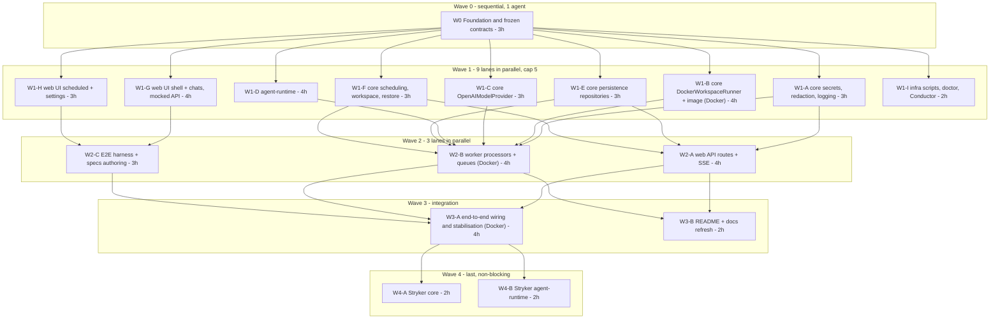

# Agent Hangar — Implementation Plan (orchestrator + parallel subagents)

| | |
|---|---|
| **Status** | ✅ Approved — 2026-08-19 · task files: [docs/tasks/](tasks/README.md) |
| **Source spec** | [docs/spec/](spec/README.md) (01–10) — this plan executes it; where they differ, this plan wins on *sequencing*, the spec wins on *behaviour* |
| **Execution model** | One orchestrator session; each workstream = one isolated subagent in its own git worktree = one PR. Workstreams in the same wave run **in parallel** |
| **Quality bar** | TS strict, zero suppressions, JSDoc on every export, **100 % coverage on all four metrics (lines / branches / functions / statements) per package**, gates green before every PR. Stryker 10 mutation testing is the **final wave** and is explicitly allowed to slip |
| **Last updated** | 2026-08-19 · §12 reflects Wave 1 in flight: seven lanes merged, three running |

---

## 1. Requirements restatement

Build the system in [docs/spec](spec/README.md) — chats backed by isolated Docker workspaces, scheduled jobs in fresh workspaces, encrypted settings, SSE streaming, Conductor-ready local setup — **as fast as wall-clock allows without lowering quality**, by:

1. Splitting the work into **workstreams that own disjoint paths**, so several subagents can implement concurrently in separate worktrees and their PRs merge without conflicts.
2. Freezing **all cross-workstream contracts first** (types, Prisma schema, Zod schemas, test doubles, dependency manifest, tooling) so parallel agents build against interfaces, never against each other's in-progress code.
3. Enforcing the same gates in every PR: lint, typecheck, unit tests with **100 % coverage on every metric**, integration tests where the workstream touches real infrastructure, JSDoc/test-comment policy, self code review to zero findings.
4. Running **Stryker 10** last, per package, as separate non-blocking PRs, with the CI mutation gate switched on only when the score holds.

Non-negotiables carried from the spec: scope exactly as the spec lists (nothing more), English-only artefacts, no secrets anywhere but encrypted Postgres rows, dockerode confined to `packages/core/src/runner/docker/**`.

## 2. Reuse scan (simplicity ladder §0)

- **Codebase:** empty repository (no commits) → every file is new by necessity; no per-file justification is repeated below.
- **Org libs / siblings:** `@bymax-one/*` are NestJS-oriented; this project is Next.js + plain Node worker, so nothing is imported. Proven *patterns* are reused from the knowledge vault: SSE (no compression, `Last-Event-ID` replay, same-origin route), BullMQ Job Schedulers (`upsertJobScheduler`, `maxRetriesPerRequest: null` only on workers), Prisma 7 driver adapter (`$connect()` is lazy → `SELECT 1` at boot), macOS `127.0.0.1` over `localhost`.
- **Platform / stdlib:** `node:crypto` (AES-256-GCM, `randomUUID`, `timingSafeEqual`), `fetch`, `AbortController`, `URL`, `Intl`, `structuredClone`.
- **Installed deps that cover needs (no custom code):** `openai` (Responses streaming), `bullmq`/`ioredis`, `dockerode`, `@prisma/client` + `@prisma/adapter-pg`, `zod`, `pino`, `cron-parser` (cron validation + next run), `react-markdown` + `rehype-highlight` (assistant Markdown), `shadcn` components, `lucide-react`, `msw` (test-mode GitHub API), `@testing-library/react`, `@vitest/coverage-v8`, `@playwright/test`, `@stryker-mutator/core` + `vitest-runner`.
- **Reusable units planned once:** `packages/core/src/testing/**` (fakes used by every workstream), `apps/web/src/shared/ui/**` (shadcn + project primitives, zero domain imports), `packages/core/src/agent-protocol/**` (shared by worker and runtime).

## 3. Parallelism rules (learned the hard way — do not skip)

1. **One agent per directory, one directory per agent.** Every workstream below has an **Owned paths** list; an agent may create/edit only there (plus its own test files). Reading anything is fine. Touching another stream's path = the PR is rejected by the orchestrator.
2. **No dependency additions inside waves.** Wave 0 installs the complete manifest (§5). A stream that truly needs a new package stops and reports; the orchestrator adds it in a tiny `chore(deps)` PR on `main` first. This is what keeps `pnpm-lock.yaml` conflict-free.
3. **Docker-running tests are a shared resource.** Only streams marked 🐳 run real-Docker integration tests, and the orchestrator runs **at most one 🐳 stream at a time** (OOM/port pressure on a laptop). Everyone else tests against `FakeWorkspaceRunner`.
4. **Concurrency cap: 5 subagents** at once (more buys little and risks OOM from five `next build`/`vitest` processes).
5. **Shared files are pre-split.** `packages/core/src/index.ts` re-exports one barrel per folder; a lane adds exports only to the barrel of the folder it owns. Each package's `vitest.config.ts` `coverage.include` is the one file several lanes append a line to — keep it one line per lane, appended at the end, to make rebases trivial. Root `package.json` scripts are owned by W1-I (merged first).
6. **Contracts are frozen after Wave 0.** A stream that needs a contract change opens a 1-file PR against `packages/core/src/**/types.ts` (+ Zod) and waits for the orchestrator to merge and notify dependants. Changes must be additive.
6. **Each subagent: `isolation: "worktree"`, branch `feat/<stream-id>-<slug>`, steps 0–4 only** (branch → implement → gates → self-review → commit/push/open PR → return PR number + summary). The orchestrator owns merge, CI watching, review-thread resolution, and chaining (see §8).
7. **Verify, don't trust:** orchestrator confirms every stream via `git`/`gh` (commits ahead, PR number, CI state) — never via the agent's narration.

## 4. Wave plan (critical path and parallel lanes)



**Dependency graph (what each lane needs merged before it starts)**

| Lane | Needs merged | Why |
|---|---|---|
| W1-A … W1-H | W0 | contracts, tooling, deps |
| W1-I | W0 (+ W1-A, W1-C, W1-E for the doctor/rotate-key tasks) | runs in the second Wave 1 batch; merges first within that batch (root scripts block) |
| W2-A (web API) | W1-A, W1-E, W1-F | secrets status, repositories, scheduling validation |
| W2-B (worker) | W1-A, W1-B, W1-C, W1-D, W1-E, W1-F | everything the processors orchestrate |
| W2-C (E2E authoring) | W1-G, W1-H | UI selectors; specs run for real only in W3-A |
| W3-A | all W2 | wiring, real OpenAI smoke, E2E green |
| W3-B | W2 (can start on W1 and rebase) | docs |
| W4-A/B | W3-A | mutation on stable code |

Estimated wall-clock with cap 5: **≈ 3 h (W0) + ≈ 7 h (W1 in two batches) + ≈ 4 h (W2) + ≈ 4 h (W3) + ≈ 2 h (W4) ≈ 20 h** of agent time, versus ≈ 45 h sequential. Human time is review/merge decisions only.

## 5. Wave 0 — Foundation & frozen contracts (single agent, critical path)

**Goal.** After this PR merges, eight agents can start without asking questions.

**Scope.**

1. **Monorepo & tooling** — `pnpm-workspace.yaml` (`apps/*`, `packages/*`), root `package.json` (`packageManager: pnpm@11`, `engines.node: 24`), `tsconfig.base.json` (strict + `noUncheckedIndexedAccess`, `exactOptionalPropertyTypes`, `verbatimModuleSyntax`, `isolatedModules`), per-package `tsconfig.json` with project references, path alias `@/` per app, ESLint flat config (typescript-eslint, import-x order, security, `no-restricted-imports`: dockerode outside `packages/core/src/runner/docker/**`, `crypto` → `node:crypto`, no `enum` via `no-restricted-syntax`), Prettier + tailwind plugin, Husky + commitlint + lint-staged, `.editorconfig`, `.nvmrc`, `.gitignore` (`.env*`, `master.key`, coverage, reports), `CLAUDE.md` (project rules: ownership map, gates, no-secrets canaries).
   - **TypeScript pinned to `~6.0.3`** (decided — spec 01 R1): latest stable JS-line compiler; TS 7 (native, `latest` tag) is not used because its programmatic API is unstable until 7.1. `tsconfig` avoids options removed in TS 7 (`baseUrl`, legacy `moduleResolution`) so a later upgrade is a version bump. Record in README "Decisions".
2. **Complete dependency manifest** installed and locked (no stream adds deps later):
   - root dev: `typescript`, `eslint` + `typescript-eslint` + `eslint-plugin-import-x` + `eslint-plugin-security` + `eslint-plugin-react-hooks` + `@next/eslint-plugin-next`, `prettier` + `prettier-plugin-tailwindcss`, `husky`, `lint-staged`, `@commitlint/cli` + `config-conventional`, `vitest` + `@vitest/coverage-v8` + `@vitest/ui`, `tsx`, `esbuild`, `concurrently`, `@stryker-mutator/core` + `@stryker-mutator/vitest-runner` (10.x, configured in W4 only), `gitleaks` via CI action (not npm).
   - `packages/core`: `zod`, `pino`, `@prisma/client`, `@prisma/adapter-pg`, `pg`, `prisma` (dev), `bullmq`, `ioredis`, `dockerode` + `@types/dockerode`, `openai`, `cron-parser`, `tar-stream` (copy files into containers if needed by runner).
   - `packages/agent-runtime`: `zod`, `openai` (via core), `execa` **not** used — `node:child_process` suffices (stdlib rung).
   - `apps/web`: `next`, `react`, `react-dom`, `tailwindcss` + `@tailwindcss/postcss`, `shadcn` (dev) + generated components deps (`@base-ui-components/react`, `class-variance-authority`, `clsx`, `tailwind-merge`, `lucide-react`, `sonner`, `cmdk`), `react-markdown`, `rehype-highlight`, `remark-gfm`, `@testing-library/react` + `jest-dom` + `user-event`, `jsdom`, `msw`, `@playwright/test`.
   - `apps/worker`: `pino-pretty` (dev).
3. **Frozen contracts in `packages/core`** (copied from [spec 03](spec/03-interfaces.md), with Zod schemas where data crosses a boundary): `src/runner/types.ts`, `src/model/types.ts`, `src/agent-protocol/{types,schemas,ndjson}.ts` (codec included — tiny and shared), `src/secrets/types.ts` (`SecretsService`, `Redactor`), `src/scheduling/types.ts`, `src/workspace/types.ts` (lifecycle states, `RestoreContext`), `src/persistence/ports.ts` (repository interfaces: `ChatRepository`, `MessageRepository`, `TurnRepository`, `WorkspaceRepository`, `ScheduledJobRepository`, `JobRunRepository`, `ToolCallLogRepository`, `SecretRepository`), `src/api/contracts.ts` (Zod request/response schemas for every route in spec 03 §4 + SSE frame type), `src/queues/contracts.ts` (queue names, job names, payload schemas), `src/config/{schema,instance}.ts` (env schema + instance/port derivation — implemented here because every app boots through it), `src/errors.ts` (typed error classes: `WorkspaceImageMissing`, `SecretIntegrityError`, `ProtocolError`, …).
4. **Test doubles** in `src/testing/**`: `FakeWorkspaceRunner` (in-memory FS per handle, scripted exec), `FakeAgentModelProvider` (script keyed by last user message, supports tool-call sequences and delays), `FakeClock`, `InMemory*Repository` for every port, `canaries.ts` (`GITHUB_CANARY = 'ghp_TESTCANARY…'`, `OPENAI_CANARY = 'sk-TESTCANARY…'`). Fully unit-tested (100 %).
5. **Prisma 7** — `prisma/schema.prisma` exactly as [spec 02](spec/02-data-model.md), `prisma.config.ts`, first migration incl. the partial unique index (one live workspace per chat), `src/persistence/client.ts` (adapter-pg, `SELECT 1` on boot helper).
6. **Infra skeleton** — `infra/docker-compose.yml` (postgres 18 / redis 8, parameterised), `infra/workspace/Dockerfile` (base only; runtime bundle COPY added by W1-D), `infra/scripts/env.sh` (instance/port derivation — mirrors `config/instance.ts`), `.env.example`, root scripts: `setup`, `dev`, `build`, `lint`, `typecheck`, `test`, `test:integration`, `test:e2e`, `infra:*`, `db:*`, `doctor` (stub that W1-I completes).
7. **Apps skeleton** — `apps/web`: Next 16 App Router, Tailwind v4 with the full token set from [spec 10 §2](spec/10-ui-design.md) in `app/globals.css` (`@theme`, light/dark), shadcn init (Base UI, new-york) + the component set from spec 10 §5 generated into `src/shared/ui/`, `next/font` Inter + JetBrains Mono, `(app)/layout.tsx` with an **empty** sidebar slot and routes `/chats/new`, `/chats/[id]`, `/scheduled`, `/scheduled/[id]`, `/settings` rendering placeholders, `src/shared/api/client.ts` (typed fetch over `api/contracts`), `vitest.config.ts` (jsdom, 100 % thresholds, `coverage.include: ['src/**']`), `playwright.config.ts`. `apps/worker`: `src/main.ts` boots config, Postgres `SELECT 1`, Redis ping, logs, graceful shutdown; `vitest.config.ts` 100 %.
8. **CI** — `.github/workflows/ci.yml` with jobs `lint`, `typecheck`, `unit` (coverage thresholds enforced by Vitest config), `integration` (services postgres/redis; runs `@docker`-tagged tests), `e2e`, `build`, `secret-scan` (gitleaks). `mutation` job added in W4. `pnpm/setup@v2` for pnpm 11 + Node 24.
9. **Plan hygiene** — `docs/plan.md` §9 status table initialised; `CLAUDE.md` includes the ownership map (§6) verbatim so every subagent sees it.

**Owned paths.** Everything (only agent in this wave).

**Gates / DONE.** `pnpm setup && pnpm dev` serves placeholder pages; `pnpm lint typecheck test` green with 100 % coverage on `packages/core/src/testing/**`, `config/**`, `agent-protocol/**`, `errors.ts`; CI green on the PR; TS 6 pin recorded in README "Decisions"; `CLAUDE.md` present. Complexity: **HIGH** (breadth), ~3 h.

## 6. Wave 1 — parallel workstreams (after W0 merges)

Each lane below is one subagent prompt. Common to all: read `CLAUDE.md`, the spec documents named, and the contract files; TDD (`/bymax-quality:tdd`) — tests first; JSDoc on exports; test-file headers + `it()` comments; 100 % coverage on **owned** `src/**` (the package's `vitest.config` `coverage.include` is scoped to owned paths until W3 widens it); no new deps; `/bymax-quality:code-review` to zero findings; open PR; return PR number.

### W1-A — Secrets, redaction, logging (core) — complexity MEDIUM, ~3 h

- **Reads:** spec 03 §6, 04 (d), 06 §2.
- **Owned:** `packages/core/src/secrets/**` (AES-256-GCM `SecretsService` impl over `SecretRepository` port, `MasterKeyFile` 0600 create/verify, `keyVersion`, `reveal` marked worker-only), `packages/core/src/redaction/**` (`Redactor`: exact values + shape patterns, `redactJson`, idempotent), `packages/core/src/logging/**` (pino factory with redact paths + `Redactor` serializer; no PII).
- **Tests:** unit suite from spec 06 §2 (roundtrip, iv uniqueness, tamper → `SecretIntegrityError`, wrong key, key-file perms, all shape patterns, deep JSON, idempotence, no false positive, logger never prints canaries).
- **DONE:** 100 % coverage; canaries never appear in any test output (`vitest` reporter grep assertion).

### W1-B 🐳 — DockerWorkspaceRunner + workspace image — complexity HIGH, ~4 h

- **Reads:** spec 03 §1, 05 §5, 06 §3.
- **Owned:** `packages/core/src/runner/docker/**` (socket resolution, container spec builder with labels/limits/security opts, `create/exec/signal/snapshot/destroy/health/list`, exec demux, timeout → KILL), `infra/workspace/**` (Dockerfile: node:24-bookworm-slim, git, rg, jq, python3, build-essential, user `agent`, `/workspace`, `askpass.sh`, git config; `ENTRYPOINT sleep infinity`), script `pnpm infra:image`.
- **Tests:** unit (pure parts with faked dockerode: socket order, spec builder, demux, timeout path); integration `@docker` (create/health/exec stdout+stdin/timeout/signal/snapshot on a real git repo/destroy/list, two-workspace isolation, limits applied, image missing → `WorkspaceImageMissing`). Integration runs only when `DOCKER_AVAILABLE=1`; otherwise the suite **fails loudly** with instructions (never silently skipped in CI).
- **DONE:** 100 % coverage on unit-testable modules; `@docker` suite green locally; image builds in < 3 min; `docker inspect` shows no secrets in image config.

### W1-C — OpenAIModelProvider — complexity MEDIUM, ~3 h

- **Reads:** spec 03 §2; official Responses API docs (verify event names at build time).
- **Owned:** `packages/core/src/model/openai/**` (provider over `openai` SDK `responses.stream`, tool mapping with `strict: true`, event mapping table, error mapping 401/429/400-context, `store:false`, `previousResponseId`, `listModels`), `packages/core/src/model/registry.ts` (`createModelProvider(name)` → openai | fake), `packages/core/fixtures/openai/*.ndjson` (recorded, redacted stream fixtures: text, tool call with args deltas, completed+usage, failed, refusal).
- **Tests:** unit with a fake SDK client replaying fixtures; every `ModelEvent` variant produced; error mapping; model id from input only.
- **DONE:** 100 % coverage; a `scripts/record-fixtures.ts` exists (manual, needs a real key, documented).

### W1-D — Agent runtime (inside the container) — complexity HIGH, ~4 h

- **Reads:** spec 03 §3, 04 (a), 06 §2 runtime section.
- **Owned:** `packages/agent-runtime/**` (`cli.ts` `turn`/`--version`, `protocol.ts` stdin reader/stdout writer using core NDJSON codec, `prepare.ts` clone/checkout/`expectedHeadSha` check, `loop.ts` step loop with limits + cancellation via SIGINT → `AbortController`, `tools/{run-shell,read-file,write-file,list-dir}.ts` with path confinement, truncation, timeout, env scrubbing, `GIT_ASKPASS`, `redact.ts` shape-only redaction, `git-events.ts` push detection, `esbuild.config.mjs` → `dist/cli.js`), and the two `COPY` lines in `infra/workspace/Dockerfile` **by instruction to the orchestrator** (W1-B owns the file; W1-D's PR description lists the exact lines; orchestrator applies them when merging the second of the two).
- **Tests:** unit for every tool against a temp dir (escape attempts, symlink, truncation notice, timeout, scrubbed env), loop with `FakeAgentModelProvider` (stops with no tool calls, `maxSteps`, cancel → `turn.cancelled`, event ordering), protocol framing, prepare against a local bare repo (`git init --bare` in tmp) incl. `workBranch` checkout and sha mismatch warning.
- **DONE:** 100 % coverage; `node dist/cli.js --version` works; bundle < 2 MB; no dependency on Postgres/Redis.

### W1-E — Persistence repositories (core) — complexity MEDIUM, ~3 h

- **Reads:** spec 02, 03 §6 (`Redactor` is injected), 06 §3 persistence.
- **Owned:** `packages/core/src/persistence/repositories/**` (Prisma implementations of every port; message `seq` in a transaction; redact-on-write via injected `Redactor`; mapping Prisma enums ↔ string-union domain types), `packages/core/src/persistence/testing/db.ts` (integration helper: truncate tables, connect to `AH_INSTANCE=test`).
- **Tests:** unit (mapping functions, redact-on-write with an in-memory fake Prisma client is **not** done — instead) integration against compose Postgres (`pnpm test:integration`, tag `@db`): CRUD per repo, cascade, partial unique index enforced, gap-free `seq` under `Promise.all`, canary never stored.
- **DONE:** 100 % coverage (integration counts toward coverage for this package — `vitest` run includes `@db` tests when DB available; CI always has DB).

### W1-F — Scheduling, workspace lifecycle, restore context (core) — complexity MEDIUM, ~3 h

- **Reads:** spec 02 §4, 03 §5, 04 (b)(c).
- **Owned:** `packages/core/src/scheduling/**` (cron validation via `cron-parser`, `nextRunAt` with tz/DST, overlap policy, `reconcile(dbJobs, schedulers)` diff, scheduler key helpers), `packages/core/src/workspace/**` (lifecycle state machine with illegal-transition errors, `ensureWorkspaceDecision`, idle-TTL selection, orphan reconcile decision), `packages/core/src/restore/**` (`buildRestoreContext` → `TurnRequest` fields: history window + `TOOL_SUMMARY` compaction + restoration notice + `expectedHeadSha`), `packages/core/src/queues/{queues,schedulers}.ts` (BullMQ queue/worker factories, `upsertJobScheduler`/`removeJobScheduler` wrappers, `maxRetriesPerRequest: null` on workers only).
- **Tests:** unit for all pure modules (DST boundaries, window budget, compaction text, notice text); integration `@redis` for queue factories and scheduler upsert/remove/list against compose Redis.
- **DONE:** 100 % coverage.

### W1-G — Web UI: shell + chats (mocked API) — complexity HIGH, ~4 h

- **Reads:** spec 10 (all), 03 §4 contracts, 04 (a)(b) for states.
- **Owned:** `apps/web/src/features/shell/**` (`AppSidebar`, `ChatList`, search ⌘K, env pill, theme toggle, keyboard shortcuts), `apps/web/src/features/chats/**` (`Composer` + `RepoPicker` + `BranchPicker`, `SuggestionCard`, `Transcript` + `UserMessage`/`AssistantMarkdown`/`ToolCallRow`/`SystemNotice`/`StreamCursor`, `StatusPill`, `ErrorCard`, archived banner, SSE client hook `useTurnEvents` with reconnect + `Last-Event-ID`, streaming reducer), pages `app/(app)/chats/new/page.tsx`, `app/(app)/chats/[id]/page.tsx`, `app/(app)/layout.tsx` (fills the sidebar slot), `apps/web/src/mocks/**` (MSW handlers implementing `api/contracts` for dev/test, incl. a scripted SSE stream).
- **Tests:** component tests (Testing Library) for every component and state in spec 10 §4.1–4.2 and §6; reducer tests; hook tests with a fake `EventSource`; a11y assertions (labels, roles, focus order) — 100 % coverage.
- **DONE:** `pnpm dev` with `NEXT_PUBLIC_API_MOCK=1` shows the home composition matching spec 10 §4.1 and a streaming chat from MSW; Lighthouse a11y ≥ 95 locally (screenshot in PR).

### W1-H — Web UI: scheduled + settings — complexity MEDIUM, ~3 h

- **Reads:** spec 10 §4.3–4.4, 03 §4.
- **Owned:** `apps/web/src/features/scheduled/**` (`JobsTable`, `JobDialog` + `CronField` + `CronPreview` + timezone combobox, `RunsTable`, `RunDrawer` reusing `Transcript` **by import from `features/chats` barrel? No — cross-feature import is banned**: `Transcript` is lifted by W1-G into `apps/web/src/shared/transcript/**` (zero domain imports) so both features use it; W1-H imports from `shared`), `apps/web/src/features/settings/**` (`SecretField` masked/replace/remove, `EnvSummary`, toasts), pages `app/(app)/scheduled/**`, `app/(app)/settings/page.tsx`, MSW handlers for jobs/runs/settings in `apps/web/src/mocks/scheduled.ts`, `settings.ts` (separate files from W1-G's).
- **Tests:** component tests for all states (empty, loading, error, validation, mask), cron preview text, 100 % coverage.
- **DONE:** both pages match spec 10 wireframes with MSW; a11y checks pass.

> Coordination note for W1-G/W1-H: W1-G creates `apps/web/src/shared/transcript/**` **first** (in its first commit) and the orchestrator merges W1-G before W1-H's final rebase; until then W1-H develops `RunDrawer` against a local stub and swaps the import at rebase. This is the only soft coupling in Wave 1.

### W1-I — Infra scripts, doctor, Conductor — complexity LOW, ~2 h

- **Reads:** spec 05 (all), 01 R2.
- **Owned:** `infra/scripts/{setup,run,archive,doctor,rotate-key}.sh`, `.conductor/settings.toml`, `infra/docker-compose.yml` (compose-profile `test` + healthchecks), `.env.example`, root `package.json` **scripts block only** (orchestrator-mediated: W1-I's PR is merged first in its batch to avoid `package.json` conflicts; other streams do not edit scripts).
- **Tests:** `bats`-free shell tests via Vitest spawning the scripts with env permutations (`AH_INSTANCE`/`CONDUCTOR_*` precedence, slugify, port math, idempotent setup, archive leaves no `ah-ws-<instance>-*`); `doctor` output snapshot.
- **DONE:** two instances (`default`, `feat-x`) start side by side with distinct ports/DBs; `doctor` table correct for both; Conductor file validates against its schema.

## 7. Wave 2 — integration lanes (after the listed W1 lanes merge)

### W2-A — Web API routes + SSE — complexity HIGH, ~4 h

- **Reads:** spec 03 §4–5, 04 (a)(d), vault SSE gotchas.
- **Owned:** `apps/web/app/api/**` (all routes from spec 03 §4, Zod-validated via `api/contracts`, repositories from core, queue producers, settings routes with request-logging disabled, `events` SSE routes: Redis Streams `XRANGE` replay + `XREAD BLOCK` tail, heartbeat, no compression, cancel via Redis pub/sub command channel), `apps/web/src/server/**` (DI container: prisma client, repos, queues, secrets service status-only, redactor, github client for `/api/repos`), `apps/web/proxy.ts` only if needed (none planned).
- **Tests:** route handler unit tests with in-memory repositories + fake queue (validation, status transitions, settings never leak plaintext); integration `@redis` for SSE replay/tail/heartbeat; 100 % coverage.
- **DONE:** UI runs against real API with `NEXT_PUBLIC_API_MOCK=0` for chats/jobs/settings CRUD (turns stay queued until W2-B).

### W2-B 🐳 — Worker processors — complexity HIGH, ~4 h

- **Reads:** spec 04 (a)(b)(c), 03 §5, 06 §3 worker e2e.
- **Owned:** `apps/worker/src/**` (`processors/run-turn.ts`, `processors/run-scheduled-job.ts`, `processors/gc.ts`, `scheduler-reconcile.ts`, `commands.ts` (cancel channel), `events.ts` (XADD publisher with MAXLEN/EXPIRE), `container.ts` (DI), `main.ts` wiring + graceful shutdown + image-present check at boot).
- **Tests:** unit with `FakeWorkspaceRunner` + `FakeAgentModelProvider` + in-memory repos (ordering of persisted events, statuses, `finally` destroy for jobs, overlap policy, stalled recovery, cancel); integration 🐳 `@docker @db @redis`: full turn with real container + fake provider, GC reaps idle + orphan, restore turn clones `workBranch`, scheduled run creates and destroys its container; 100 % coverage.
- **DONE:** with `AGENT_MODEL_PROVIDER=fake`, a chat turn round-trips UI → API → worker → container → SSE → UI.

### W2-C — E2E harness + specs (authoring) — complexity MEDIUM, ~3 h

- **Reads:** spec 06 §4.
- **Owned:** `apps/web/e2e/**` (fixtures: DB reset, local git server container `infra/test/gitserver/**` (owned too), MSW-in-server for GitHub API in test mode, helpers), the six specs from spec 06 §4, `playwright.config.ts` projects (chromium), `pnpm test:e2e` wiring, CI `e2e` job body.
- **Tests:** the specs themselves; run against W1-G/H + MSW to validate selectors; full runs only in W3-A.
- **DONE:** specs compile, selectors resolve against the mocked UI, harness boots/tears down cleanly.

## 8. Wave 3 — wiring, stabilisation, docs (2 lanes)

### W3-A 🐳 — End-to-end wiring & stabilisation — complexity HIGH, ~4 h (single agent; touches many paths, so nothing else runs in `apps/**` concurrently)

- Widen every `vitest.config` `coverage.include` to the whole package (`src/**`) and keep 100 %; wire remaining seams (worker image check banner in UI, `/api/health` ↔ env pill, cancel button, restore banner, settings-missing gate); run Playwright suite for real (Docker + Postgres + Redis + fake provider) until green 3× in a row; run **one real OpenAI smoke** with the user's key (documented script `pnpm smoke:openai`, not in CI); fix flakiness at the root; UI polish pass against spec 10 §10 checklist on real data; `pnpm doctor` final; CI all jobs green.
- **Owned:** any path, one agent. **DONE:** spec 01 §5 success criteria S1–S6, S8 verified and listed in the PR with evidence.

### W3-B — README + docs refresh — complexity LOW, ~2 h (parallel with W3-A; owns only `README.md`, `docs/**`)

- README per spec 05 §7 (quick start, config table, scripts, Conductor, testing, security notes, troubleshooting, known gaps, decisions, deployment appendix = spec 08 condensed with a link); refresh `docs/spec/*` to match reality (versions, names); this plan's §9 updated.

## 9. Wave 4 — Stryker 10 mutation testing (last, non-blocking, parallel per package)

Deliberately last: the code is stable, so mutants are meaningful, and if time runs out the product is complete without it (README "Known gaps" then states the mutation status and the plan — which is this section).

| Lane | Owned | Config | Gate |
|---|---|---|---|
| W4-A | `packages/core/stryker.config.mjs`, test improvements under `packages/core/**` | `@stryker-mutator/core@10` + `vitest-runner@10` (same version), `mutate: ['src/secrets/**','src/redaction/**','src/scheduling/**','src/workspace/**','src/restore/**','src/agent-protocol/**','src/model/openai/mapping.ts']`, `concurrency: 2`, `incremental` off for the first full run, `reporters: ['html','clear-text','progress']` | `break: 80` (target 90) |
| W4-B | `packages/agent-runtime/stryker.config.mjs`, tests under `packages/agent-runtime/**` | `mutate: ['src/tools/**','src/loop.ts','src/prepare.ts']` | `break: 80` |

Rules: kill survivors by **strengthening tests** (or simplifying code to the value that serves); no `// Stryker disable` without a one-line reason; equivalent mutants documented in the PR. When both lanes pass, a third tiny PR adds the `mutation` CI job (PR-scoped incremental, nightly full) and the README badge/section.

## 10. Risks

| Level | Risk | Mitigation in this plan |
|---|---|---|
| LOW | TypeScript toolchain incompatibility stalls W0 | Decided up front: `typescript@~6.0.3` (stable); TS 7 not used in v1 |
| HIGH | Contract drift discovered mid-Wave 1 | Contracts copied verbatim from spec 03 + Zod; additive-only change PRs; `FakeWorkspaceRunner`/`FakeAgentModelProvider` in W0 give every lane a working counterpart |
| MEDIUM | `pnpm-lock.yaml`/`package.json` merge conflicts | Full manifest in W0; scripts block owned by W1-I and merged first; no deps added in lanes |
| MEDIUM | OOM / port collisions from parallel Docker-heavy lanes | ≤ 1 🐳 lane at a time; `AH_INSTANCE` per worktree (`feat-*` ports) so even two local stacks never collide |
| MEDIUM | 100 % coverage on UI code slows W1-G/H | Components are small and state-driven; MSW + Testing Library; `coverage.include` scoped to owned paths during the wave; W3-A widens |
| MEDIUM | Subagent ends without PR (context exhaustion) | Orchestrator verifies via `git`; spawns a *finalize-agent* on the **same worktree path** to run gates, commit, push, open PR |
| LOW | Responses API event names differ from spec | W1-C verifies against official docs and fixtures; provider is the only place that changes |
| LOW | Stryker time budget | Last wave, parallel per package, explicitly allowed to slip; CI gate added only once green |

## 11. Orchestrator protocol (copy into the orchestrator session)

```text
ORCHESTRATION PROTOCOL — Agent Hangar (waves of parallel workstreams, one PR per workstream)

ROLES
- WORKSTREAM SUBAGENT (spawned per lane, isolation:"worktree", branch feat/<lane>-<slug>):
  steps 0–4 ONLY: branch off latest main → read CLAUDE.md + the lane's spec sections +
  contract files → TDD implement inside OWNED PATHS only → gates (lint, typecheck, unit
  100 % coverage all metrics, integration if tagged, code-review to zero findings) →
  commit (Conventional, English, no attribution trailers) → push → open PR → RETURN
  {pr, branch, headSha, gates, coverage, notes, contractChangeRequests[]}.
  Do NOT add dependencies, edit paths you don't own, wait for CI, merge, or chain.
- ORCHESTRATOR (this session): owns steps 5–9 per PR and the wave schedule:
  5. background poll until SIGNAL (CI fail | review posted | grace elapsed) — never fixed sleep.
  6. on findings: free the branch (remove the agent's worktree), spawn an isolated fix-agent
     with the exact findings; re-poll.
  7. MERGE only when: CI green (0 fail/0 pending) + 0 unresolved review threads +
     ≥ 4–5 min grace since last push. Re-fetch FRESH thread ids, reply+resolve one by one.
     `gh pr merge --squash --delete-branch`.
  8. sync main, remove worktree, verify no stale remote branch, update docs/plan.md §12.
  9. spawn the next lanes whose dependencies (plan §4 table) are all merged, respecting
     cap 5 and ≤ 1 🐳 lane; stop only when Wave 4 is merged or explicitly deferred.

MERGE ORDER INSIDE A WAVE: W1-I first (scripts block), then any lane as it turns green;
W1-G before W1-H's final rebase; W1-B and W1-D: apply W1-D's Dockerfile COPY lines when
merging the later of the two.

AUTONOMY BACKBONE: never end a turn without a pending tracked job OR an armed long
ScheduleWakeup (1200s+) whose prompt states the CURRENT wave/lane status.

VERIFY, DON'T TRUST: confirm every claim via git/gh (`git rev-list --count main..HEAD`,
`git status --porcelain`, `gh pr view`). Never Read an agent's transcript output file.

RESOURCE RULES: ≤ 5 concurrent subagents; ≤ 1 Docker-integration lane at a time;
each worktree uses AH_INSTANCE=<lane> so local stacks never collide.
```

## 12. Status dashboard (orchestrator keeps this current)

| Lane | Status | Branch / PR | Coverage | Notes |
|---|---|---|---|---|
| W0 | 🟩 merged | PR #4 | core 100 / web 100 / worker 100 (all four metrics) | TypeScript pinned `~6.0.3` |
| W1-A | 🟩 merged | PR #6 | core 100 (all four metrics) | secret ciphertext bound to its key as GCM AAD; master-key file refuses symlink, FIFO and group/world-readable modes |
| W1-B 🐳 | 🟩 merged | PR #7 | 100/100/100/100 (runner/docker) | subpath export `@agent-hangar/core/runner/docker`; `/opt/agent-runtime` stays root-owned so the workspace cannot replace the askpass helper |
| W1-C | 🟩 merged | PR #10 | core 100 (all four metrics) | openai SDK 7.5.0 verified against its shipped types; no SDK or server text reaches a persisted event |
| W1-D | 🟩 merged | PR #11 | 100/100/100/100 (agent-runtime `src/**`) | three Dockerfile `COPY` lines (bundle, map, `{"type":"module"}` manifest) written in the PR body for the infra lane to apply, not in this diff; path confinement resolves symlinks |
| W1-E | 🟩 merged | PR #8 | core 100 (all four metrics) | status stamps are transactional; `ScheduledJob.prompt` and `Chat.title` redacted on write |
| W1-F | 🟩 merged | PR #12 | core 100 (all four metrics) | BullMQ 6 API read from the installed types |
| W1-G | 🟨 PR open | PR #19 | web 100 (all four metrics) | chats list, composer and streaming detail; Lighthouse a11y 100 on both routes. Routed a pre-existing blocker: `next dev` cannot resolve `@agent-hangar/core` from source under Turbopack |
| W1-H | 🟥 blocked | `feat/w1h-web-scheduled-settings` | web 100 (all four metrics) | 1H.1–1H.5 done and pushed; stopped at its close-out because opening a pull request now would ship 18 `TEMP-STUB(W1-H)` files standing in for W1-G's modules. The orchestrator finalises it once W1-G merges |
| W1-I | 🟨 PR open | PR #18 | scripts 100 (all four metrics) | run, doctor, archive, prune and the Conductor wiring; the two-instance walkthrough was executed against real Docker, not simulated |
| W2-A | 🟦 running | `feat/w2a-web-api-sse` | — | started once W1-A, W1-E and W1-F were merged |
| W2-B 🐳 | 🟦 running | `feat/w2b-worker` | — | started once W1-A…W1-F were merged; its 🐳 suite needs the runtime bundled into the image (PR #16) |
| W2-C | ⬜ | — | — | gate is W1-G and W1-H merged — both are still running |
| W3-A 🐳 | ⬜ | — | — | success criteria S1–S6, S8 |
| W3-B | ⬜ | — | — | |
| W4-A | ⬜ | — | — | may slip — documented |
| W4-B | ⬜ | — | — | may slip — documented |

**Orchestrator fixes alongside the lanes** (not lanes of the plan; each fixes a defect found while shepherding, and the Status column says whether that fix has landed):

| PR | Status | The defect |
|---|---|---|
| #9 | 🟩 merged | The `e2e` job installed a browser to run an empty suite, taking 111–1367 s and gating every merge |
| #5 | 🟩 merged | `@agent-hangar/core` was unresolvable from source, so a fresh worktree could not run the worker; repository URLs hardened |
| #13 | 🟩 merged | A connection failure repeated the driver message and attached the driver error as `cause`, leaking the database password twice over |
| #14 | 🟩 merged | The destructive-test guard printed the password back when the connection URL had no authority |
| #15 | 🟩 merged | This dashboard had drifted six merges behind reality |
| #16 | 🟨 PR open | The workspace image had no agent runtime in it: the bundle was described in a pull request body and never applied |

Legend: ⬜ not started · 🟦 running (branch) · 🟨 PR open · 🟩 merged · 🟥 blocked.

## 13. Estimated complexity

| Wave | Agent hours (sum) | Wall-clock (cap 5, ≤ 1 🐳) |
|---|---|---|
| W0 | 3 | 3 |
| W1 | 29 | ≈ 7 (two batches: A,B🐳,C,E,F then D🐳,G,H,I — I is short and merges first) |
| W2 | 11 | ≈ 4 |
| W3 | 6 | ≈ 4 |
| W4 | 4 | ≈ 2 (deferrable) |
| **Total** | **53** | **≈ 18–20 h** |

Approved 2026-08-19. Per-lane task files with self-contained agent prompts live in [docs/tasks/](tasks/README.md).
