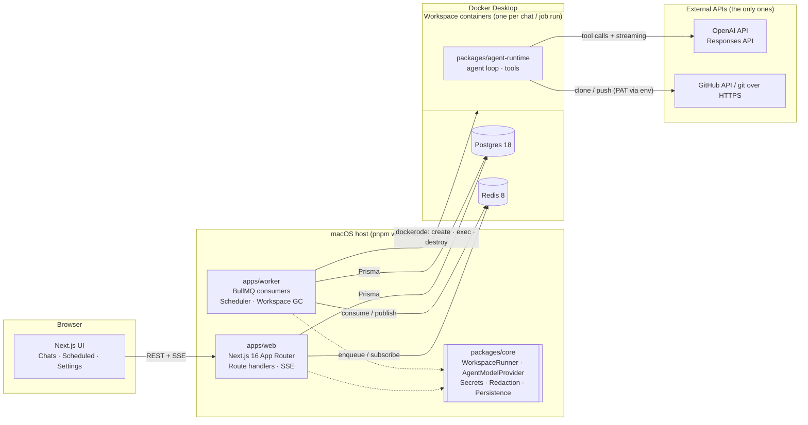

# 01 — System Overview

| | |
|---|---|
| **Status** | ✅ Approved — 2026-08-19 |
| **Owner** | Maximiliano |
| **Last updated** | 2026-08-19 |
| **Related** | [02 Data model](02-data-model.md) · [03 Interfaces](03-interfaces.md) · [04 Flows](04-flows.md) · [05 Local dev](05-local-dev.md) · [06 Testing](06-testing.md) · [07 Build plan](07-build-plan.md) · [08 Deployment](08-deployment-discussion.md) · [09 Non-goals](09-non-goals.md) · [10 UI design](10-ui-design.md) |

## 1. Goal

**Agent Hangar** is a web application where a developer opens a chat, points it at a GitHub repository, and an AI agent answers questions and performs coding tasks inside an **isolated, disposable workspace** (a local container). Users can also define **scheduled jobs** that run a prompt in a fresh workspace on a cron schedule, and a **settings page** holds the two credentials the system needs — a GitHub Personal Access Token and an OpenAI API key — encrypted at rest and never exposed.

It runs entirely on a developer's macOS machine. The only external runtime dependencies are the **OpenAI API** and the **GitHub API**. Postgres and Redis run locally in Docker and are infrastructure, not external dependencies.

The architectural bet: **conversation state and workspace lifecycle are decoupled.** Postgres owns every durable fact; a container owns only its ephemeral filesystem. Containers are cattle. That single decision makes archive/restore trivial, makes scheduled jobs a special case of "run a turn in a fresh workspace", and makes a future move of agent execution to cloud infrastructure a second implementation of one interface.

## 2. Background

Cloud-agent products (OpenAI Codex, Devin, Cursor background agents) share the same shape: a chat UI on one side, an isolated sandbox with a repository checkout on the other, and an agent loop that calls a model with tools and executes those tools in the sandbox. This project rebuilds that core experience as a local-first web app with a clean seam for cloud execution.

## 3. Scope

### In scope (v1)

- **Chats (agent workspaces).** Create a chat, choose a GitHub repository and branch, send prompts. Each chat is backed by its own Docker container. The agent can run shell commands, read/write files, and use git (clone, commit, push) with the configured PAT. Output streams to the browser live. Chats can be **archived**; history persists and an archived chat can be **restored** into a brand-new container to continue work.
- **Scheduled jobs.** Name, cron expression, timezone, repository/branch, prompt. On each trigger a **fresh** workspace is created, the prompt is executed, the run and its output are recorded, and the workspace is destroyed. Runs are listed per job; a run can be opened to see its output. Jobs can be enabled/disabled, edited, deleted, and triggered manually.
- **Settings.** GitHub PAT and OpenAI API key. Encrypted at rest (AES-256-GCM, local master key outside the repo), masked in the UI (last 4 characters), redacted from logs, injected into containers only at start as environment variables.
- **Developer experience.** Clone → README → it runs. Single command to boot infrastructure, a doctor script that checks Docker, and a Conductor integration so several checkouts of this repo can run side by side without colliding on databases, ports, or container names.
- **Quality.** Unit + integration tests (Vitest), E2E for the three critical flows (Playwright), mutation testing on the core domain (Stryker), CI on GitHub Actions.

### Out of scope (v1)

See [09 Non-goals](09-non-goals.md): multi-user auth, cloud deployment, multiple LLM providers, Kubernetes. Also out: pull-request management UI, site previews, plugins, voice input, file attachments, and any feature not listed above.

### Future (documented seams, not built)

- A cloud `WorkspaceRunner` (Fargate / micro-VM) — [08 Deployment](08-deployment-discussion.md).
- A second `AgentModelProvider`.
- Workspace snapshots persisted to object storage for byte-exact restore.

## 4. User stories

1. As a developer, I open the app, pick one of my repositories, type "explain how authentication works in this codebase", and watch the agent clone the repo, read files, and answer — without anything touching my local filesystem.
2. As a developer, I ask the agent to "add input validation to the signup endpoint and push a branch", and I see each shell command and file edit as it happens, ending with a pushed branch I can open on GitHub.
3. As a developer, I archive a finished chat to tidy the sidebar; a week later I restore it and keep going in a fresh workspace with the full conversation intact.
4. As a developer, I schedule "every weekday at 09:00, run the test suite on `main` and summarise failures" and later review each run's output in the Scheduled page.
5. As a developer, I paste my GitHub PAT and OpenAI key once in Settings; afterwards I only ever see `••••••••abcd`, and nothing in the repo, logs, or container images contains the real values.
6. As a developer working on this project, I open two Conductor workspaces on two feature branches and run both stacks at the same time with separate databases and ports.

## 5. Success criteria

| # | Criterion | How verified |
|---|---|---|
| S1 | `git clone` → follow README → app running with a working chat in ≤ 10 minutes on a clean macOS with Docker Desktop | Manual first-run walkthrough; documented in README |
| S2 | Every chat turn executes in a container that is not shared with any other chat or job | Integration test: two concurrent workspaces, distinct container IDs and filesystems |
| S3 | Archive → restore reproduces repo checkout and full conversation in a new container | Playwright E2E `archive-restore` |
| S4 | A scheduled job with a one-minute cron creates a new workspace per run, records output, and leaves no container behind | Playwright E2E `schedule-run` + integration test on runner |
| S5 | Secrets: ciphertext only in Postgres; UI shows last 4; `grep` of logs and container image for the plaintext finds nothing | Unit tests on crypto + redaction; E2E `settings-mask`; CI secret-scan step |
| S6 | Live streaming of agent output via SSE with reconnect/replay | Integration test on the events endpoint |
| S7 | Mutation score ≥ 80% on `packages/core` (secrets, scheduling, workspace lifecycle) enforced in CI | Stryker gate |
| S8 | Two Conductor workspaces run concurrently with independent DB, Redis keyspace, ports, and container names | Manual verification + `pnpm doctor` output |

## 6. Technical approach (one page)

**Components**

| Component | Responsibility |
|---|---|
| `apps/web` | UI and HTTP API. Writes user intent to Postgres, enqueues work in BullMQ, and streams results to the browser over SSE by subscribing to Redis. Never talks to Docker. |
| `apps/worker` | The only process that touches Docker and OpenAI (indirectly, through the container). Consumes `chat-turns` and `scheduled-jobs` queues, owns workspace lifecycle, persists every event and tool call, publishes progress to Redis. Registers BullMQ Job Schedulers from `ScheduledJob` rows. Runs workspace garbage collection. |
| `packages/core` | Pure domain: `WorkspaceRunner` interface + `DockerWorkspaceRunner`; `AgentModelProvider` interface + `OpenAIModelProvider`; secrets (AES-256-GCM), redaction, cron validation, restore-context builder, agent protocol types, Prisma client + repositories. No framework imports. This is where the mutation gate lives. |
| `packages/agent-runtime` | Bundled into the workspace image. Receives a turn request on stdin (NDJSON), runs the OpenAI tool loop, executes tools inside the container, emits events on stdout. Knows nothing about Postgres or Redis. |
| `infra/` | `docker-compose.yml` (Postgres, Redis), workspace `Dockerfile`, Conductor `.conductor/settings.toml` + `scripts/`. |

**Key decisions and trade-offs**

| Decision | Chosen | Considered | Why |
|---|---|---|---|
| Runner | `WorkspaceRunner` interface, one impl `DockerWorkspaceRunner` (dockerode) | Podman, direct `docker` CLI | dockerode talks to the Docker Engine API over the socket — the same API surface a remote/cloud runner would wrap. The interface is the migration seam. |
| Agent ↔ host transport | `docker exec` + NDJSON over stdin/stdout | HTTP server inside each container with published port | No per-workspace port allocation, no host networking quirks on macOS, works unchanged for a cloud runner that offers an exec primitive. Cancellation is a signal. |
| Streaming to browser | Server-Sent Events | WebSocket | Client only listens. SSE is plain HTTP, reconnects natively, and `Last-Event-ID` replay maps directly onto Redis Streams. |
| Scheduling/queue | BullMQ 6 + Redis 8 (Job Schedulers) | pg-boss (Postgres only, fewer moving parts) | BullMQ has mature, tested repeatable-job support (`upsertJobScheduler`), clean separation of queue from state, and is proven at volume. pg-boss would remove Redis but couples queue load to the state DB and has weaker cron semantics. Redis is also the SSE fan-out bus, so it earns its place twice. |
| State | Postgres 18 + Prisma 7 | SQLite | Concurrent writers (web + worker), JSON columns for redacted tool args, and a direct path to RDS in the cloud. |
| Secrets | AES-256-GCM via `node:crypto`, master key file outside repo | OS keychain, Vault | No extra dependency, deterministic tests, and the same envelope pattern maps to KMS/Secrets Manager later. |
| Model API | OpenAI **Responses API** with function tools, streaming | Chat Completions | Responses is the API OpenAI recommends for new agentic work; it has first-class function-call items and streaming events designed for multi-step tool loops. Calls are stateless (`store: false`, full history resent) so Postgres stays the only state owner. |
| Model | `gpt-5.6-sol` default, configurable via `OPENAI_MODEL` | — | OpenAI's flagship for coding and reasoning as of 2026-08; the name lives in one env var, never in code. |
| UI | Next.js 16 App Router, Tailwind v4, shadcn/ui | — | See [10 UI design](10-ui-design.md): dark-first, sidebar + centered composer, closely modelled on current cloud-agent apps. |

**Stack (latest stable, verified 2026-08-19)**

| Layer | Version |
|---|---|
| Node.js | 24 LTS (Active LTS "Krypton") |
| TypeScript | 6.0 (strict) — `typescript@~6.0.3`, latest stable of the JS compiler line; TS 7 (native Go compiler) deliberately deferred — see Risk R1 |
| pnpm | 11 |
| Next.js / React | 16.3 / 19.2 |
| Tailwind CSS / shadcn CLI | 4.3 / 4.x (Base UI default) |
| Postgres / Prisma | 18 / 7.9 (`prisma-client` generator + `@prisma/adapter-pg`) |
| Redis / BullMQ / ioredis | 8 / 6.1 / 6.0 |
| dockerode | 5.0 (+ `@types/dockerode` 4.x) |
| openai (Node SDK) | 7.5 |
| zod | 4.4 |
| Vitest / Playwright / Stryker | 4.1 / 1.62 / 10.0 |
| Docker Desktop for Mac | 4.87 (OrbStack and Colima also work) |

## 7. Constraints

- **macOS-only, local-only.** No cloud resources may be required to run or test.
- **External dependencies:** OpenAI API and GitHub only. CI may additionally use GitHub-hosted runners.
- **Isolation:** every chat and every scheduled run gets its own container; containers never share a filesystem; resource limits applied (CPU, memory, PIDs); no Docker socket inside workspaces.
- **Secrets:** never in repo, images, logs, or UI beyond the last 4 characters. Master key file lives outside the repo and is `.gitignore`d even if copied in.
- **Migration seam:** nothing outside `packages/core/runner/docker/*` may import dockerode.
- **Runnable from README:** every step scripted; `pnpm doctor` explains anything missing.
- **Incomplete work** must be listed in the README with a plan to finish.

## 8. Risks

| ID | Risk | Level | Mitigation |
|---|---|---|---|
| R1 | TypeScript 7.0 (`latest` on npm) is a new native compiler with no stable programmatic API until 7.1; tools in the chain (typescript-eslint, Stryker instrumenter, Next type-check) may reject it | LOW (mitigated by decision) | **Decided:** pin `typescript@~6.0.3` (latest stable JS-line release) for v1; do not use TS 7. Upgrade to TS 7.1+ is a later, isolated PR once the ecosystem supports it. Code avoids options removed in TS 7 (`baseUrl`, legacy `moduleResolution`) so the upgrade is a version bump. |
| R2 | Docker socket not reachable on the user's machine (Docker Desktop's `/var/run/docker.sock` symlink is opt-in) | MEDIUM | Runner resolves `DOCKER_HOST` → `~/.docker/run/docker.sock` → `/var/run/docker.sock`; `pnpm doctor` prints the fix. |
| R3 | Agent runs away (infinite tool loop, huge output, long shell command) | MEDIUM | Hard limits per turn: max steps, max wall-clock, per-command timeout, output truncation; cancel button sends SIGINT. |
| R4 | Secret leaks through tool output (e.g. `env` command) | MEDIUM | Redaction pass on every tool result and every persisted string using known secret values + token-shape regexes; secrets also not exported to the shell tool's environment — only `GIT_ASKPASS` helper sees the PAT. |
| R5 | SSE connection buffered or dropped by dev tooling | LOW | No compression on the events route, heartbeat every 15 s, Redis Streams replay via `Last-Event-ID`. |
| R6 | BullMQ Job Scheduler drift between DB and Redis (job edited while worker down) | LOW | Worker reconciles all enabled `ScheduledJob` rows → schedulers on boot; scheduler key = job id. |
| R7 | OpenAI model id retired | LOW | Model id in env; provider exposes a `listModels()` check used by `pnpm doctor`. |

## 9. Open questions

| # | Question | Impact | Default if unanswered |
|---|---|---|---|
| Q1 | Will the OpenAI key used for agents have access to `gpt-5.6-sol`, or only to a cheaper tier? | Default model | Ship `gpt-5.6-sol` default; `OPENAI_MODEL` override documented on Settings page and README. |
| Q2 | Should archiving a chat destroy its container immediately, or only after the idle TTL? | UX, resource use | Destroy on archive; idle TTL (30 min) also destroys active chats' containers — restore path is the same either way. |
| Q3 | Should the agent push to a dedicated branch (`agent/<chat-short-id>`) by default, or to the user-selected branch? | Safety | Dedicated branch by default; the user can instruct otherwise in the prompt. |

## 10. References

- OpenAI Responses API & models — https://developers.openai.com/api/docs
- BullMQ Job Schedulers — https://docs.bullmq.io/guide/job-schedulers
- Prisma 7 upgrade guide — https://www.prisma.io/docs/orm/more/upgrade-guides/upgrading-versions/upgrading-to-prisma-7
- Conductor scripts & environment variables — https://www.conductor.build/docs/reference/scripts · https://www.conductor.build/docs/reference/environment-variables
- Docker Desktop for Mac socket permissions — https://docs.docker.com/desktop/setup/install/mac-permission-requirements/
- Next.js 16 (proxy.ts, Turbopack default) — https://nextjs.org/blog/next-16
