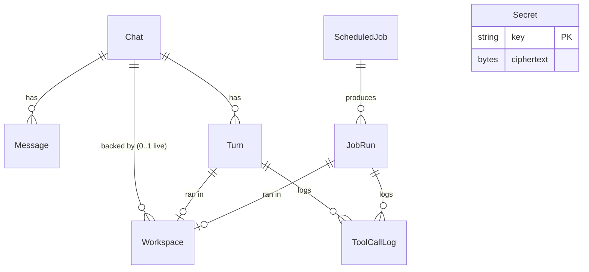

# 02 — Data Model

Postgres owns **all** durable state. A workspace container owns only its ephemeral filesystem. Nothing that is needed to restore a chat may live only inside a container.

## 1. Entity overview



| Entity | Purpose | Lifetime |
|---|---|---|
| `Chat` | A conversation bound to a repository and branch. Carries the **restore context**. | Forever (soft-archived) |
| `Message` | Ordered conversation history: user, assistant, system, and compact tool summaries. | Forever |
| `Turn` | One user prompt → one agent execution in a workspace. Tracks status, timing, usage, error. | Forever |
| `Workspace` | Metadata about a container: id, image, status, which chat/job run it served. Never holds state needed for restore. | Forever as a record; container itself is short-lived |
| `ScheduledJob` | Cron definition + prompt + repo/branch + enabled flag. Mirrors a BullMQ Job Scheduler keyed by `id`. | Until deleted |
| `JobRun` | One execution of a `ScheduledJob` in a fresh workspace, with recorded output and, when it pushed, the branch and commit it pushed to. | Forever |
| `ToolCallLog` | Every tool call executed by the agent, with **redacted** arguments and a truncated result. | Forever |
| `Secret` | Encrypted credential envelope (`GITHUB_PAT`, `OPENAI_API_KEY`). | Until replaced/removed |

## 2. Prisma schema draft

Prisma 7 conventions: `prisma-client` generator with explicit `output`, no `url` in the datasource (the connection string is given to `@prisma/adapter-pg` at runtime), config in `prisma.config.ts`.

```prisma
// packages/core/prisma/schema.prisma

generator client {
  provider = "prisma-client"
  output   = "../src/persistence/generated"
}

datasource db {
  provider = "postgresql"
}

// ───────────────────────────── Chats ─────────────────────────────

enum ChatStatus {
  ACTIVE
  ARCHIVED
}

model Chat {
  id          String     @id @default(cuid())
  title       String                              // first prompt, trimmed, editable
  status      ChatStatus @default(ACTIVE)
  repoUrl     String                              // https://github.com/owner/repo (no credentials)
  baseBranch  String                              // branch chosen at creation
  workBranch  String?                             // branch the agent pushes to (agent/<short-id>)
  lastPushedSha String?                           // last commit the agent pushed (restore hint)
  createdAt   DateTime   @default(now())
  updatedAt   DateTime   @updatedAt
  archivedAt  DateTime?

  messages    Message[]
  turns       Turn[]
  workspaces  Workspace[]

  @@index([status, updatedAt])
}

enum MessageRole {
  USER
  ASSISTANT
  SYSTEM        // restoration notes, workspace lifecycle notices
  TOOL_SUMMARY  // compact summary of a tool call, kept in history for the model
}

model Message {
  id        String      @id @default(cuid())
  chatId    String
  chat      Chat        @relation(fields: [chatId], references: [id], onDelete: Cascade)
  turnId    String?
  turn      Turn?       @relation(fields: [turnId], references: [id], onDelete: SetNull)
  seq       Int                                   // monotonic per chat; ordering key
  role      MessageRole
  content   String                                // redacted before write
  createdAt DateTime    @default(now())

  @@unique([chatId, seq])
  @@index([chatId, createdAt])
}

enum TurnStatus {
  QUEUED
  PREPARING   // workspace being created / restored
  RUNNING
  SUCCEEDED
  FAILED
  CANCELLED
}

model Turn {
  id            String     @id @default(cuid())
  chatId        String
  chat          Chat       @relation(fields: [chatId], references: [id], onDelete: Cascade)
  workspaceId   String?
  workspace     Workspace? @relation(fields: [workspaceId], references: [id], onDelete: SetNull)
  status        TurnStatus @default(QUEUED)
  model         String                            // model id actually used
  queueJobId    String?                           // BullMQ job id for cancellation
  inputTokens   Int?
  outputTokens  Int?
  stepCount     Int        @default(0)            // model round-trips in the loop
  error         String?                           // redacted
  queuedAt      DateTime   @default(now())
  startedAt     DateTime?
  finishedAt    DateTime?

  messages      Message[]
  toolCalls     ToolCallLog[]

  @@index([chatId, queuedAt])
  @@index([status])
}

// ─────────────────────────── Workspaces ──────────────────────────

enum WorkspaceKind {
  CHAT
  JOB
}

enum WorkspaceStatus {
  CREATING
  READY
  BUSY        // a turn or job run is executing inside
  STOPPING    // a teardown has committed to destroying the container; only DESTROYED/FAILED follow
  DESTROYED
  FAILED
}

model Workspace {
  id            String          @id @default(cuid())
  kind          WorkspaceKind
  status        WorkspaceStatus @default(CREATING)
  chatId        String?
  chat          Chat?           @relation(fields: [chatId], references: [id], onDelete: SetNull)
  runnerKind    String                            // "docker" — the WorkspaceRunner implementation
  runnerRef     String?                           // container id (opaque handle owned by the runner)
  image         String                            // image reference incl. tag/digest
  repoUrl       String
  branch        String
  createdAt     DateTime        @default(now())
  readyAt       DateTime?
  lastActiveAt  DateTime        @default(now())   // idle-TTL clock
  destroyedAt   DateTime?
  failureReason String?                           // redacted

  turns         Turn[]
  jobRun        JobRun?
  toolCalls     ToolCallLog[]

  @@index([status, lastActiveAt])
  @@index([chatId])
}

// ──────────────────────── Scheduled jobs ─────────────────────────

model ScheduledJob {
  id          String    @id @default(cuid())
  name        String
  cron        String                              // 5-field cron, validated with cron-parser
  timezone    String    @default("UTC")           // IANA tz
  prompt      String
  repoUrl     String
  branch      String
  enabled     Boolean   @default(true)
  lastRunAt   DateTime?
  nextRunAt   DateTime?                           // computed from cron; shown in UI
  createdAt   DateTime  @default(now())
  updatedAt   DateTime  @updatedAt

  runs        JobRun[]

  @@index([enabled, nextRunAt])
}

enum JobRunStatus {
  QUEUED
  PREPARING
  RUNNING
  SUCCEEDED
  FAILED
  CANCELLED
}

enum JobRunTrigger {
  SCHEDULE
  MANUAL
}

model JobRun {
  id            String        @id @default(cuid())
  jobId         String
  job           ScheduledJob  @relation(fields: [jobId], references: [id], onDelete: Cascade)
  workspaceId   String?       @unique
  workspace     Workspace?    @relation(fields: [workspaceId], references: [id], onDelete: SetNull)
  status        JobRunStatus  @default(QUEUED)
  trigger       JobRunTrigger
  model         String
  output        String?                           // final assistant message, redacted
  error         String?                           // redacted
  workBranch    String?                           // branch the run pushed to, as git reported it
  lastPushedSha String?                           // commit at that branch's head after the push
  inputTokens   Int?
  outputTokens  Int?
  stepCount     Int           @default(0)
  scheduledFor  DateTime                          // the cron tick this run belongs to
  queuedAt      DateTime      @default(now())
  startedAt     DateTime?
  finishedAt    DateTime?

  toolCalls     ToolCallLog[]

  @@index([jobId, queuedAt])
}

// ───────────────────────── Tool call logs ────────────────────────

enum ToolCallStatus {
  RUNNING
  SUCCEEDED
  FAILED
  TIMED_OUT
}

model ToolCallLog {
  id          String         @id @default(cuid())
  workspaceId String
  workspace   Workspace      @relation(fields: [workspaceId], references: [id], onDelete: Cascade)
  turnId      String?
  turn        Turn?          @relation(fields: [turnId], references: [id], onDelete: Cascade)
  jobRunId    String?
  jobRun      JobRun?        @relation(fields: [jobRunId], references: [id], onDelete: Cascade)
  callId      String                              // model-issued call id
  seq         Int                                 // order within the turn / run
  toolName    String                              // run_shell | read_file | write_file | list_dir
  args        Json                                // REDACTED before write
  resultHead  String?                             // first 8 KB of result, redacted
  resultBytes Int?                                // full length, for "truncated" indicator
  exitCode    Int?
  status      ToolCallStatus @default(RUNNING)
  startedAt   DateTime       @default(now())
  finishedAt  DateTime?
  durationMs  Int?

  @@index([turnId, seq])
  @@index([jobRunId, seq])
}

// ───────────────────────────── Secrets ───────────────────────────

enum SecretKey {
  GITHUB_PAT
  OPENAI_API_KEY
}

model Secret {
  key         SecretKey @id
  ciphertext  Bytes                               // AES-256-GCM
  iv          Bytes                               // 12 bytes, random per write
  authTag     Bytes                               // 16 bytes
  keyVersion  Int       @default(1)               // master key rotation hook
  last4       String                              // for UI masking only
  createdAt   DateTime  @default(now())
  updatedAt   DateTime  @updatedAt
}
```

## 3. Invariants (enforced in domain code and tested)

1. **Redact before write.** Every `String`/`Json` column that can carry agent or tool output (`Message.content`, `Turn.error`, `Workspace.failureReason`, `JobRun.output/error`, `ToolCallLog.args/resultHead`) passes through `redact()` in the repository layer. Repositories are the only writers. Four columns are outside that list and are safe for a different reason, which is worth stating because "a branch name cannot carry a secret" would be the wrong one — the agent chooses the branch, so it can. `Chat.workBranch`/`lastPushedSha` and `JobRun.workBranch`/`lastPushedSha` are written from a `git.pushed` event, and every event is passed through `redactJson` by the worker *before* it is published or handed to a sink, so what reaches these columns is already redacted. The guarantee is the executor's, not the column's, and the canary suites assert it on both paths.
2. **One live workspace per chat.** At most one `Workspace` with `status IN (CREATING, READY, BUSY, STOPPING)` per `chatId` (partial unique index in the migration: `CREATE UNIQUE INDEX ... ON "Workspace"("chatId") WHERE status IN (...)`).
3. **Job runs never reuse workspaces.** `JobRun.workspaceId` is unique and the workspace `kind = JOB`; the worker destroys it in a `finally`.
4. **Secrets table is append-or-replace.** There is never more than one row per key; removing a secret deletes the row. Plaintext never enters Prisma — `Secret` rows are created by `SecretsService`, which returns only `last4` to callers outside the worker's injection path.
5. **Message sequence is gap-free per chat** (`seq` assigned in a transaction with `SELECT max(seq)`), because the restore context is rebuilt from ordered messages.
6. **A run's push record is both columns or neither.** `JobRun.workBranch` and `JobRun.lastPushedSha` are written by one statement, from one `git.pushed` event, and the API reports a half-filled pair as no push at all — a branch with no commit describes nothing. The last push of a run is the record: a run may push more than once, and only the newest describes the branch as it stands. These columns are **not** restore hints, unlike the identically named ones on `Chat`: a run always starts in a fresh workspace from the job's prompt, so nothing is ever rebuilt from them. They exist because a run's container is destroyed the moment it ends and its event stream is discarded an hour later, so the branch a scheduled coding job produced would otherwise be recoverable from nowhere in the application.

## 4. What "workspace context" must be persisted for faithful restore

A restored chat must behave as if the workspace never disappeared, within the limits of what was pushed. The restore builder reads:

| Field | Source | Used for |
|---|---|---|
| `repoUrl`, `baseBranch` | `Chat` | `git clone --branch` |
| `workBranch`, `lastPushedSha` | `Chat` | If present: `git fetch origin workBranch && git checkout workBranch`; verify HEAD == `lastPushedSha`, else note divergence |
| Ordered `Message[]` (USER, ASSISTANT, SYSTEM, TOOL_SUMMARY) | `Message` | Model input for the next turn (windowed: last N messages + a compaction summary when over budget) |
| Tool-call history summary | `ToolCallLog` → compacted into `TOOL_SUMMARY` messages at turn end (`"ran `pnpm test` → exit 0 (12 s)"`, `"wrote src/auth.ts (+42/-3)"`) | Lets the model know what it already did without replaying full outputs |
| Restoration notice | Generated `SYSTEM` message on restore: *"Workspace recreated from history at <time>. Uncommitted changes from the previous workspace are gone; pushed work on `<workBranch>` is checked out."* | Keeps the model honest about filesystem state |

A run has no equivalent of this table and is given none. A `Message` exists to feed the model's history window, and a run has no history — it always starts fresh from the job's prompt — so a run-shaped message channel would be a table with a writer and no reader. What a run does keep is a fact rather than a conversation: `workBranch`/`lastPushedSha`, from which its drawer rebuilds the same push line a chat's `SYSTEM` message carries.

Not persisted (by design): the container filesystem, shell history, installed dependencies. The agent re-installs as needed; this is the price of "cattle, not pets" and is stated in the UI when a chat is restored.

## 5. Retention

- `Chat`/`Message`/`Turn`/`JobRun`/`ToolCallLog`: kept indefinitely (local app, user's own data). "Delete chat" and "Delete job" cascade.
- `Workspace` rows for destroyed containers are kept (audit trail); a `pnpm db:prune` script can drop rows older than 30 days.
- Redis Streams used for SSE replay expire after 1 hour and are capped at `TURN_EVENTS_MAXLEN` entries, so a long turn can outrun the window before the hour is up; they are a cache, never the source of truth, and the events route says so rather than serving a partial replay as a whole one.
