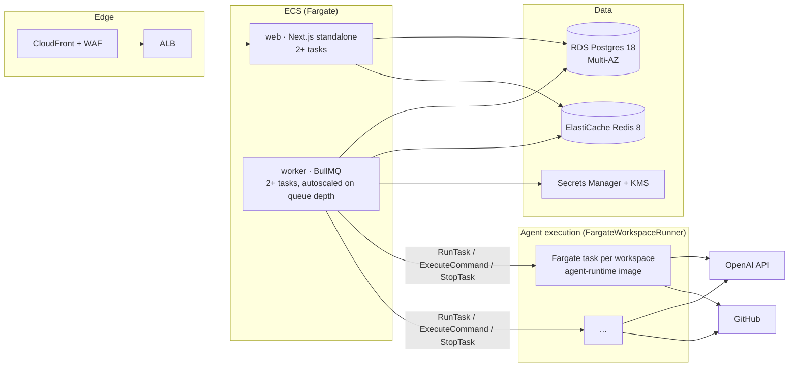

# 08 — Deployment Discussion (README appendix)

This section is prose for the README, not code. Nothing here is implemented; it explains how the local architecture maps to a cloud deployment and what would change before operating in production. AWS is used for concreteness; the same shape fits GCP or Azure.

## 1. How it deploys

The local topology already has the right seams: a stateless web tier, a worker tier that is the only thing touching the runner, Postgres as the source of truth, Redis as queue + event bus, and a `WorkspaceRunner` interface in front of execution.

| Local | Cloud | Notes |
|---|---|---|
| `apps/web` on host | ECS Fargate service behind ALB (or Vercel for the UI + a thin API service) | SSE works through ALB with idle timeout raised (≥ 60 s) and heartbeats; no response buffering. |
| `apps/worker` on host | ECS Fargate service, autoscaled on BullMQ queue depth (custom CloudWatch metric) | Same code; `WORKSPACE_RUNNER=fargate`. |
| Postgres in compose | RDS Postgres 18 Multi-AZ, automated backups, PITR | Prisma unchanged; connection pooling via RDS Proxy. |
| Redis in compose | ElastiCache Redis 8 (or Valkey), cluster-mode off, TLS | BullMQ + Streams unchanged. |
| `DockerWorkspaceRunner` | **`FargateWorkspaceRunner`** — `create` = `RunTask` (one task per workspace, `enableExecuteCommand`), `exec` = ECS Exec (SSM) session streaming, `destroy` = `StopTask`, `health` = `DescribeTasks`, `list` = tags | Second implementation of the same interface; nothing else changes. |
| `~/.agent-hangar/master.key` | KMS-backed envelope: master key in Secrets Manager, data-key caching in the worker | `SecretsService` gets a `KmsKeyProvider`; the AES-GCM code is reused. |
| Workspace image built locally | ECR, built in CI, signed (cosign), scanned (ECR scan/Trivy) | Same Dockerfile. |
| `docker-compose` | Terraform/CDK stack | — |

### Runner options compared

| Option | Isolation | Cold start | Fit |
|---|---|---|---|
| **ECS Fargate task per workspace** (recommended first step) | Per-task micro-VM (Firecracker under the hood), own ENI, no shared kernel | 30–60 s | Simplest mapping of the interface; ECS Exec gives the exec primitive; pay per second. |
| Firecracker micro-VMs on EC2 (self-managed, or Fly Machines / E2B as a service) | Strong; sub-second boots with snapshot restore | < 1 s with snapshots | Better UX and cost at volume; more to operate (or a vendor dependency). |
| Kubernetes pods with gVisor/Kata | Good with sandboxed runtimes; shared cluster | 5–20 s | Only if the organisation already runs Kubernetes — see non-goals. |
| Lambda | Not suitable | — | 15-minute limit, no long-lived filesystem, poor fit for exec streaming. |

## 2. How agent execution scales

- **Horizontal by design.** Each turn/job is a BullMQ job; workers are stateless consumers; the runner creates one task per workspace. Capacity = Fargate task quota × concurrency per worker. Autoscale workers on `waiting` count; cap concurrent workspaces with a per-account budget (BullMQ group rate limits or a Postgres-backed semaphore).
- **Warm pool.** Keep N pre-started workspace tasks (no repo, no secrets) and `exec` the clone on assignment — cuts perceived start time to seconds while keeping per-task isolation. Secrets are still injected per assignment via ECS Exec environment or fetched by the runtime with a short-lived task-role credential.
- **Idle economics.** The idle-TTL GC that exists locally becomes the cost control: tasks are stopped after inactivity; restore is the normal path, so nothing is lost.
- **Back-pressure.** Turn limits (`maxSteps`, `maxTurnMs`) bound cost per job; queue concurrency bounds parallelism; model rate limits surface as retryable errors and BullMQ backoff.
- **State stays small.** Postgres carries metadata and redacted logs; large tool outputs move to S3 with a pointer (`ToolCallLog.resultRef`) once volumes grow.

## 3. How workspaces are isolated in production

- One Fargate task (micro-VM) per workspace; no two chats share a kernel, filesystem, or network namespace.
- Task network: private subnets, egress through NAT with an egress allow-list (GitHub, OpenAI, package registries) enforced by a network firewall or proxy; no inbound.
- Task role with **no** AWS permissions beyond what the runtime needs (typically none; secrets are injected, not fetched). Read-only root filesystem except `/workspace` and `/tmp` (ephemeral storage, size-capped).
- Non-root user, dropped capabilities, `no-new-privileges`, seccomp default profile — the same flags the local runner already sets.
- Per-user quotas (CPU, memory, wall-clock, concurrent workspaces) enforced by the worker before `create`.
- Image provenance: signed images only (ECR + policy), rebuilt weekly for base patches.

## 4. How secrets are stored and delivered

- **At rest:** user credentials (GitHub PAT, OpenAI key) stay in Postgres as AES-256-GCM ciphertext; the data key is wrapped by **KMS** and the wrapped key stored in **Secrets Manager**, rotated on schedule (`keyVersion` already exists for re-encryption).
- **In transit to the agent:** the worker never passes plaintext through the queue. On `create`, it writes the decrypted values to a per-workspace secret (Secrets Manager, TTL = workspace lifetime) and starts the task with `secrets:` references resolved by the ECS agent into environment variables **at task start** via the task execution role — the cloud equivalent of "env at container start, never in images". The secret is deleted on `destroy`.
- **Alternative:** a short-lived, scoped GitHub App installation token minted per run instead of a user PAT — narrower blast radius and automatic expiry; the `Secret` model gains a `GITHUB_APP` key. OpenAI keys can be swapped for an org-owned key with per-project budgets.
- **Logs:** the same `Redactor` runs before anything leaves the process; CloudWatch log groups encrypted with KMS; retention 30 days.
- **Local vs production difference stated honestly:** locally `docker inspect` can show env for a running workspace on the developer's own machine; in production, ECS Exec and `DescribeTasks` access is IAM-restricted and audited.

## 5. Rough monthly cost at small scale

Assumptions: one team, ~10 active users, ~200 chat turns and ~100 scheduled runs per day, average workspace alive 20 minutes, us-east-1, on-demand prices (2026).

| Item | Sizing | ≈ USD / month |
|---|---|---|
| ECS Fargate — web (2 × 0.5 vCPU/1 GB) | always on | 30 |
| ECS Fargate — worker (2 × 1 vCPU/2 GB) | always on | 60 |
| ECS Fargate — workspaces (2 vCPU/4 GB × ~100 task-hours/day) | pay per second | 270 |
| RDS Postgres (db.t4g.medium Multi-AZ, 50 GB) | | 130 |
| ElastiCache Redis (cache.t4g.small) | | 25 |
| ALB + NAT gateway + data transfer | NAT is the surprise line | 80 |
| Secrets Manager, KMS, CloudWatch, ECR | | 25 |
| **Infrastructure total** | | **≈ 620** |
| OpenAI API usage (≈ 300 runs/day × ~150 k tokens avg at flagship rates) | dominant, usage-driven | 2 000 – 6 000 |

Takeaways: infrastructure is a rounding error next to model spend; model cost is controlled by `maxSteps`, output truncation, history windowing, and choosing a mid-tier model for routine scheduled jobs (`OPENAI_MODEL` per job is a one-column change).

## 6. What changes before operating in production

1. **Authentication & tenancy** — OIDC login, `userId` on every table, per-user secrets, per-user quotas. Seam: route handlers and repositories already take an explicit context object.
2. **Network egress control** for workspaces (allow-list) and **DLP** on outputs.
3. **Observability** — OpenTelemetry traces across web → queue → worker → runtime (trace id already travels in `TurnRequest`), structured logs to CloudWatch/Loki, dashboards for queue depth, turn latency, workspace count, model cost per user; alerts on stuck turns and GC failures.
4. **Resilience** — RDS Multi-AZ + PITR, Redis replication, idempotent processors (already `jobId = turnId`), dead-letter queue review UI.
5. **Supply chain** — signed images, SBOM, dependency scanning, renovate; pin the runtime image by digest in `WORKSPACE_IMAGE`.
6. **Abuse controls** — rate limits per user, prompt-size caps, cost budgets, kill switch for the worker.
7. **Compliance hygiene** — data retention policy for transcripts, right-to-delete (cascade exists), audit log of secret changes.
8. **Operational runbooks** — key rotation, image rebuild, incident for leaked credential (revoke PAT, rotate key, purge logs).
